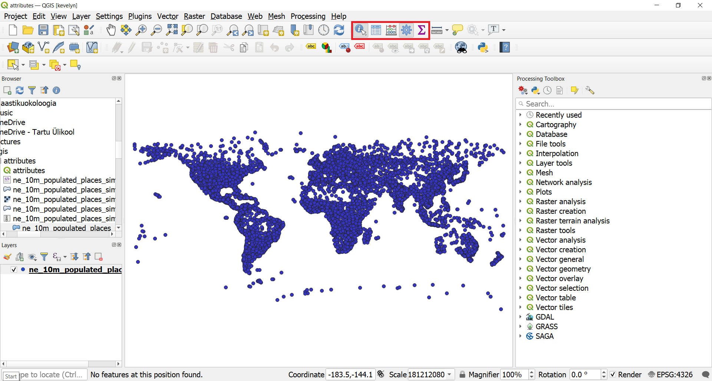
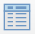
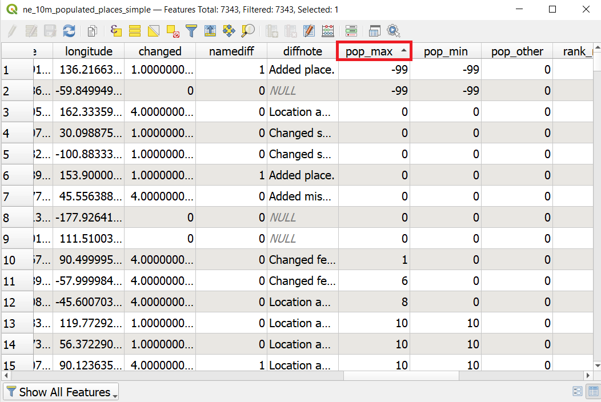
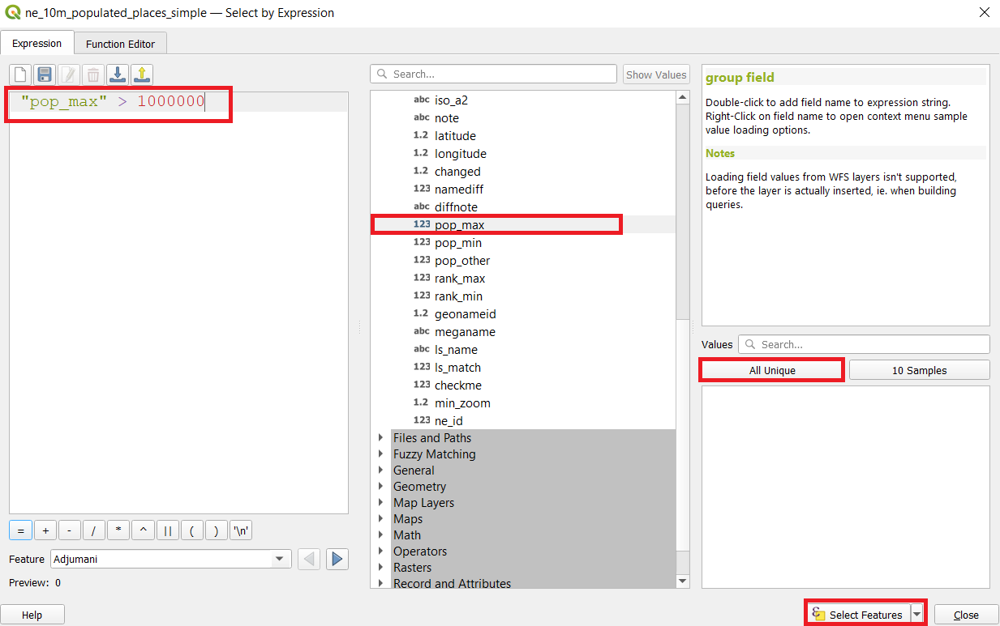

GIS data has two parts - features and attributes. Attributes are structured data about each feature. This tutorial shows how to view the attributes of a GIS vector layer and do basic queries on them in QGIS.

#### The tutorial consists of the following steps:

### 1. Download data
Natural Earth provides a [Populated Places](http://www.naturalearthdata.com/downloads/10m-cultural-vectors/10m-populated-places/) dataset. Download the [simple (less columns) dataset](http://www.naturalearthdata.com/http//www.naturalearthdata.com/download/10m/cultural/ne_10m_populated_places_simple.zip). Extract the dataset to your working folder.

For convenience, you may directly download a copy of datasets from the link below:
[ne_10m_populated_places_simple.zip](../../datasets/ne_10m_populated_places_simple.zip)

Data Source: [NaturalEarth](https://www.naturalearthdata.com/)

### 2. Steps to work with attributes
#### 2.1. Identifying single objects on the map
1. Locate the span <style="font-family:Consolas; color:#AF1B03">ne_10m_populated_places_simple.shp file in the QGIS Browser drag it to the map view. Save your project with a suitable name to your working folder.
>**Tip** :smirk:
>
*You can add files also directly from zip-file without extracting them if you expand the zip file in the Browser and drag shp-file to the map view*

2. A new ne_10m_populated_places_simple will now be loaded in QGIS and you will see many points representing the populated places of the world. The default view in the QGIS canvas shows the geometry of the GIS layer. Each point also has associated attributes. Let’s view them. Locate the Attributes Toolbar. This toolbar contains many useful tools to inspect, view, select, and modify attributes of a layer. If you do not see the toolbar, you can enable it from `View ► Toolbars ► Attributes Toolbar`.

3. Click the Identify button  on the Attributes Toolbar. Once the tool is selected, click on any point on the canvas. The associated attributes of that point will be displayed in a new Identify Results panel. Once you are done exploring attributes of different points, you can click the Close button.

4. You can also view all of the attributes together as a table. Click the Open Attribute Table button  on the Attributes Toolbar. You can also right-click the ne_10m_populated_places_simple and select Open Attribute Table.
>**Tip** :smirk:
>
*You open also the attribute table with F6 from the keyboard. However, the layer of which attribute table you wish to open must be selected from the Layer panel*

5. In the attribute table, scroll horizontally and locate the **pop_max** column. This field contains the population of the associated place. You can click on the field header to sort the column in ascending order. You can see that two cities have values of -99 which obviously can't be a population value. Value -99 indicates here No Data meaning that there is no data about the population of these places.

6. Click again on the field header to sort the column in descending order this time. The highest value is over 3.5 million and if you scroll horizontally to the left and find the field **name** then you can see that the city is Tokyo. Click on this first row to make it selected (goes blue). You can now see on the map where the selected point (currently Tokyo) is located if you click on the  Zoom map to the selected rows button  from the attribute table toolbar and go to your Map view. You should now see the zoomed in view to Tokyo and Tokyo is colored yellow. Yellow is usually always marking the color of selected objects in GIS-programmes.

>**Tip** :smirk:
>
*You change the default selection color under `Settings ► Options... ► Canvas&Legend` and Selection color*

#### 2.2. Making queries
7. Lets perform our query on these attributes. QGIS uses SQL-like expressions to perform queries. Click Select features using an expression button  from the attribute table toolbar. In the Select By Expression window, expand the Fields and Values section and double-click the pop_max label. You will notice that it is added to the expression section at the bottom. If you aren’t sure about the field values, you can click the All Unique button to see what the attribute values are present in the dataset. For this exercise, we are looking to find all features that have a population greater than 1 million. So complete the expression as below and click Select Features and then Close.

>:scroll:**Note** 
>
*In the QGIS Expression engine, text with double-quotes refers to a field and text with single-quotes refer to a string value. For example, if you would want to find Tokyo from the attribut etable by using expression then your expression would look like this  "name"  =  'Tokyo'*
