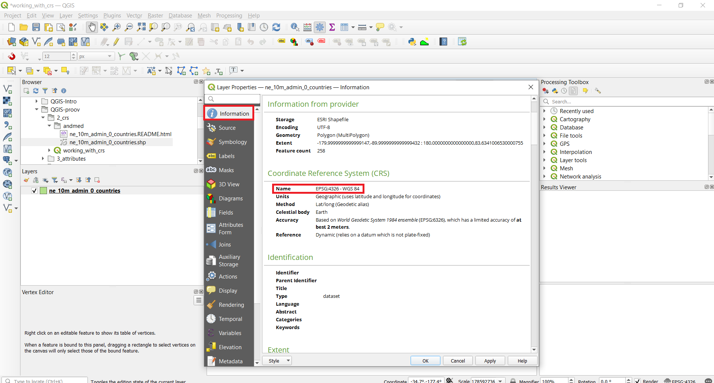

Coordinate Reference System (CRS) often cause a lot of frustration when working with GIS data. But a proper understanding of the concepts and access to the right tools will make it much easier to deal with projections. Coordinate Reference Systems, also referred to as Spatial Reference Systems, include two common types:
+ Geographic Coordinate Systems (GCS)
+ Projected Coordinate Systems (PCS)

It is important to recognise and make the difference between them. The projected coordinate systems always include also information about the projection. You can read more about Coordinate Reference Systems from [QGIS Documentation](https://docs.qgis.org/3.16/en/docs/gentle_gis_introduction/coordinate_reference_systems.html#coordinate-reference-systems)

In this tutorial, we will explore how CRSs work in QGIS and learn about tools available for vector and raster data layers.

#### The tutorial consists of the following steps:

- [1. Download data](#1-download-data)
- [2. Steps to make a map](#2-steps-to-make-a-map)

### 1. Download data

Natural Earth has [Admin 0 - Countries](http://www.naturalearthdata.com/downloads/10m-cultural-vectors/) dataset. Download the [countries](https://www.naturalearthdata.com/http//www.naturalearthdata.com/download/10m/cultural/ne_10m_admin_0_countries.zip) and extract to your working folder.

[Estonian Land Board](https://geoportaal.maaamet.ee/eng/Spatial-Data-p58.html) provides open data about Estonia for download. Download the [administrative counties](https://geoportaal.maaamet.ee/docs/haldus_asustus/maakond_shp.zip?t=20210809134825) and extract it to a folder on your computer.

For convenience, you may directly download files required only for this tutorial from the link below:

data_projections.zip

Data Sources: [NATURALEARTH](https://www.naturalearthdata.com/) [Estonian Land Board](https://maaamet.ee/en)

### 2. Steps to work with CRS
1. Open QGIS. Locate your working folder in the Browser panel and drag/drop the ne_10m_admin_0_countries.shp file to your QGIS Map view or alternatively click on Open Data Source Manager button , click on the Vector tab and add the file from there.

2. At the bottom of QGIS window, you will notice the label Coordinate. As you move your cursor over the map, it will show you the X and Y coordinates at that location. Currently it is presenting geographic coordinates because the data layer CRS is geographic, more precisely WGS84 (EPSG:4326), which you can see at the bottom-right corner. This is also the current Project CRS because QGIS assigns the empty project CRS of the first layer you add to the project.

3. To determine a layer’s projection, we can look into the metadata. Right click on ne_10m_admin_0_countries.shp layer and select Properties. From there switch to the Information tab in the Layer Properties dialog. Under provider information you will find CRS. As you can see, there is also a lot of other information under metadata, such as extent of the layer, units etc.

4. Lets first change the Project CRS. Click on the status bar lower right corner on EPSG:4326. Type "winkel" to the filter. This should bring up several Winkel CRS-s. Click on World_Winkel_Tripel_NGS (ESRI:54042) and then OK. Winkel-Tripel is minimal-error projection and it is used in National Geographic. In result, the map should change in your map view as the Project CRS is changed.

