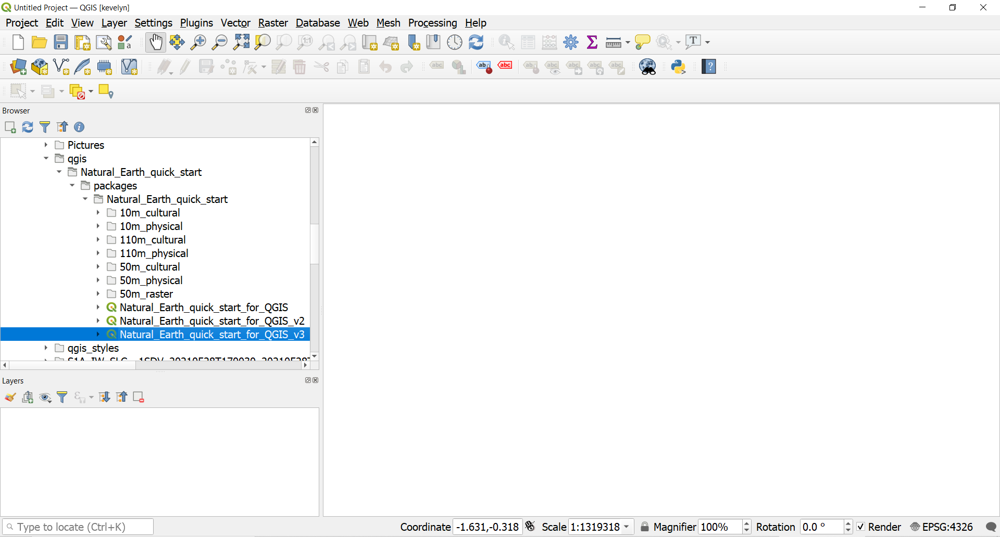
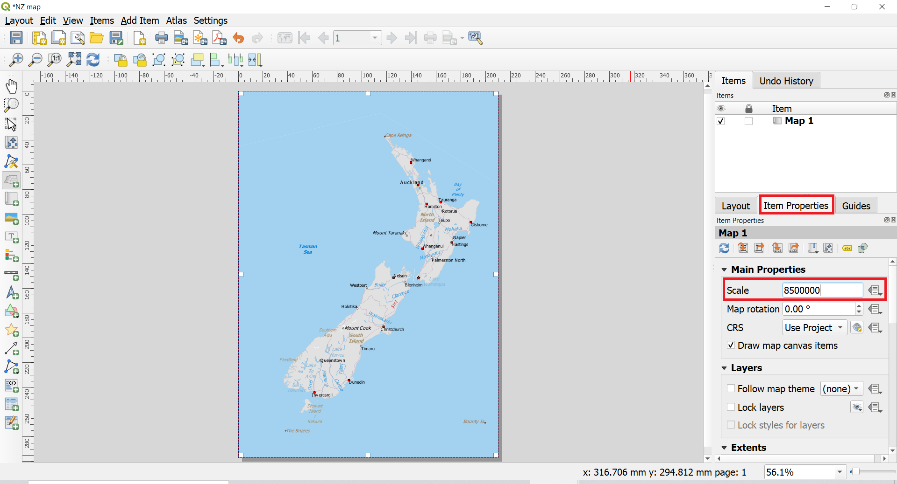
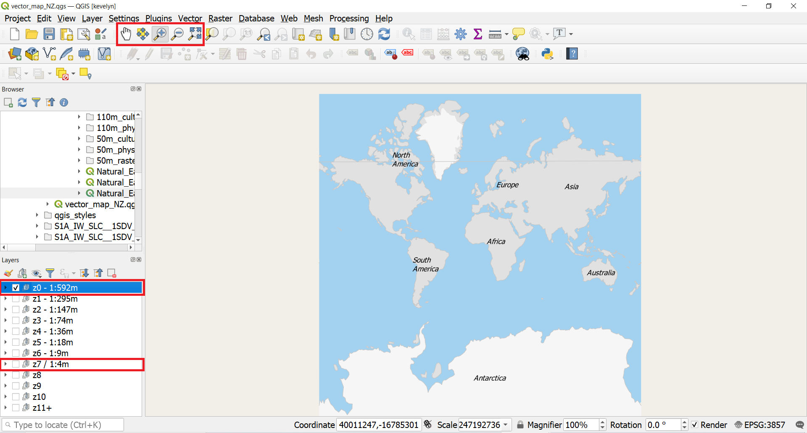
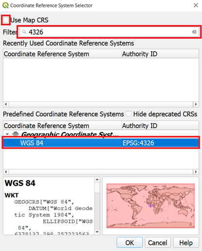

A map is the most common output of GIS. This tutorial shows how to create a map from vector and raster data with standard map elements like map inset, grids, north arrow, scale bar and labels.

#### The tutorial consists of the following steps:

- [1. Download data](#1-download-data)
- [2. Steps to make a map](#2-steps-to-make-a-map)
  * [2.1. Creating the main map](#21-creating-the-main-map)
  * [2.2. Creating an inset map](#22-creating-an-inset-map)

### 1. Download data

We will use the Natural Earth dataset - specifically the Natural Earth Quick Start Kit that comes with beautifully styled global layers that can be loaded directly to QGIS.

Download the [Natural Earth Quickstart Kit](https://naciscdn.org/naturalearth/packages/Natural_Earth_quick_start.zip). If the download link doesn’t work, get it directly from Natural Earth Downloads page.

### 2. Steps to make a map
#### 2.1. Creating the main map

1. Download and extract the Natural Earth Quick Start Kit data. Open QGIS. Locate the Natural_Earth_quick_start folder in the Browser panel. Expand the folder to locate the Natural_Earth_quick_start_for_QGIS_v3 project. This is the project file that contains styled layers in QGIS Document format. Double-click the project to open it.

2. The state of your QGIS session is called a project. QGIS works on one project at a time.  Please save your project `Project ► Save as` into your folder. The information saved in a project file includes added layers, layer properties and symbology, projection of the map view, print layouts etc. Read more about QGIS project from [QGIS Documentation](https://docs.qgis.org/testing/en/docs/user_manual/introduction/project_files.html#).
3. You may notice that the map labels are in Greek. This project uses variables to set the language.  We can change the variables by going to `Project ► Properties`. Switch to the `Variables` tab in the `Project Properties` dialog. Locate the project_language variable and change the language to name_en and click OK. The place names should now switch to English. If they do not then click the Refresh button  in the toolbar. 
4. The attribute table of ne_10m_populated_places contains place names in multiple languages and therefore you can use variables to create a map in several language. Open the attribute table of ne_10m_populated_places by making a right click on the layer name choose `Open Attribute Table`. Find in the table variables (column names) name_en and name_el. Place names are generated automatically to the map based on these variables. 
5. Use the pan and zoom controls in the Map Navigation Toolbar and zoom to New Zealand.You can see that the map kind of ends half way in the map view. This is because of the date line. The map extent specified to end there, however, it is possible to re-define the map center line and therefore also the western-most and eastern-most borders. 
6. Before we make a map suitable for printing, we need to choose an appropriate projection from the Status bar in the lower right corner . The default CRS for the project is set to EPSG:3857 [^1] Pseudo-Mercator. This CRS is popularly used for web mapping and is a decent choice for our purpose, so we can leave it to its default value. The New Zealand's official geodetic datum for New Zealand and its offshore islands is [NZGD2000](https://www.linz.govt.nz/data/geodetic-system/datums-projections-and-heights/geodetic-datums/new-zealand-geodetic-datum-2000-nzgd2000) and if you are working for a smaller region in NZ, using this CRS will be better.
7. For creating a new map layout, go to `Project ► New Print Layout` or alternatively click on the Show Layout Manager IMAGE . Create a new layout and named it appropriately (for example, "NZ map"). 
8. Now we have "canvas" where can add the map from the map view. Before doing that, we should change the layout from landscape to portrait as NZ is rather north-south stretched country. Right-click on the canvas and then `Page Properties` opens page properties panel on the right side where you can change the page orientation from Landscape to Portrait. 
9. To add the map to the layout, choose from the menu `Add Item  ► Add Map` or alternatively click  which makes the Add map mode active. Hold the left mouse button and drag a rectangle where you want to insert the map. Currently we would add to the whole layout, therefore, draw full page.

10. You will see that the rectangle window will be rendered with the map from the main QGIS Map view. The rendered map may not be covering the full extent of our interest area if you did not draw the full extent of the canvas. Use `Edit ‣ Select/Move item and Edit ‣ Move Content` from the menu or alternatively  and  to pan the map in the window and center it in the composer. To adjust the zoom level, click on the Item Properties tab and enter 8500000 as the Scale value. Alternatively, you can also click on  and use mouse scroll-in to zoom in, however, this is not very convenient. 
11. The initial project has layer group for the scale of 1 to 18 million switched on in the layer panel. As we set our scale to less than 1 million in the previous scale then we should change the layer visibility in the main map menu. Switch back to the map view and switch off the visibility of the z5 - 1:18m and switch on the visibility of z5 - 1:4m. The map rendering might take a while. Switch back to the Layout view and click refresh  in the map's Item properties panel.

#### 2.2. Creating an inset map

12. Now we will add a map inset[^2] that shows New Zealand's location in the world. Before we make any changes to the layers in the main QGIS window, check the Lock layers and Lock styles for layers boxes. This will ensure that if we turn off some layers or change their styles, this view will not change. 
13. To add the inset map, click  which makes the Add map mode active. Draw an rectangle to the upper left corner of the map or whereever you would like to add the inset. You will now notice that we have 2 map objects in the Print Layout. When making changes, make sure you have the correct map selected. You can also change the name of Map 2 to Inset map if making a double click on the name.

14. The level of detail for the inset map is too high and we should once more change the layer visibility in the Map view. Switch to Map view and switch off the visibility of the z5 - 1:4m and switch on the visibility of z0 - 1:592m. Change the zoom level so that the whole world is visible by using Pan/Zoom In and Out/Zoom Full options. Finally switch back to the Layout view. Refresh the inset map view and it should change.

16. The current main map and the inset have the same CRS (Pseudo-Mercator) which for global maps is not really suitable because it distorts the areas close to poles. Therefore we use more suitable CRS called Winkel Tripel (EPSG 54042) which is also known as National Geographic projection. Winkel Tripel is minimal error projection which means that it tries to minimize all types of map distortion (area, shape, angle, distances) and it looks aesthetically pleasing. Click on the Select CRS button  on the Item properties panel of the inset map. Coordinate Referrence System Selector panel will open. Uncheck the option "Use Project CRS" and type EPSG code 54042 into Filter field. This should find Winkel Tripel. Click on World_Winkel_Tripel_NGS and then OK. This should switch the inset map's CRS to Winkel Tripel.

15. You might need to adjust the zoom level of the inset map and you can use Select/Move  and Move Content  to pan the map in the window and center it in the composer. You can also change the size of the inset map.
16. To make more clear visual separation between the main map and inset map, we can add frame around the inset map. Select the Map 2 (inset map) object from the Items panel. Select the Item properties tab. Scroll down to the Frame panel and check the box next to it. You can change the color and thickness of the frame border so it is easy to distinguish against the map background.

17. One neat feature of the Print Layout is that it can automatically highlight the area of the main map in the inset map (and also vice versa). Select the Map 2 object from the Items panel. In the Item properties tab, scroll down to the Overviews section. Click the Add a new overview button. Select Map 1 as the Map Frame. This tells the Print Layout to highlight the current object Map 2 with the extent of the map shown in the Map 1 object.

#### 2.3. Adding grid to the map
18. Now that we have the map inset ready, we will add a grid to the main map. Select the Map 1 object from the Items panel. In the Item properties tab, scroll down to the Grids section. Click the Add a new grid button and then Modify grid….

19. By default, the grid lines use the same units and projection as the currently selected map. However, for small scale maps (1:2 000 000 – 1:∞)[^3] it is more common and useful to display grid lines in degrees. We can select a different CRS for the grid. Click on the Select CRS button 

20. In the Coordinate Reference System Selector dialog, uncheck the option "Use Map CRS" and enter 4326 in the Filter box. From the results, select the WGS84 EPSG:4326 as the CRS. Click OK.

21. Select the Interval values as 5 degrees in both X and Y direction. You can adjust the Offset to change where the grid lines appear. You might also want to change the line style of the grid lines. You can do that by clicking on the line next to the Line style. You can change the color and the thickness of the lines. Currently, it might be good idea to reduce the line width to 0.1 because with the default line style the grid is a bit too overpowering.

22. Scroll down to the Grid frame section and check the Draw coordinates box. The default format is Degrees but it appears as a number. We can change this to Decimal with Suffic under Format. Then you can bring the coordinates inside the frame and rotate them into appropriate direction. You can also change the font of the coordinates if you like. As our grid lines are full degrees then there is no need to show so high coordinate precision and you can change this to 1.

[^1]: EPSG Geodetic Parameter Dataset (also EPSG registry) is a public registry of geodetic datums, spatial reference systems, Earth ellipsoids, coordinate transformations and related units of measurement.  Each entity is assigned an EPSG code between 1024-32767, along with a standard machine-readable well-known text (WKT) representation. (Wiki) The EPSG codes are unique and they are very useful to use for searching and identifying the CRS-s in GIS programmes.
[^2]: An inset map is a smaller map featured on the same page as the main map (GIS Wiki)
[^3]: A map is classified as small scale or large scale or sometimes medium scale. Large scale maps are usually 1:0 – 1:600 000 and represent for example town. Medium scale maps are usually 1:600 000 – 1:2 000 000 and mostly a whole country maps are in this range. Small scale maps are 1:2 000 000 – 1:∞ and world or regions are mapped in this scale. (Wiki)
