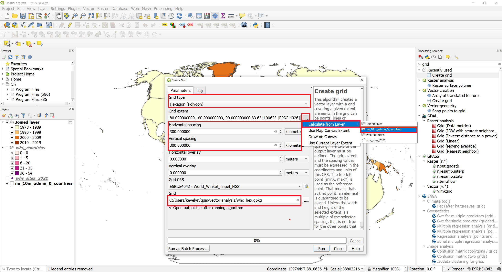

Spatial queries and spatial joins are one of the basic analysis forms in GIS. In this tutorial, we will find how many UNSESCO WHC sites are every country. In some areas there are a lot of WHC sites and this makes their visualization complicated because points tend to overlap. To overcome this, we will analyze points in a grid or generate a heatmap.

#### The tutorial consists of the following steps:
- [1. Download data](#1-download-data)
- [2. Procedure](#2-procedure)
  * [2.1. Spatial join](#21-spatial-join)
  * [2.2 Spatial query](#22-spatial-query)
  * [2.3. Heatmap](#22-heatmap)

### 1. Download data
This tutorial is a continuation to ["Basic vector syling"](https://kevelyn1.github.io/QGIS-Intro/qgis/vector-styling/). And we will use the same WHC sites data from [UNESCO World Heritage Sites](http://whc.unesco.org/en/syndication) saved as gpkg (["Basic vector syling"](https://kevelyn1.github.io/QGIS-Intro/qgis/vector-styling/) sections 1. and 2.1).

We will also need country borders. Download the [countries](https://http//www.naturalearthdata.com/download/10m/cultural/ne_10m_admin_0_countries.zip) and extract to your working folder.

**Data Sources:**
World Heritage List from [World Heritage List](http://whc.unesco.org/en/syndication) and country borders from [Natural Earth](https://www.naturalearthdata.com/)

### 2. Procedure
#### 2.1. Spatial join
1. Open QGIS and in the QGIS Browser Panel, locate the directory where you added the data and add files whc_sites_2021.gpkg and the ne_10m_admin_0_countries.shp to QGIS.
2. Change the CRS of the project to Winkel Tripel (ESRI:54042) and save your project.
3. Let's find out which countries have the highest numbers of world heritage sites. We will use spatial join for that purpose. In the Procesing Toolbox, find tool Count points in polygon. Make layer ne_10m_admin_0_countries as Polygons and layer  whc_sites_2021 as Points, save the output as whc_countries.gpkg and click Run.

4. You will have a new layer of countries whc_countries.gpkg. Open the attribute table of this new layer and browse horizontally to the end until you find a column named **NUMPOINTS**. This was created as a result of this analysis. Every country has now a count of WHC sites.

5. Let's visualize the countries based on the number of WHC sites in the country. Open the Symbology of the layer whc_countries. Choose legend type as Graduated and NUMPOINTS for Value. Pick suitable Color ramp and click Classify. You may see that the ranges are quite uneven because the Equal Count has divided even number into each class and as there are very few with very high numbers then the highest class has very large range. This means that we won't really see from the map what countries have a lot of WHC sites.

6. Let's try to adjust the classification so that we would see better what countries have only very few WHC sites and which have a lot. Under Symbology, change the classification Mode into Natural Breaks (Jenks)[^1]. You can see that the classes changed into more equal ranges. However, there is no class with 0 WHC sites. We would still want to see also these countries, so well make small adjustments to the classes based on the automatic classification. We also need to adjust the values that are presented in the legend so that they are not overlapping and would represent the actual class values. Adjust the class values to what is shown below and click OK.

7. We can now adjust the stroke width of the borders and make the map even nicer with some shading. Under Symbology, select all classes and then click on Symbol. Under Symbol Settings click on Simple Fill. Change the Stroke width to 0.16 mm and switch on Draw Effect. Click on the  Customize Effects button . Switch in Inner Glow and adjust the Spread and Blur to 0.4 mm, Opacity of 50% and color darker grey. Click OK.

8. It is possible to perform also more complex spatial join. Let's find out when was the first WHC site registered in every country. In the Processing Toolbar, find Join attributes by location (summary). Choose ne_10m_admin_0_countries as Input, Join layer whc_countries, Geometric predicate: intesects, Fields to summarize: year_inscribed, and Summaries to calculate: min. You can create it as temporary layer.

9. You need to change the Symbology based on the new attribute created by join. Open the attribute table of the Joined layer (F6). The **date_inscribed_min** has valued generated by join and they show the earliest year a WHC site was inscribed in the countries.

10. Let's visualize it on a map. Open the Symbology of Joined layer and change the type to Graduated and Value to date_inscribed_min. Select appropriate color ramp and reduce the class numbers to 4. Adjust the classification as shown below.

11. As you can see, most countries have their first WHC inscribed rather in the 1980ties. You may notice that some countries are not present on the map. This means that there were no WHC sites in these countries. If you would like to make it as a proper map then you should use ne_10m_admin_0_countries under the Joined layer and make the fill color of the missing countries, for example white and show in the legend that there are no WHC sites.

12. The number of WHC sites per country might be somewhat misleading because bigger countries by area could have just more WHC sites because they are bigger. This is known as modifiable areal unit problem (MAUP)[^2]. There are several ways how to reduce the problem. One possibility is to normalize the number of WHC sites with the area of the country or population. The other possibility is to normalise the spatial unit (enumeration unit) itselt. We can create a regular grid (fishnet) and count the WHC sites there. Let's generate regular grid of hexagons. Hexagons are nesting together perfectly and they look cool :smirk: To create a hexagonal grid, find Create grid tool from the Processing Toolbox.
Make grid type as Hexagon, fro the grid extent choose layer ne_10m_admin_0_countries, horizontal and vertical spacing 300 km, grid CRS can remain Winkel Tripel and save the file as whc_hex.gpkg

13. Now we need to perform spatial join. Open Count Points in Polygon tool. Add whc_hex as Polygons, whc_sites_2021 as Points and save the file as whc_hex_count.gpkg.

13. We can now visualize the hexagons based on the WHC sites' count. Open the Symbology of the whc_hex_count layer. Change the type to Graduated, choose appropriate color ramp, switch the classification mode to Natural Breaks to get the base for classes. There are most of the hexagons without any WHC sites. Therefore the class with value 0 could be separately and made invisible.

#### 2.2. Spatial queries
Will be added by 1.09.2021
#### 2.3. Heatmap
Will be added by 1.09.2021

[^1]:You can read more about data classification from this [overview by Axis Maps](https://www.axismaps.com/guide/data-classification).
[^2]:MAUP affects results when point-based measures of spatial phenomena are aggregated into districts, for example, population density or illness rates. The resulting summary values (e.g., totals, rates, proportions, densities) are influenced by both the shape and scale of the aggregation unit. (Wiki) You can watch this nice [Youtube video about MAUP](https://www.youtube.com/watch?v=CISjONu-5Qg) to understand the problem a bit better.
