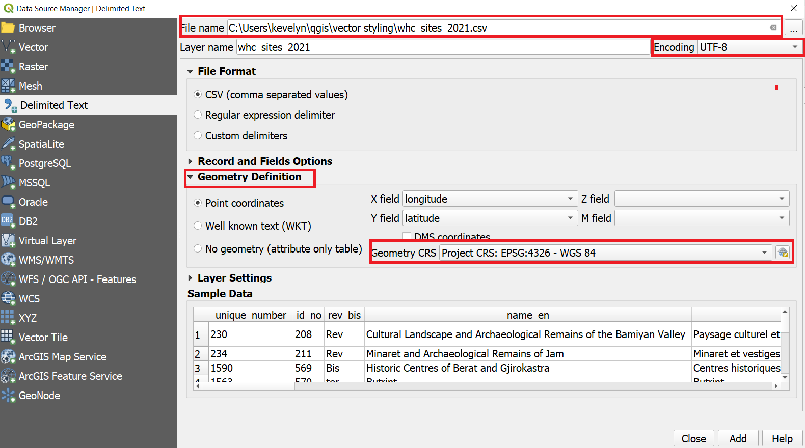
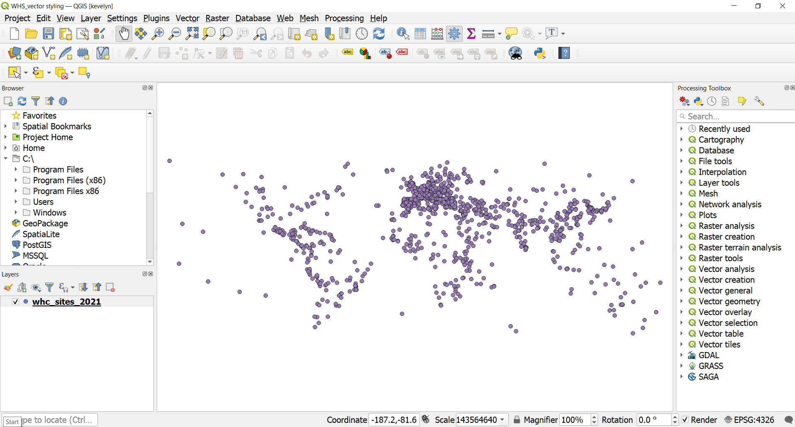
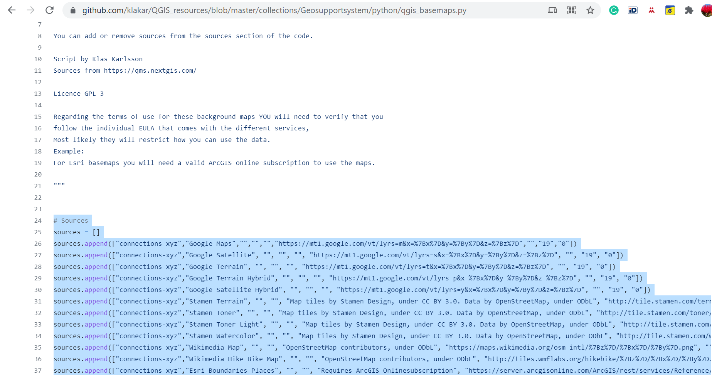
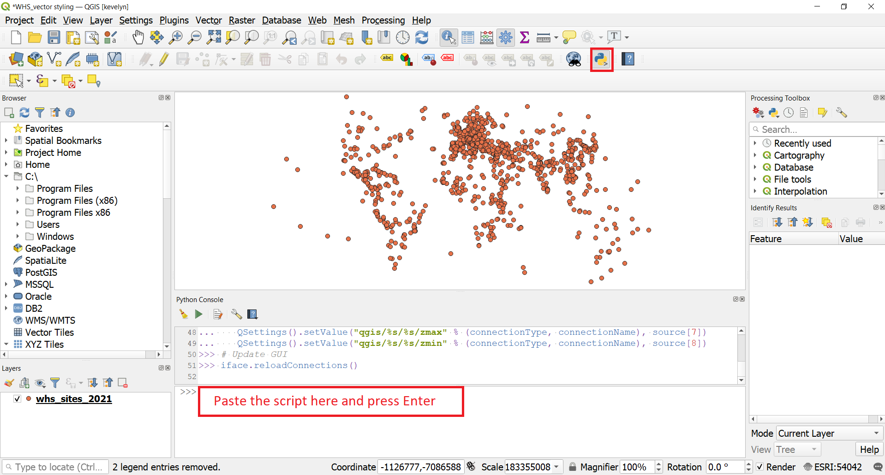
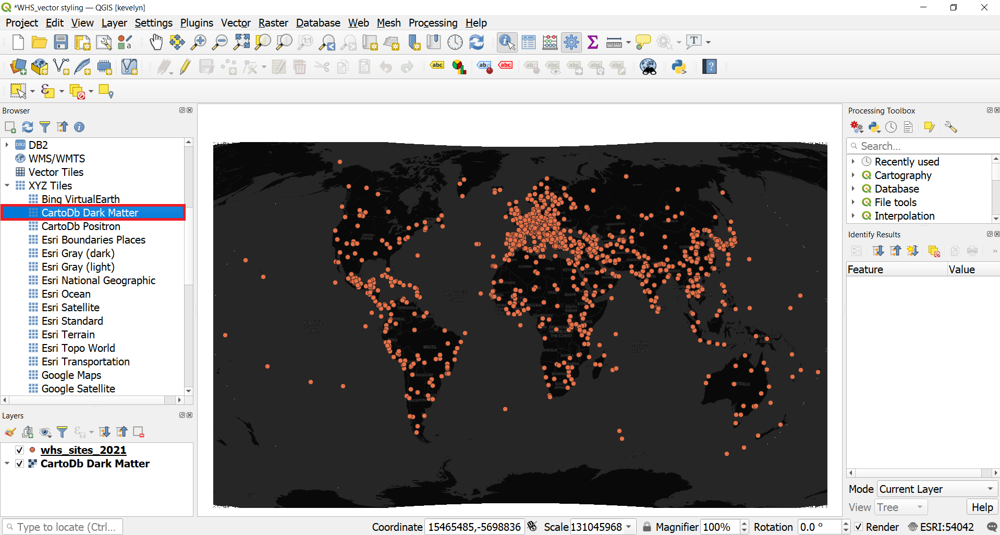

To create a map, one has to style the GIS data and present it in a form that is visually informative and also pleasing. There are a large number of options available in QGIS to apply different types of symbology to the underlying data. In this tutorial, we will take a text file and apply different data visualization techniques to highlight spatial patterns in the data.

#### The tutorial consists of the following steps:

### 1. Download data
In this tutorial we will use [UNESCO World Heritage Sites](http://whc.unesco.org/en/syndication). Scroll down and find World Heritage List in XLS format. Download the file and open in Excel. Save the file as csv-file `File ► Save As` and name it whc_sites_2021.csv and choose file type as CSV UTF-8 (Comma delimited).

For convenience, you may directly download a copy of dataset from the link below:
[vector_styling.zip](../../datasets/whc_sites_2021.csv)

Data Sources:
World Heritage List from [World Heritage List](http://whc.unesco.org/en/syndication) and base maps from [Klas Karlsson](https://github.com/klakar)

### 2. Procedure
#### 2.1. Add csv file to QGIS
1. Open QGIS and in the QGIS Browser Panel, locate the directory where you added the data. The World Heritage Sites (WHS) database is a CSV file, so we will need to import it. CSV-files are simple text files but if they have coordinates in them then they can be easily imported as spatial data. Click the Open Data Source Manager button  on the toolbar. You can also use `Ctrl + L` keyboard shortcut.
In the Data Source Manager window, switch to the Delimited Text tab. Click the … button next to File name and browse to the directory where the whc_sites_2021.csv file is and select it. QGIS will auto detect the delimiter if it is a comma. Expand the Geometry Definition. The X and Y have been recognised correctly by QGIS and also that the CRS is WGS84 (EPSG: 4326). Finally, click Add and close.

2. A new layer whc_sites_2021 will be added to the Layers panel and you will see the points representing the World Heritage Sites. Make right click on the layer name and `Export ► Save Features As...` and save it as whc_sites_2021.gpkg. You can remove the CSV layer whc_sites_2021.gpkg by right clicking on it and `Remove Layer`.

3. Change the CRS of the project to Winkel Tripel (ESRI:54042).

#### 2.2. Add base map
3. Lets add some base maps to our map.  Sometimes it is practical to use ready made stylised base maps instead of styling the base map yourself. [Klas Karlsson](https://github.com/klakar) has collated a nice collection of different basemaps which can be added by running a little Python script in QGIS. Open [qgis_basemaps.py](https://github.com/klakar/QGIS_resources/blob/master/collections/Geosupportsystem/python/qgis_basemaps.py) from GitHub. Select the script starting from # Sources and copy it (`Crtl+C`).

4. Go back to QGIS and open Python Console by clicking  on the toolbar. Python Console opens under the Map view. Paste the script to the console and click Enter on the keyboard. After this you may close the Python Console.

5. On the Browser Panel under XYZ tiles, a lot of new layers have appeared. These are the added base maps. Let's try some of them. Double-click on CartoDb Dark Matter and the base map is added to the map view. It covers the WHS points but in the Layer panel drag CartoDb Dark Matter under the whc_sites_2021

