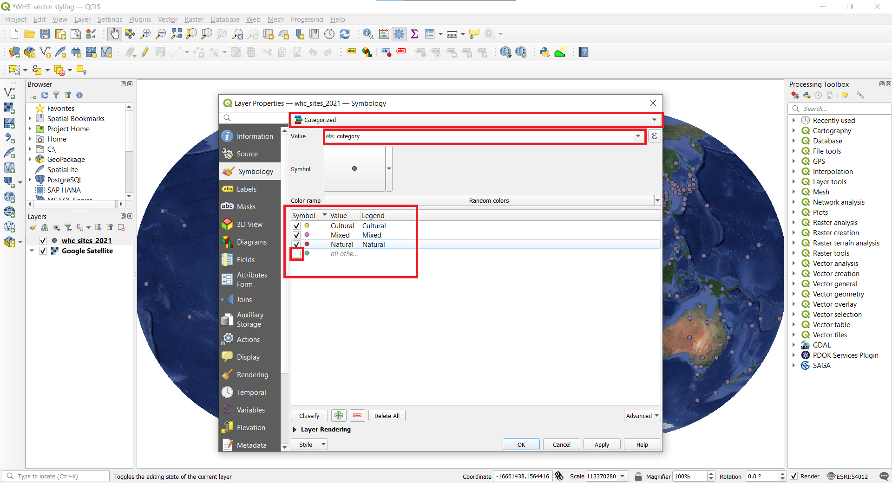
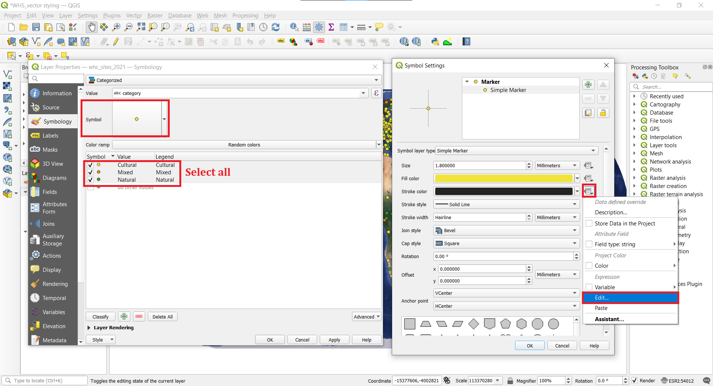

To create a map, one has to style the GIS data and present it in a form that is visually informative and also pleasing. There are a large number of options available in QGIS to apply different types of symbology to the underlying data. In this tutorial, we will take a text file and apply different data visualization techniques to highlight spatial patterns in the data.

#### The tutorial consists of the following steps:
- [1. Download data](#1-download-data)
- [2. Procedure](#2-procedure)
  * [2.1. Add csv file to QGIS](#21-add-csv-file-to-qgis)
  * [2.2. Add base maps](#22-add-base-maps)
  * [2.3. Categorized symbology](#23-categorized-symbology)
  * [2.4. Graduated symbology](#24-graduated-symbology)

### 1. Download data
In this tutorial we will use [UNESCO World Heritage Sites](http://whc.unesco.org/en/syndication). Scroll down and find World Heritage List in XLS format. Download the file and open in Excel. Save the file as csv-file `File ► Save As` and name it whc_sites_2021.csv and choose file type as CSV UTF-8 (Comma delimited).

For convenience, you may directly download a copy of dataset from the link below:
[vector_styling.zip](../../datasets/whc_sites_2021.csv)

Data Sources:
World Heritage List from [World Heritage List](http://whc.unesco.org/en/syndication) and base maps from [Klas Karlsson](https://github.com/klakar)

### 2. Procedure
#### 2.1. Add csv file to QGIS
1. Open QGIS and in the QGIS Browser Panel, locate the directory where you added the data. The World Heritage Sites (WHS) database is a CSV file, so we will need to import it. CSV-files are simple text files but if they have coordinates in them then they can be easily imported as spatial data. Click the Open Data Source Manager button  on the toolbar. You can also use `Ctrl + L` keyboard shortcut.
In the Data Source Manager window, switch to the Delimited Text tab. Click the … button next to File name and browse to the directory where the whc_sites_2021.csv file is and select it. QGIS will auto detect the delimiter if it is a comma. Expand the Geometry Definition. The X and Y have been recognised correctly by QGIS and also that the CRS is WGS84 (EPSG: 4326). Finally, click Add and close.

2. A new layer whc_sites_2021 will be added to the Layers panel and you will see the points representing the World Heritage Sites. Make right click on the layer name and `Export ► Save Features As...` and save it as whc_sites_2021.gpkg. You can remove the CSV layer whc_sites_2021.gpkg by right clicking on it and `Remove Layer`.

3. Change the CRS of the project to Winkel Tripel (ESRI:54042).

#### 2.2. Add base maps
3. Lets add some base maps to our map.  Sometimes it is practical to use ready made stylised base maps instead of styling the base map yourself. [Klas Karlsson](https://github.com/klakar) has collated a nice collection of different basemaps which can be added by running a little Python script in QGIS. Open [qgis_basemaps.py](https://github.com/klakar/QGIS_resources/blob/master/collections/Geosupportsystem/python/qgis_basemaps.py) from GitHub. Select the script starting from # Sources and copy it (`Crtl+C`).

4. Go back to QGIS and open Python Console by clicking  on the toolbar. Python Console opens under the Map view. Paste the script to the console and click Enter on the keyboard. After this you may close the Python Console.

5. On the Browser Panel under XYZ tiles, a lot of new layers have appeared. These are the added base maps. Let's try some of them. Double-click on CartoDb Dark Matter and the base map is added to the map view. It covers the WHS points but in the Layer panel drag CartoDb Dark Matter under the whc_sites_2021. Try also for example Google Satellite base map or more fun Stamen Watercolor. Explore some more base maps if you like but finally leave Stamen Watercolor as the map base map.

6. You might notice that the there are two New Zealands on the map. This is because the specific projection should not show rectangular shaped map but the base map is rectangular and it stretches/duplicates some areas. We can mask these areas out by creating a grid. From the Processing Toolbox find Create grid tool. For the Grid type choose rectangle, Grid extent: -180,180,-90,90 (whole world), Grid CRS choose WGS84 (EPSG: 4326) and horizontal and vertical spacing 10 degrees. Save the grid into a file global_grid.gpkg and click Run and Close.

7. You have now grid that is being projected into Winkel Tripel that is yoru project CRS. Let's make a mask from it by changing it's symbology. Double-click on global_grid in the Layer panel to open it's properties. Switch to Symbology. Change the Single Symbol to Inverted Polygons. Click on Simple Fill and change the Fill color to white and Stroke style No Pen and click OK.

8. You should now have nicely masked world and only one NZ. Time to stylize the heritage sites.

#### 2.3. Categorized symbology
Categorized symbology is for nominal data. Nominal data are purely descriptive and they don't provide any quantitative or numeric value. For example, land use and school types. It is not possible to rank nominal data e.g. bigger or smaller.
9. The whs_sites_2021 layer contains an attribute named **category** which indicates whether the heritage site is cultural, natural or mixed. We can create a style where each category is shown in a different color. Double-click the whs_sites_2021 layer to open Symbology. Change Single Symbol into Categorized.  Select **category** as the Value. Click Classify. Three categories appear  plus all others which don't have values. Click OK. Your map will be updated with three heritage sites' categories.

10. Let's make the size of the symbols more appropriate. Open Symbology and click on a Symbol sign. Reduce the size to 1.8. This will reduce the size of all categories.

11. Change the color of the categories to more appropriate. Open Symbology and click on the symbol in front of each category and change it for example, cultural to yellow, natural to green and mixed to orange.

12.  A useful cartographic technique is to choose a slightly darker version of the fill-color as the Stroke color. Rather than trying to pick that manually, QGIS provides an expression to control this more precisely. From the Symbology, select all the categories (hold Shift while mouse clicking). Then click the Symbol which will change the settings for all the categories. Under Symbol Settings, click Simple Marker and next to Stroke color click the Data defined override button  and choose `Edit`. Enter the following expression VALUES  darker(@symbol_color, 130)  to set the color to be 50% darker shade than the fill color and click OK. You will notice that the Data defined override button next to Stroke color has turned yellow - indicating than this property is controlled by an override.Click also Ok for the Symbol Settings tab and Symbology to apply all the changes. Note how the outline of the symbols changed.
>:scroll:**Note**
>
Expressions one of the most powerful features of QGIS. Expressions allow to manipulate attribute value, geometry and variables in order to dynamically change the geometry style, the content or position of the label, the value for diagram, the height of a layout item, select some features, create virtual field. Read more about expressions from [QGIS Documentation](https://docs.qgis.org/3.16/en/docs/user_manual/working_with_vector/expression.html?highlight=expression#expressions).

#### 2.4. Graduated symbology
