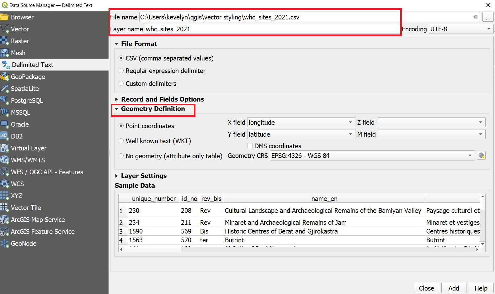

To create a map, one has to style the GIS data and present it in a form that is visually informative and also pleasing. There are a large number of options available in QGIS to apply different types of symbology to the underlying data. In this tutorial, we will take a text file and apply different data visualization techniques to highlight spatial patterns in the data.

#### The tutorial consists of the following steps:

### 1. Download data
In this tutorial we will use [UNESCO World Heritage Sites](http://whc.unesco.org/en/syndication). Scroll down and find World Heritage List in XLS format. Download the file and open in Excel. Save the file as csv-file `File ► Save As` and name it whc_sites_2021.csv and choose file type as CSV (Comma delimited).

For convenience, you may directly download a copy of dataset from the link below:
[vector_styling.zip](../../datasets/whc_sites_2021.csv)

Data Sources:
World Heritage List from [World Heritage List](http://whc.unesco.org/en/syndication) and base maps from [Klas Karlsson](https://github.com/klakar)

### 2. Procedure
#### 2.1. Add csv file to QGIS
1. Open QGIS and in the QGIS Browser Panel, locate the directory where you added the data. The World Heritage Sites (WHS) database is a CSV file, so we will need to import it. CSV-files are simple text files but if they have coordinates in them then they can be easily imported as spatial data. Click the Open Data Source Manager button  on the toolbar. You can also use `Ctrl + L` keyboard shortcut.
In the Data Source Manager window, switch to the Delimited Text tab. Click the … button next to File name and browse to the directory where the whc_sites_2021.csv file is and select it. QGIS will auto detect the delimiter if it is a comma. Default Encoding[^1] is UTF-8 which is most common, however, if you horizontally scroll the table below to **name_fr** then you notice that some symbols don't look right. That means that encoding is wrong. Unfortunately it is impossible to know what is the right encoding if there is no metadata. As the **name_en** seems correct then we'll leave it to UTF-8. Expand the Geometry Definition. The X and Y have been recognised correctly by QGIS, however, it does not have information on CRS. Change the Geometry CRS to WGS84 (EPSG: 4326) CRS to the default value of EPSG:4326 - WGS84. We can recognize the CRS based on the coordinates which are geographic and they are most commonly in WGS84. Finally, click Add and close.

[^1]: Character encoding is a way to convert text data into binary numbers. You can read more about character encoding from this [Medium article](https://medium.com/jspoint/introduction-to-character-encoding-3b9735f265a6#:~:text=A%20character%20encoding%20is%20a,characters%20based%20on%20their%20values.)
