A map is the most common output of GIS. This tutorial shows how to create a map from vector and raster data with standard map elements like map inset, grids, legend, north arrow, scale bar and labels.

#### The tutorial consists of the following steps:

- [1. Download data](#1-download-data)
- [2. Steps to make a map](#2-steps-to-make-a-map)
  * [2.1. Creating the main map](#21-creating-the-main-map)
  * [2.2. Creating an inset map](#22-creating-an-inset-map)
  * [2.3. Adding grid to the map](#23-adding-grid-to-the-map)
  * [2.4. Adding the north arrow, scale bar, map title and legend](#24-adding-the-north-arrow--scale-bar--map-title-and-legend)
  * [2.5. Adding legend to the map](#25-adding-legend-to-the-map)
  * [2.6. Exporting map as image](#26-exporting-map-as-image)
  * [2.6. Adding raster base map](#26-adding-raster-base-map)

### 1. Download data

We will use the Natural Earth dataset - specifically the Natural Earth Quick Start Kit that comes with beautifully styled global layers that can be loaded directly to QGIS.

Download the [Natural Earth Quickstart Kit](https://naciscdn.org/naturalearth/packages/Natural_Earth_quick_start.zip). If the download link doesn’t work, get it directly from Natural Earth Downloads page.

**Data Sources:** [Natural Earth](https://www.naturalearthdata.com/)

### 2. Steps to make a map
#### 2.1. Creating the main map
1. Download and extract the Natural Earth Quick Start Kit data. Open QGIS. Locate the Natural_Earth_quick_start folder in the Browser panel. Expand the folder to locate the Natural_Earth_quick_start_for_QGIS_v3 project. This is the project file that contains styled layers in QGIS Document format. Double-click the project to open it.

2. The state of your QGIS session is called a project. QGIS works on one project at a time.  Please save your project `Project ► Save as` into your folder. The information saved in a project file includes added layers, layer properties and symbology, projection of the map view, print layouts etc. Read more about QGIS project from [QGIS Documentation](https://docs.qgis.org/testing/en/docs/user_manual/introduction/project_files.html#).
3. You may notice that the map labels are in Greek. This project uses variables to set the language.  We can change the variables by going to `Project ► Properties`. Switch to the `Variables` tab in the `Project Properties` dialog. Locate the **project_language** variable and change the language to name_en and click OK. The place names should now switch to English. If they do not then click the Refresh button  in the toolbar. 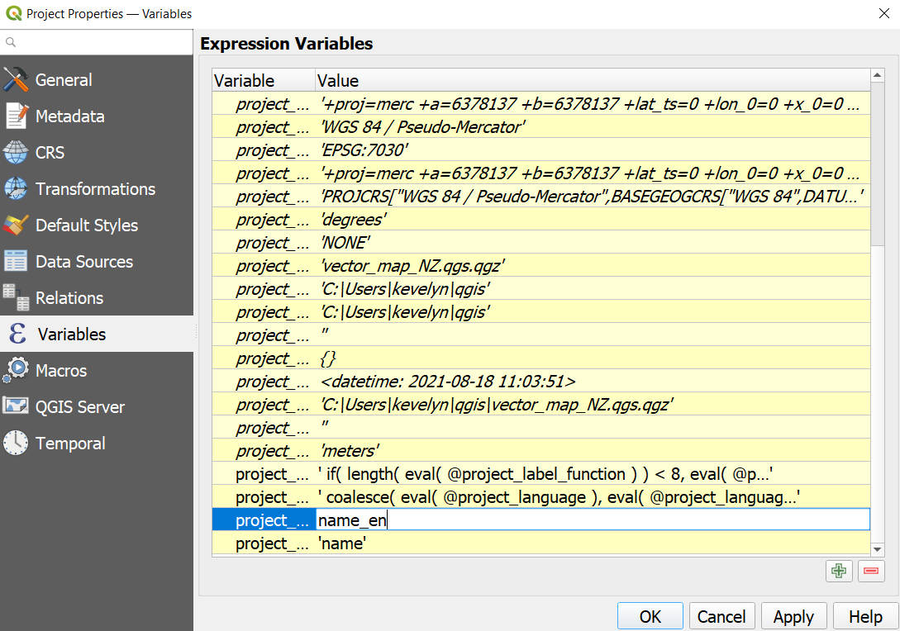
4. The attribute table of ne_10m_populated_places contains place names in multiple languages and therefore you can use variables to create a map in several language. Open the attribute table of ne_10m_populated_places by making a right click on the layer name choose `Open Attribute Table`. Find in the table variables **name_en** and **name_el**. Place names are generated automatically to the map based on these variables. 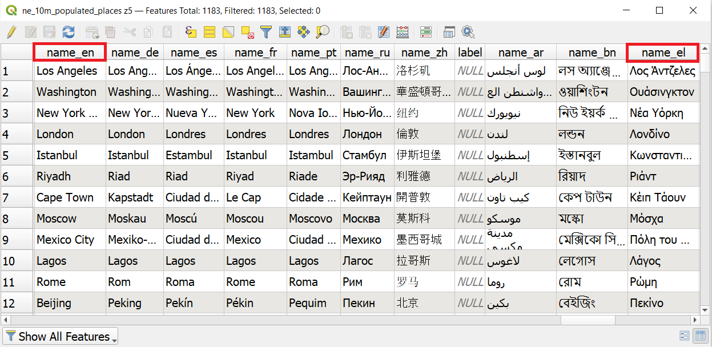
5. Use the pan and zoom controls in the Map Navigation Toolbar and zoom to New Zealand. You can see that the map kind of ends half way in the map view. This is because of the date line. The map extent specified to end there, however, it is possible to re-define the map center line and therefore also the western-most and eastern-most borders. 
6. Before we make a map suitable for printing, we need to choose an appropriate projection from the Status bar in the lower right corner . The default CRS for the project is set to EPSG:3857 [^1] Pseudo-Mercator. This CRS is popularly used for web mapping and is a decent choice for our purpose, so we can leave it to its default value. The New Zealand's official geodetic datum for New Zealand and its offshore islands is [NZGD2000](https://www.linz.govt.nz/data/geodetic-system/datums-projections-and-heights/geodetic-datums/new-zealand-geodetic-datum-2000-nzgd2000) and if you are working for a smaller region in NZ, using this CRS will be better.
7. For creating a new map layout, go to `Project ► New Print Layout` or alternatively click on the Show Layout Manager 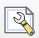. Create a new layout and named it appropriately (for example, "NZ map"). 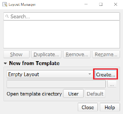
8. Now we have "canvas" where can add the map from the map view. Before doing that, we should change the layout from landscape to portrait as NZ is rather north-south stretched country. Right-click on the canvas and then `Page Properties` opens page properties panel on the right side where you can change the page orientation from Landscape to Portrait. 
9. To add the map to the layout, choose from the menu `Add Item  ► Add Map` or alternatively click  which makes the Add map mode active. Hold the left mouse button and drag a rectangle where you want to insert the map. Currently we would add to the whole layout, therefore, draw full page.
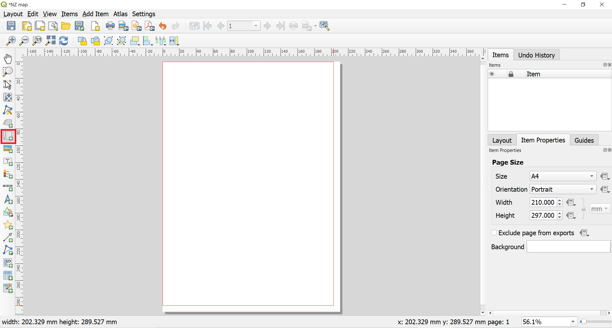
10. You will see that the rectangle window will be rendered with the map from the main QGIS Map view. The rendered map may not be covering the full extent of our interest area if you did not draw the full extent of the canvas. Use `Edit ‣ Select/Move item and Edit ‣ Move Content` from the menu or alternatively 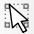 and  to pan the map in the window and center it in the composer. To adjust the zoom level, click on the Item Properties tab and enter 8500000 as the Scale value. Alternatively, you can also click on  and use mouse scroll-in to zoom in, however, this is not very convenient. 
11. The initial project has layer group for the scale of 1 to 18 million switched on in the layer panel. As we set our scale to less than 1 million in the previous scale then we should change the layer visibility in the main map menu. Switch back to the map view and switch off the visibility of the z5 - 1:18m and switch on the visibility of z5 - 1:4m. The map rendering might take a while. Switch back to the Layout view and click refresh  in the map's Item properties panel.
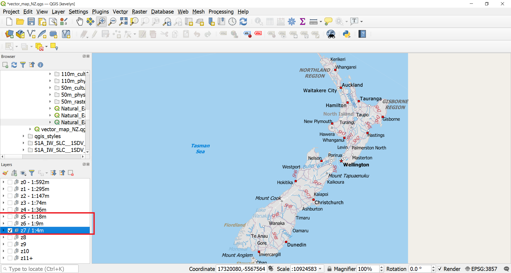

#### 2.2. Creating an inset map
12. Now we will add a map inset[^2] that shows New Zealand's location in the world. Before we make any changes to the layers in the main QGIS window, check the Lock layers and Lock styles for layers boxes. This will ensure that if we turn off some layers or change their styles, this view will not change. 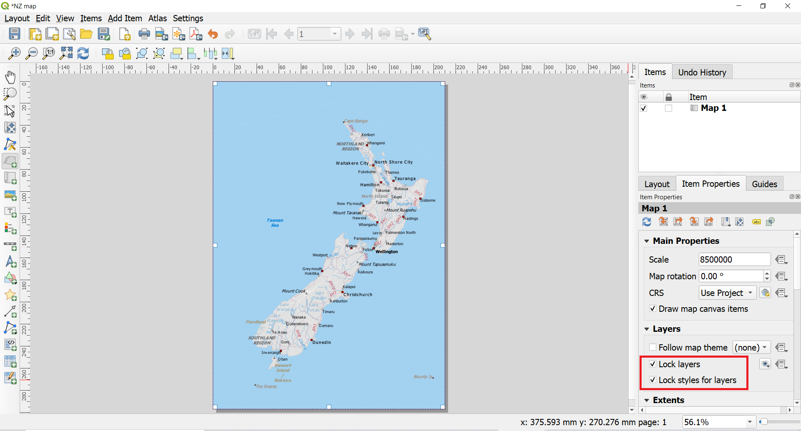
13. To add the inset map, click  which makes the Add map mode active. Draw an rectangle to the upper left corner of the map or whereever you would like to add the inset. You will now notice that we have 2 map objects in the Print Layout. When making changes, make sure you have the correct map selected. You can also change the name of Map 2 to Inset map if making a double click on the name.
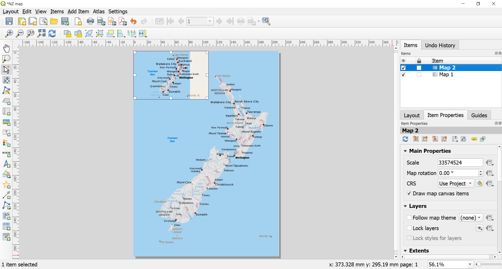
14. The level of detail for the inset map is too high and we should once more change the layer visibility in the Map view. Switch to Map view and switch off the visibility of the z5 - 1:4m and switch on the visibility of z0 - 1:592m. Change the zoom level so that the whole world is visible by using Pan/Zoom In and Out/Zoom Full options. Finally switch back to the Layout view. Refresh the inset map view and it should change.

16. The current main map and the inset have the same CRS (Pseudo-Mercator) which for global maps is not really suitable because it distorts the areas close to poles. Therefore we use more suitable CRS called Winkel Tripel (EPSG 54042) which is also known as National Geographic projection. Winkel Tripel is minimal error projection which means that it tries to minimize all types of map distortion (area, shape, angle, distances) and it looks aesthetically pleasing. Click on the Select CRS button  on the Item properties panel of the inset map. Coordinate Referrence System Selector panel will open. Uncheck the option "Use Project CRS" and type EPSG code 54042 into Filter field. This should find Winkel Tripel. Click on World_Winkel_Tripel_NGS and then OK. This should switch the inset map's CRS to Winkel Tripel.

15. You might need to adjust the zoom level of the inset map and you can use Select/Move  and Move Content  to pan the map in the window and center it in the composer. You can also change the size of the inset map.
16. To make more clear visual separation between the main map and inset map, we can add frame around the inset map. Select the Map 2 (inset map) object from the Items panel. Select the Item properties tab. Scroll down to the Frame panel and check the box next to it. You can change the color and thickness of the frame border so it is easy to distinguish against the map background.
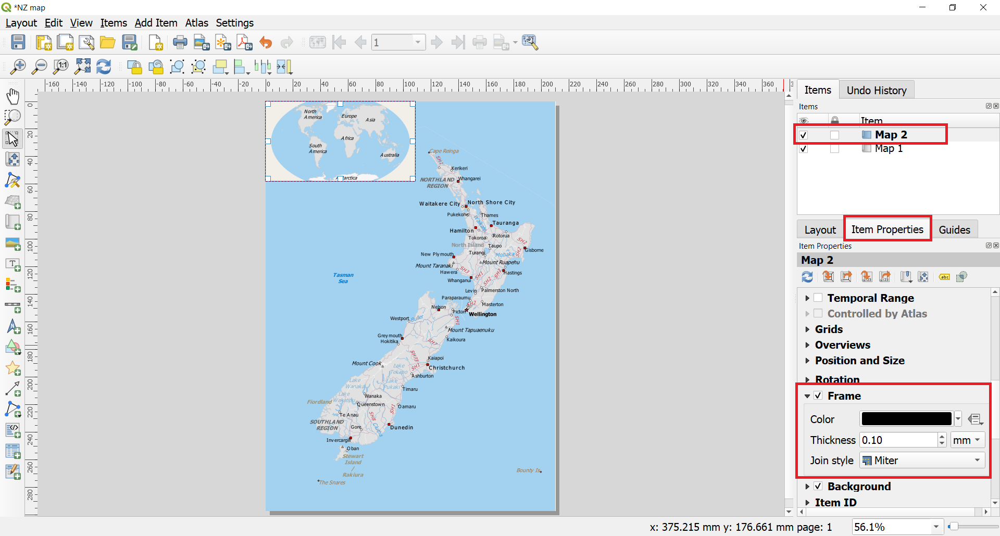
17. One neat feature of the Print Layout is that it can automatically highlight the area of the main map in the inset map (and also vice versa). Select the Map 2 object from the Items panel. In the Item properties tab, scroll down to the Overviews section. Click the Add a new overview button. Select Map 1 as the Map Frame. This tells the Print Layout to highlight the current object Map 2 with the extent of the map shown in the Map 1 object.
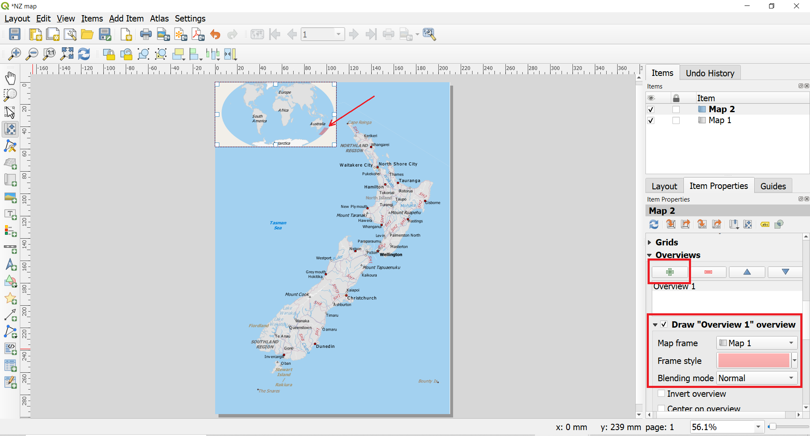

#### 2.3. Adding grid to the map
18. Now that we have the map inset ready, we will add a grid to the main map. Select the Map 1 object from the Items panel. In the Item properties tab, scroll down to the Grids section. Click the Add a new grid button and then Modify grid….
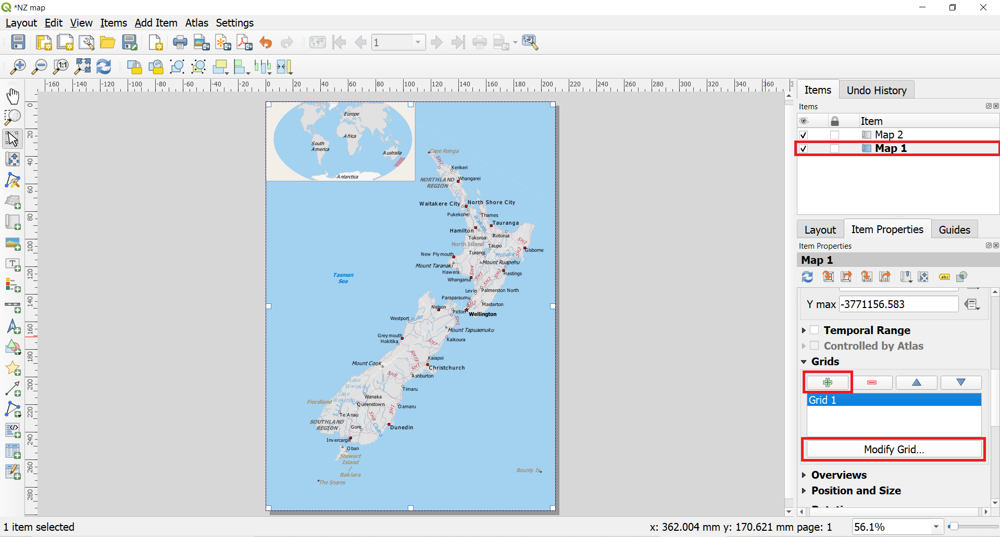
19. By default, the grid lines use the same units and projection as the currently selected map. However, for small scale maps (1:2 000 000 – 1:∞)[^3] it is more common and useful to display grid lines in degrees. We can select a different CRS for the grid. Click on the Select CRS button 

20. In the Coordinate Reference System Selector dialog, uncheck the option "Use Map CRS" and enter 4326 in the Filter box. From the results, select the WGS84 EPSG:4326 as the CRS. Click OK.

21. Select the Interval values as 5 degrees in both X and Y direction. You can adjust the Offset to change where the grid lines appear. You might also want to change the line style of the grid lines. You can do that by clicking on the line next to the Line style. You can change the color and the thickness of the lines. Currently, it might be good idea to reduce the line width to 0.1 because with the default line style the grid is a bit too overpowering.

22. Scroll down to the Grid frame section and check the Draw coordinates box. The default format is Degrees but it appears as a number. We can change this to Decimal with Suffic under Format. Then you can bring the coordinates inside the frame and rotate them into appropriate direction. You can also change the font of the coordinates if you like. As our grid lines are full degrees then there is no need to show so high coordinate precision and you can change this to 1.

#### 2.4. Adding the north arrow, scale bar, map title and legend
23. First, we'll add a rectangluar frame to hold the map elements (north arrow, scale and label). Go to `Add Item ► Add Shape ► Add Rectangle` or alternatively use Add shape button  and draw a rectangle. Note that new item called Rectangle 1 appears in the Item list panel. You can change the Style of the rectangle to match the map background by clicking on the Style button under Item properties panel.

24. Now we will add a North Arrow to the map. QGIS comes with a nice collection of North Arrows. Click `Add Item ► Add North Arrow` or alternatively click Add North Arrow . Holding your left mouse button, draw a rectangle. On the right-hand panel, click on the Item Properties tab then click arrows and choose the arrow style to your liking.
>**Tip** :smirk:
>
*QGIS north arrows are SVG images and you may add new images from external sources or design your own north arrow. Read more about picture and north arrow items as SVG images in QGIS from [QGIS Documentation](https://docs.qgis.org/3.16/en/docs/user_manual/print_composer/composer_items/composer_image.html?highlight=north%20arrow#the-picture-and-the-north-arrow-items)*

25. Add title to your map by `Add Item ► Add Label` or alternatively click . Click on the map and draw a box where the label should be. In the Item Properties tab, expand the Label section and enter a label for the map, and increase the font size and change the font type if needed.

26. Similarly to previous step, add the information about the map projection, credits for the data, software and map design.
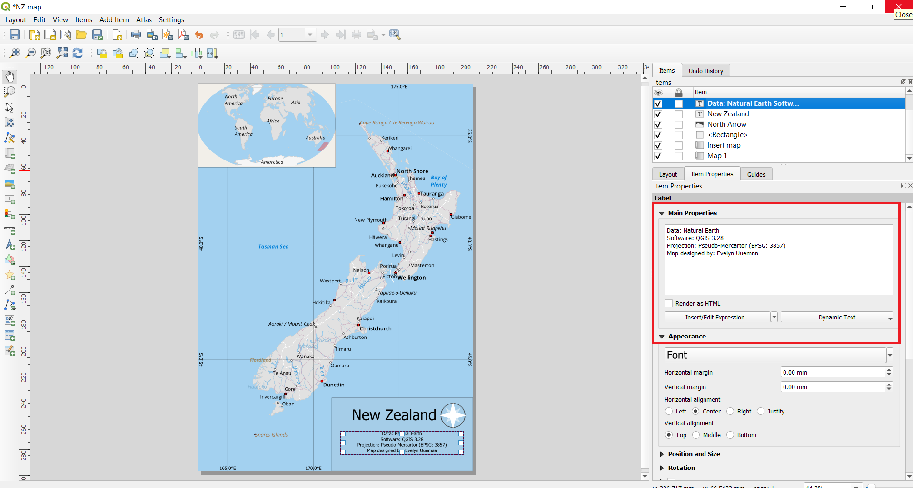
27. Lets add scale bar to the map. Click on `Add Item ► Add Scalebar` or alternatively click on Add Scale Bar . Click on the layout where you want the scalebar to appear. In the Item Properties tab, make sure you have chosen the correct map element Map 1 for which to display the scalebar. Choose the Style that fit your requirement. In the Segments panel, change the Fixed width to 150 units and adjust the segments to your liking. It is possible to adjust many properties of the scale bar. Read more about designing and adjusting scale bar properties from [QGIS Documentation](https://docs.qgis.org/3.16/en/docs/user_manual/print_composer/composer_items/composer_scale_bar.html?highlight=scale%20bar#the-scale-bar-item).

#### 2.5. Adding legend to the map
28. Finally, we will add legend to the map. Click on `Add Item ► Add Legend` or alternatively click on Add Legend
. Click on the layout where you want the scalebar to appear and holding left-side mouse button draw a rectangle. The legend should appear and it will cover most of the map as it is pulling automatically the legend info from all the layers in the Map view. We need to switch off most of the layers from the legend. In the Item Properties tab, scroll down to Legend items and uncheck the Auto update  under the Legend items. This will disconnect the legend from the map view layer panel and several legend adjustment buttons will become active.

29. We will first remove all the unnecessary layers from the legend. Under the Legend items, select all layers except z7 / 1:4 and click Remove selected item(s) from legend.

30. For the simplicity, we will show only cities and other populated places in the legend. Therefore we will delete all other sublayers of the z7 / 1:4. Click on the small arrow next to the layer group name under Legend items. This should reveal sublayers of the group. Delete all sublayers of the z7 / 1:4 except layer ne_10m_populated_places z5 copy copy copy

31. Click on the small arrow in front of the layer ne_10m_populated_places z5 copy copy copy to see all of its sublayers. Delete all sublayers except Admin-0 capital, Admin-1 capital, Populated place.

32. We will now change the names of the legend items more appropriate. Double click on the z7 / 1:4m and delete the text and just enter space. The QGIS won't accept leaving the place empty but as we don't need text there then entering space will allow it to keep seemingly empty.
.
33. Delete also the layer name of ne_10m_populated_places z5 copy copy copy similarly to previous step.
34. Rename layer name Admin-0 capital to Capital city, layer name Admin-1 capital to  Administrative unit capital.

35. Because of deleting some of the layer names, there is too much white space on the top of the legend. We will remove this by using Spacing options under Legend properties. Scroll down in the Legend Item properties tab to Spacing. Open it's options by clicking on a small arrow next to it. Change the value of Legend Title ‣ Space below to zero and Subgroups ‣ Above subgroup also zero. Note while doing that how the legend changes.

36. We will add a title to the legend. Click `Add Item ► Add Label` or alternatively click on Add Label  and while holding left-side mouse button draw a label box to the legend. Rename it to "Legend"

37. Finally, we will make the legend background more fitting with the map. In the legend's Item Properties tab scroll down to Background and click on the color option. In the color options scroll down to Opacity and reduce the opacity to 35%. This will make the legend background partially transparent making it less dominant. The map elements like legend, title, north arrow should not be too dominant on the map itself is the most important.

#### 2.6. Exporting map as image
38. Once you are satisfied with the map, you can export it as an Image, PDF or SVG. For this tutorial, let’s export it as an image. `Click Layout ► Export as Image`. Give the file a suitable name and under the Image Export Options make sure that the Export resolution is 300 dpi. 300 dpi is minimal required resolution for printing. If you want to publish the map in the we, then you may reduce the resolution to 150 to 200 dpi, however, if you are not sure about the usage then keep 300 dpi because it is a pity if you design a nice map but nobody can read it because of poor resolution.

39. Congratulations! You have made your first map! :smile:

#### 2.6. Adding raster base map
40. Natural Earth has also beautifully stylized land cover in raster format that is often very practical to use as background map. The Natural Earth Quickstart Kit has 1:50m raster included. However, our New Zealand map is in 1:1m and therefore Natural Earth 1:10m would be more appropriate scale. Download "Natural Earth I with Shaded Relief and Water" from the [Natural Earth site](https://www.naturalearthdata.com/downloads/10m-raster-data/10m-natural-earth-1/). There are two sizes available. Large size is recommended but if your internet connection is not very good or you don't have much free memory on your computer, then medium size would also do.  Extract the files to your working folder. Before the next step make sure that in the Layout view, your both maps have locked layers, so that the layout maps would not change if you change the maps in the map view.
41. In the Layer panel make visible only z7 / 1:4m layer group and all the others should be invisible. In the Browser panel, navigate to the folder where you have your downloaded raster NE1_HR_LC_SR_W.tif and drag it to your map view.

42. In the Layer panel move the NE1_HR_LC_SR_W layer downward between the ne_10m_admin_0_countries and ne_10m_admin_0_disputed_areas. Then the raster does not cover roads, rivers and other features.

43. You may notice that only half of the New Zealand is covered by the added raster. This is because the Pseudo-Mercator projection does not project the map properly and splits half of the NZ to the other hemisphere. The easiest solution to this is to switch the CRS to WGS84 (EPSG:4326)[^4]. Switch back to Layout view and select the main map object. Switch the CRS to WGS84 and unlock the layers. Your map should automatically redraw. If it does not, then click refresh button .
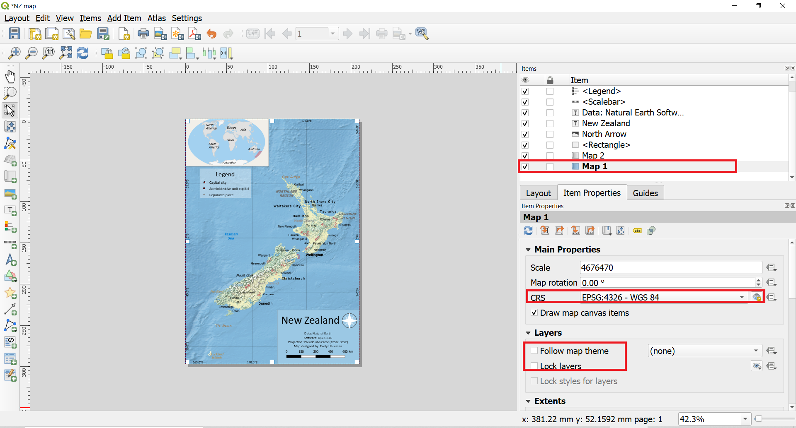
44. You might need to adjust the scale and pan the map into more appropriate position.

45. You might notice that highway labels are too overpowering on the map. We can switch them off. Go back to the map view and from the Layer panel find layer roads copy copy copy. Double-click on it to open the Properies. Switch to Labels tab and switch off the label rule.

46. Go back to the Layout view and refresh your map. Your map is ready for export.

[^1]: EPSG Geodetic Parameter Dataset (also EPSG registry) is a public registry of geodetic datums, spatial reference systems, Earth ellipsoids, coordinate transformations and related units of measurement.  Each entity is assigned an EPSG code between 1024-32767, along with a standard machine-readable well-known text (WKT) representation. (Wiki) The EPSG codes are unique and they are very useful to use for searching and identifying the CRS-s in GIS programmes.
[^2]: An inset map is a smaller map featured on the same page as the main map (GIS Wiki)
[^3]: A map is classified as small scale or large scale or sometimes medium scale. Large scale maps are usually 1:0 – 1:600 000 and represent for example town. Medium scale maps are usually 1:600 000 – 1:2 000 000 and mostly a whole country maps are in this range. Small scale maps are 1:2 000 000 – 1:∞ and world or regions are mapped in this scale. (Wiki)
[^4]: WGS84 is actually geographic CRS and is not projected, but as we still need to see it in 2D on the computer screen then QGIS uses Plate Carree projection to visualize WGS84 CRS.
