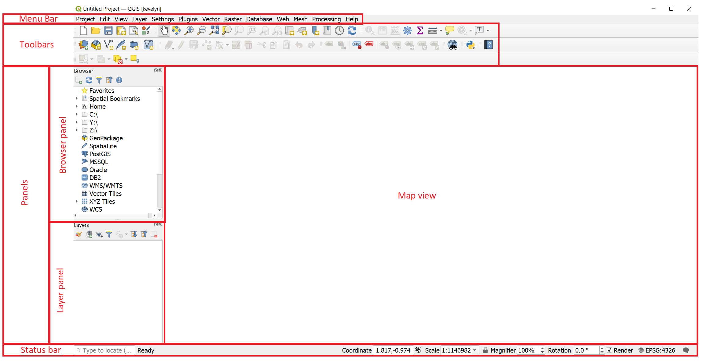
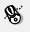
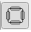

QGIS is a popular free and open-source Geographic Information System (GIS) with advanced capabilities. Gary Sherman began development of Quantum GIS in early 2002, and it became an incubator project of the Open Source Geospatial Foundation in 2007. Version 1.0 was released in January 2009. In 2013, along with release of version 2.0 the name was officially changed from Quantum GIS to QGIS to avoid confusion as both names had been used in parallel. (Wiki)

The following tutorials are an introduction to using QGIS (and also GIS in general) for those who have not been before working with QGIS. The tutorials are designed for introductory course in QGIS for the students who enter start studying GIS in University of Tartu. You may use these tutorials as a self-paced course to learn the software.

#### License and terms of usage
The materials are partially based on Ujaval Gandhi's [QGIS Tutorials and Tips](https://www.qgistutorials.com/en/docs/introduction.html) and [QGIS Desktop User Guide](https://docs.qgis.org/testing/en/docs/user_manual/index.html), under CC-BY-SA. If you wish to modify the materials, we wish that you would also share your materials openly e.g. on GitHub where everyone could benefit from you work, in a similar manner as we provide these materials for you.
In consequence, we also share our revised materials under CC-BY-SA.
Under this license, you are free to:
+ **Share** - copy and redistribute the material in any medium or format
+ **Adapt** - remix, transform, and build upon the material

You only **need to give appropriate credit to the author** for the original work.

#### The tutorial consists of the following steps:

- [1. Installation](#1-installation)
- [2. Course pre-work](#2-course-pre-work)
- [4. Folder preparation](#4-folder-preparation)
- [5. Graphical user interface](#5-graphical-user-interface)

### 1. Installation
**These tutorials are made with QGIS version 3.16 for Windows** and therefore it is the easiest to follow them in version 3.16 and on a PC.

### 2. Course pre-work
If you do not have any previous experience with GIS then you need to get a understanding of basic GIS concepts and spatial data before following the tutorials. There is a great video [A practical introduction to GIS](https://www.youtube.com/watch?v=yfLjnK569XY) made by Ujaval Gandhi from [Spatial Thoughts](https://spatialthoughts.com/) that you can watch to gain basic understanding about GIS.

### 4. Folder preparation
Create a working folder in Windows File Explorer where you will keep all the files of this course. Please do not use spaces nor umlauts in your folder nor file names.

### 5. Graphical user interface
Open QGIS in your computer and you should be seeing similar view as below.

**The Menu bar** provides access to QGIS functions using standard hierarchical menus.

**The Toolbars** provide access to most of the functions in the menus, plus additional tools for interacting with the map. Each toolbar item has pop-up help available. Hover your mouse over the item and a short description of the tool’s purpose will be displayed. Every toolbar can be moved around according to your needs. Additionally, they can be switched off using the right mouse button context menu, or by holding the mouse over the toolbars.

**The Browser panel** is for browsing, searching, inspecting, copying and loading QGIS resources. Only resources that QGIS knows how to handle are shown in the browser. Using the Browser panel you can locate, inspect and add data to your project.

**The Layer panel** (also called the map legend) lists all the layers in the project and helps you manage their visibility. A layer can be selected and dragged up or down in the legend to change the Z-ordering. Z-ordering means that layers listed nearer the top of the legend are drawn over layers listed lower down in the legend.

>**Tip** :smirk:
>
*From the `View` menu, you can switch QGIS widgets (`Panels ►`) and toolbars (`Toolbars ►`) on and off. To (de)activate any of them, right-click the menu bar or toolbar and choose the item you want. Panels and toolbars can be moved and placed wherever you like within the QGIS interface.*

**The Map view** (also called Map canvas) is the “business end” of QGIS — maps are displayed in this area, in 2D. The map displayed in this window will reflect the rendering (symbology, labeling, visibilities…) you applied to the layers you have loaded. It also depends on the layers and the project’s Coordinate Reference System (CRS).

>**Tip** :smirk:
>
>*By default, QGIS opens a single map view, which is tightly bound to the Layers panel; the main map automatically reflects the changes you do in the Layers panel area. But it is also possible to open additional map views whose content could diverge from the Layers panel current state. They can be of 2D or 3D type, show different scale or extent, or display a different set of the loaded layers thanks to map themes. Read more about setting up additional Map view from [QGIS Documentation](https://docs.qgis.org/3.16/en/docs/user_manual/introduction/qgis_gui.html#setting-additional-map-views)*

**The Status bar** provides you with general information about the map view and processed or available actions, and offers you tools to manage the map view.

The  `Coordinate` option shows the current position of the mouse, following it while moving across the map view. You can set the units (and precision) in the `Project ► Properties… ► General tab`. Click on the small button at the left of the textbox to toggle between the `Coordinate` option and the  `Extents` option that displays the coordinates of the current bottom-left and top-right corners of the map view in map units.

Next to the coordinate display you will find the `Scale` display which shows the scale of the map view. On the right side of the scale display, press the  button to lock the scale to use the magnifier to zoom in or out.

On the right side of the status bar, there is a small checkbox which can be used temporarily to prevent layers being rendered to the map view. Switching rendering off is sometimes useful when your data layers are very large and rendering takes long time. Read more about Rendering in [QGIS Documentation](https://docs.qgis.org/3.16/en/docs/user_manual/introduction/general_tools.html#rendering).

> **Tip** :smirk:
>
>*You can also set up your personal user profile in QGIS. A user profile is a unified application configuration that allows to store all the global settings, GUI configurations and customization, installed plugins and their configurations, project templates, processing settings etc. You can create your user profile under `Settings ► User Profiles`. Read more about User Profiles from [QGIS Documentation](https://docs.qgis.org/testing/en/docs/user_manual/introduction/project_files.html#introducing-qgis-projects)*
