To create a map, one has to style the GIS data and present it in a form that is visually informative and also pleasing. There are a large number of options available in QGIS to apply different types of symbology to the underlying data. In this tutorial, we will take a text file and apply different data visualization techniques to highlight spatial patterns in the data. 

#### The tutorial consists of the following steps:
- [1. Download data](#1-download-data)
- [2. Procedure](#2-procedure)
  * [2.1. Add csv file to QGIS](#21-add-csv-file-to-qgis)
  * [2.2. Add base maps](#22-add-base-maps)
  * [2.3. Categorized symbology](#23-categorized-symbology)
  * [2.4. Graduated symbology](#24-graduated-symbology)

### 1. Download data
In this tutorial we will use [UNESCO World Heritage Sites](http://whc.unesco.org/en/syndication). Scroll down and find World Heritage List in XLS format. Download the file and open in Excel. Save the file as csv-file `File ► Save As` and name it whc_sites_2021.csv and choose file type as CSV UTF-8 (Comma delimited).

For convenience, you may directly download a copy of dataset from the link below:
[vector_styling.zip](../../datasets/whc_sites_2021.csv)

**Data Sources:**
World Heritage List from [World Heritage List](http://whc.unesco.org/en/syndication) and base maps from [Klas Karlsson](https://github.com/klakar)

### 2. Procedure
#### 2.1. Add csv file to QGIS
1. Open QGIS and in the QGIS Browser Panel, locate the directory where you added the data. The UNESCO World Heritage Centre (WHC) sites database is a CSV file, so we will need to import it. CSV-files are simple text files but if they have coordinates in them then they can be easily imported as spatial data. Click the Open Data Source Manager button  on the toolbar. You can also use `Ctrl + L` keyboard shortcut.
In the Data Source Manager window, switch to the Delimited Text tab. Click the … button next to File name and browse to the directory where the whc_sites_2021.csv file is and select it. QGIS will auto detect the delimiter if it is a comma. Expand the Geometry Definition. The X and Y have been recognised correctly by QGIS and also that the CRS is WGS84 (EPSG: 4326). If not, then make the changes as shown in the picture. Finally, click Add and close.

2. A new layer whc_sites_2021 will be added to the Layers panel and you will see the points representing the World Heritage Sites. Make right click on the layer name and `Export ► Save Features As...` and save it as whc_sites_2021.gpkg. You can remove the CSV layer whc_sites_2021.csv by right clicking on it and `Remove Layer`.
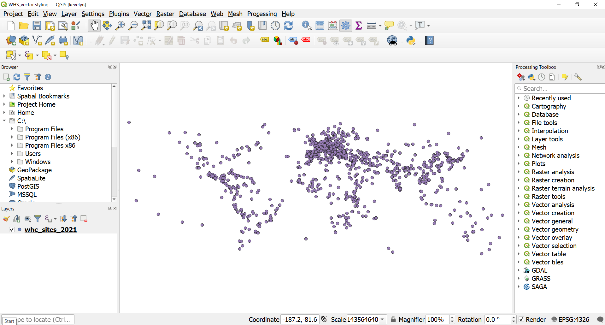
3. Change the CRS of the project to Winkel Tripel (ESRI:54042) and save your project.

#### 2.2. Add base maps
3. Lets add some base maps to our map.  Sometimes it is practical to use ready made stylised base maps instead of styling the base map yourself. [Klas Karlsson](https://github.com/klakar) has collated a nice collection of different basemaps which can be added by running a little Python script in QGIS. Open [qgis_basemaps.py](https://github.com/klakar/QGIS_resources/blob/master/collections/Geosupportsystem/python/qgis_basemaps.py) from GitHub. Select the script starting from # Sources and copy it (`Crtl+C`).
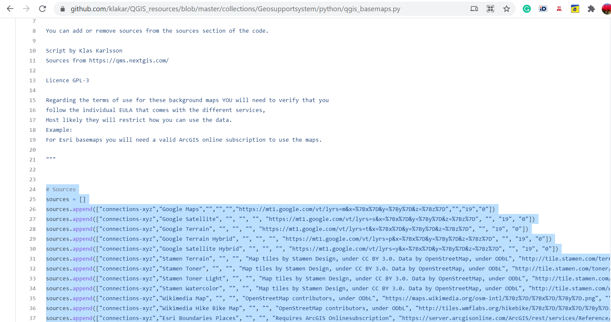
4. Go back to QGIS and open Python Console by clicking  on the toolbar. Python Console opens under the Map view. Paste the script to the console and click Enter on the keyboard. After this you may close the Python Console.

5. On the Browser Panel under XYZ tiles, a lot of new layers have appeared. These are the added base maps. Let's try some of them. Double-click on CartoDb Dark Matter and the base map is added to the map view. It covers the WHC sites but in the Layer panel drag CartoDb Dark Matter under the whc_sites_2021. Try also for example Google Satellite base map or more fun Stamen Watercolor. Explore some more base maps if you like but finally leave Stamen Watercolor as the map base map.
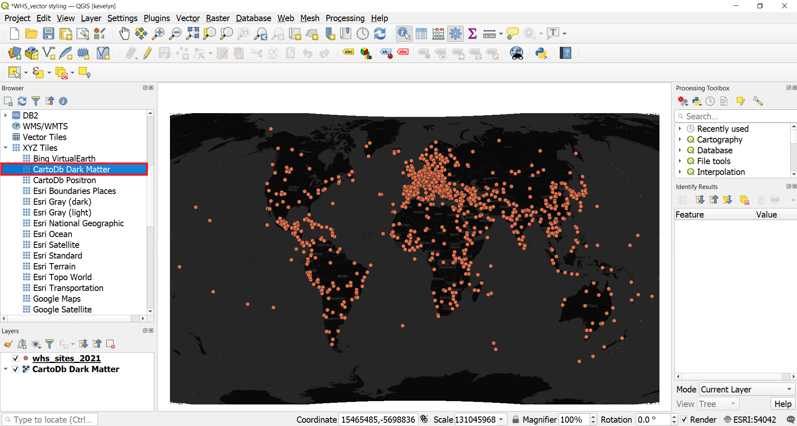
6. You might notice that the there are two New Zealands on the map. This is because the specific projection should not show rectangular shaped map but the base map is rectangular and it stretches/duplicates some areas. We can mask these areas out by creating a grid. From the Processing Toolbox find Create grid tool. For the Grid type choose rectangle, Grid extent: -180,180,-90,90 (whole world), Grid CRS choose WGS84 (EPSG: 4326) and horizontal and vertical spacing 10 degrees. Save the grid into a file global_grid.gpkg and click Run and Close.

7. You have now grid that is being projected into Winkel Tripel that is your project CRS. Let's make a mask from it by changing it's symbology. Double-click on global_grid in the Layer panel to open it's properties. Switch to Symbology. Change the Single Symbol to Inverted Polygons. Click on Simple Fill and change the Fill color to white and Stroke style No Pen and click OK.

8. You should now have nicely masked world and only one NZ. Time to stylize the heritage sites.
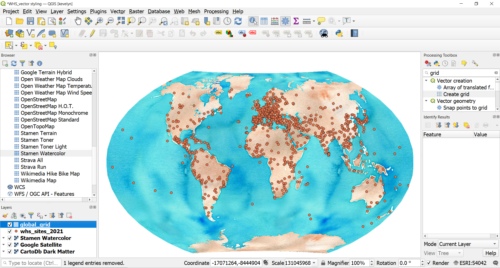

#### 2.3. Categorized symbology
Categorized symbology is for nominal data. Nominal data are purely descriptive and they don't provide any quantitative or numeric value. For example, land use and school types. It is not possible to rank nominal data e.g. bigger or smaller.
9. The whc_sites_2021 layer contains an attribute named **category** which indicates whether the heritage site is cultural, natural or mixed. We can create a style where each category is shown in a different color. Double-click the whc_sites_2021 layer to open Symbology. Change Single Symbol into Categorized.  Select **category** as the Value. Click Classify. Three categories appear  plus all others which don't have values. Click OK. Your map will be updated with three heritage sites' categories.

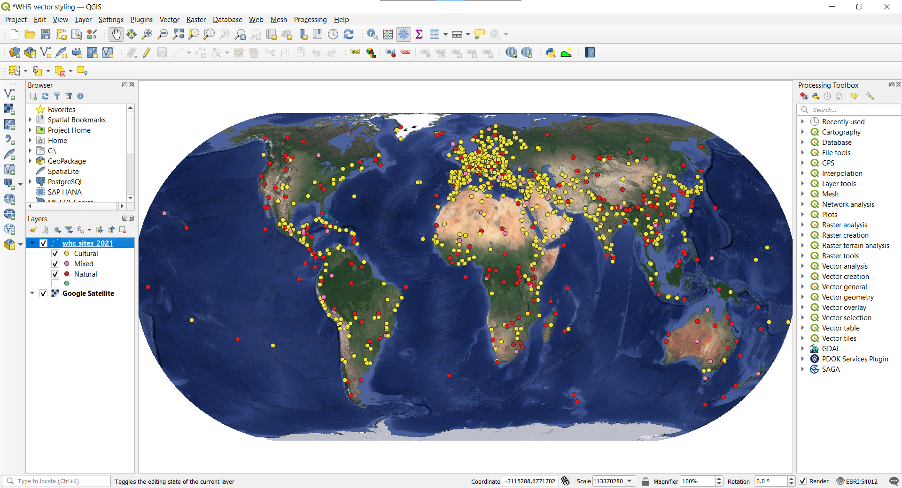
10. Let's make the size of the symbols more appropriate. Open Symbology and click on a Symbol sign. Reduce the size to 1.8. This will reduce the size of all categories.
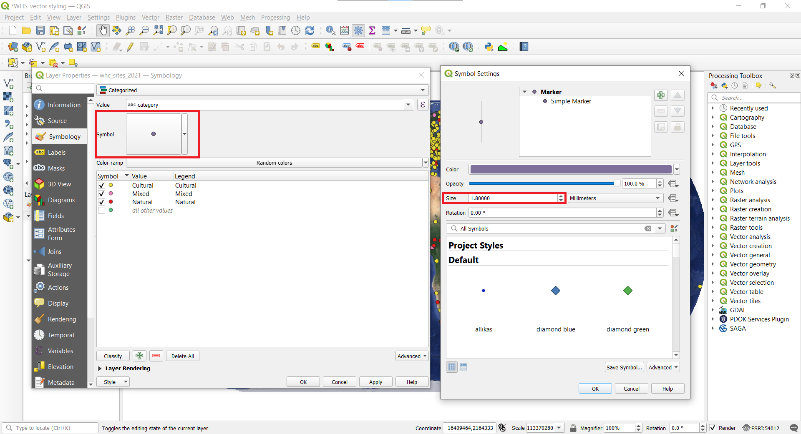
11. Change the color of the categories to more appropriate. Open Symbology and click on the symbol in front of each category and change it for example, cultural to yellow, natural to green and mixed to orange.
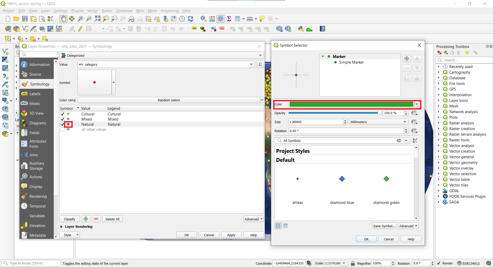
12.  A useful cartographic technique is to choose a slightly darker version of the fill-color as the Stroke color. Rather than trying to pick that manually, QGIS provides an expression to control this more precisely. From the Symbology, select all the categories (hold Shift while mouse clicking). Then click the Symbol which will change the settings for all the categories. Under Symbol Settings, click Simple Marker and next to Stroke color click the Data defined override button  and choose `Edit`. Enter the following expression darker(@symbol_color, 150)  to set the color to be 50% darker shade than the fill color and click OK. You will notice that the Data defined override button next to Stroke color has turned yellow - indicating than this property is controlled by an override. Click also Ok for the Symbol Settings tab and Symbology to apply all the changes. Note how the outline of the symbols changed.
>:scroll:**Note**
>
*Expressions are one of the most powerful features of QGIS. Expressions allow to manipulate attribute value, geometry and variables in order to dynamically change the geometry style, the content or position of the label, the value for diagram, the height of a layout item, select some features, create virtual field. Read more about expressions from [QGIS Documentation](https://docs.qgis.org/3.28/en/docs/user_manual/expressions/expression.html#expressions).*

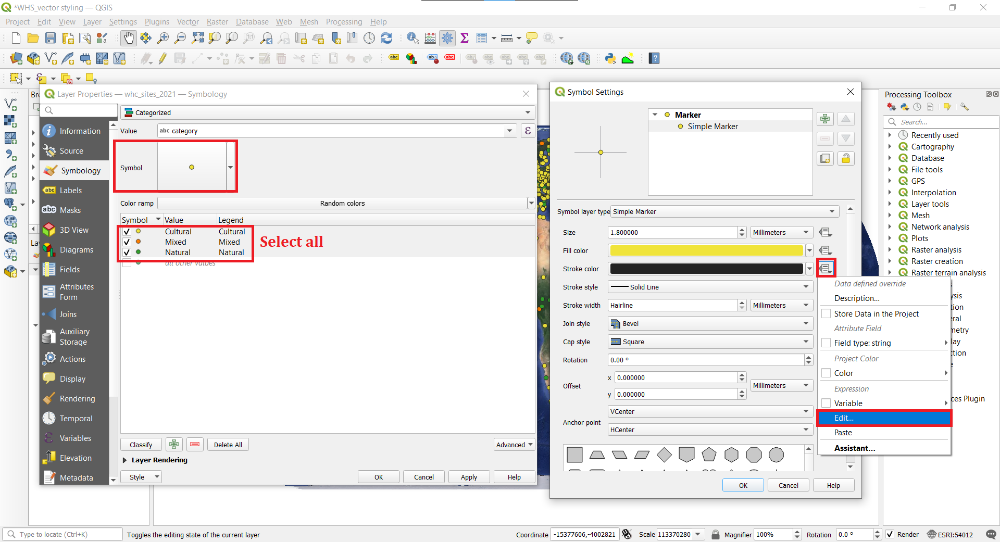
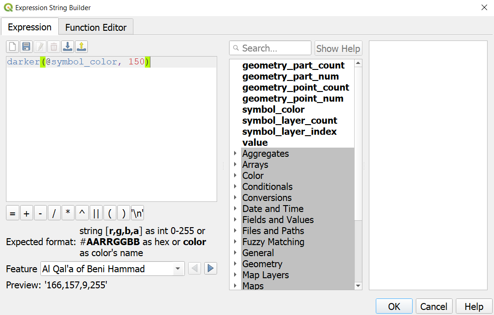
13. We can make the symbols stand out even more with adding shadow. QGIS has very cool Effects feature under Symbology which enables to create very beautifully stylized maps. To add shadow to the WHC sites, open Symbology and then expand Layer Rendering options. Switch on the Effects and click on the Customize Effect button . The Effect Properies panel opens. Switch on Drop Shadow. You can see the immediate effect on the symbol next to it. Adjust Offset and Blur radius to 0.4 mm and reduce the Opacity to 60%. Switch on Source. If Source is not there when u open Effect properties, click on the green plus sign. Also make sure that Drop Shadow is below Source (move it with blue arrows if needed). Click OK. The WHC points now have a more elevated appearance.

14. You can make a nice map by using Layout manager and adding legend and title to the map. Tutorial for [making a map and adding map elements](https://kevelyn1.github.io/QGIS-Intro/qgis/making-a-map/).

#### 2.4. Graduated symbology
While categorized symbology is for nominal data (qualitative) then graduated symbolgy is for ordinal and interval (quantitative) data. WHC dataset includes a date of inscription that we can consider as ordinal. Let's map the WHC sites based on their year of inscription.
15. First, create a duplicate of your already stylized whc_sites_2021 layer because we want to keep the previous symbology on the categories. Make a right-click on the whc_sites_2021 layer name `Duplicate Layer`.
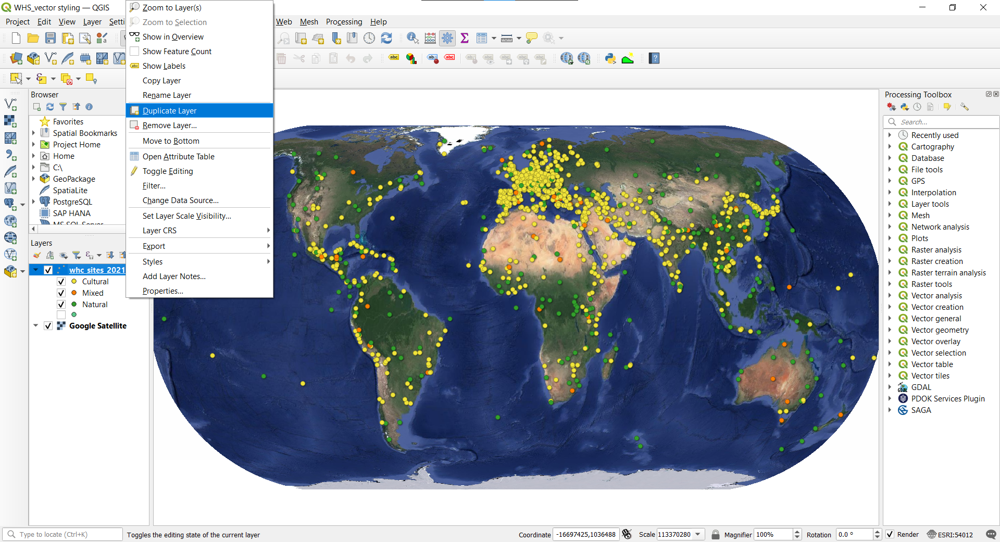
16. Make the duplicate layer visible and move it on top of the original. Open layer's Symbology. Change the symbology to Graduated, and Value to date_inscribed. Make number of Classes to 4 and click Classify. Currently the classification Mode is Equal Count (Quantile) which tries to divide values into classes so that each class would have even number of observations. We would adjust them a little. The classes should also not overlap. The legend values in QGIS do not enable to eliminate overlap but if we know that the higher value of each class is in the current class and lower value is in previous class then we can create correct Legend values. Adjust the class values and legend as shown below and click OK.
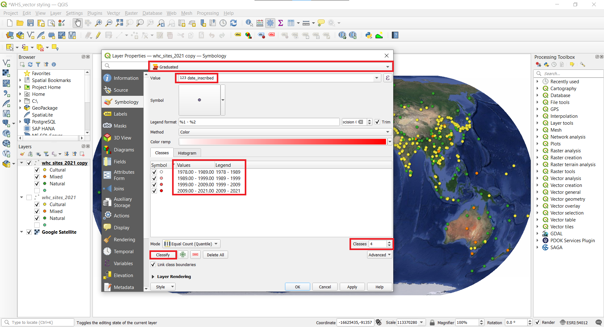
17. The map symbols should now have different color based on the year of inscription. Let's change the color palette of the gradual scale. Open layer's Symbology and click on the small arrow next to Color ramp. This will open a selection of color ramps. You can expand it even more by clicking All color ramps. You may choose a ramp of you choice. However, keep in mind that for gradually increasing values like years, sequential color palette is the best. Avoid using diverging color palette in this case because there is no clear mid-point. You can read more about ["When to use sequential and diverging palettes"](https://blog.datawrapper.de/diverging-vs-sequential-color-scales/).
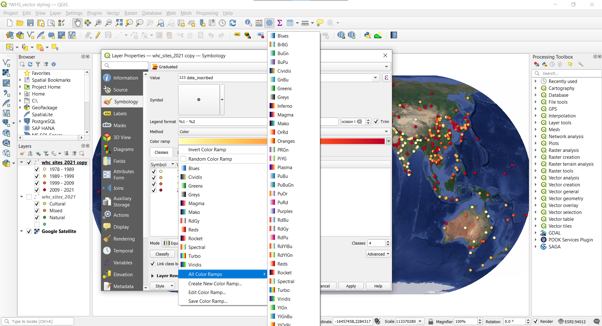
18. Change the symbol outlines 50% of darker than the fill as you did under section 2.3. Add also small shadow to the symbols. Finally, you can make it as a proper map by adding tile, legend and info about the data.
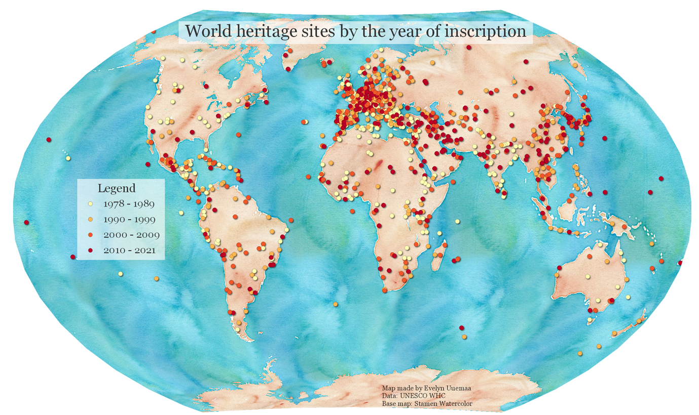
