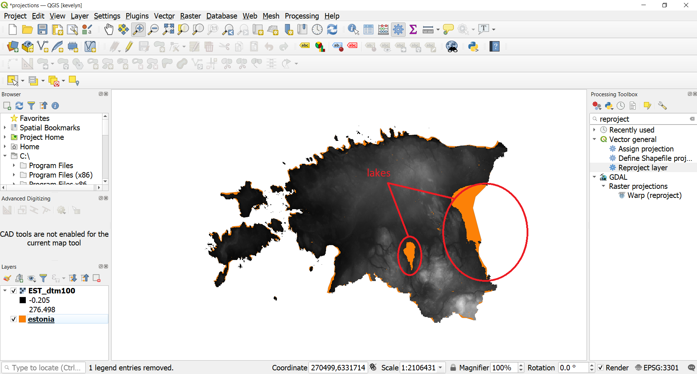
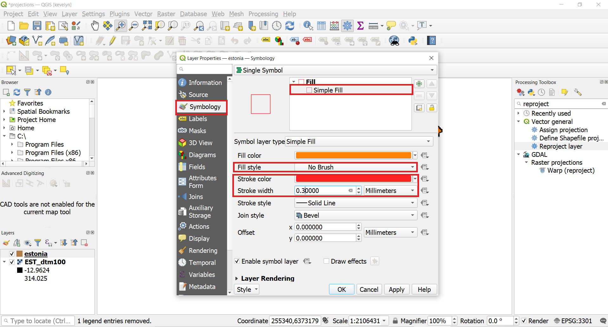

Coordinate Reference System (CRS) often cause a lot of frustration when working with GIS data. But a proper understanding of the concepts and access to the right tools will make it much easier to deal with projections. Coordinate Reference Systems, also referred to as Spatial Reference Systems, include two common types:
+ Geographic Coordinate Systems (GCS)
+ Projected Coordinate Systems (PCS)

It is important to recognise and make the difference between them. The projected coordinate systems always also include information about the projection. It is important to make an appropriate choice of CRS for projects. Choosing an inappropriate CRS can cause your maps to look distorted, and poorly reflect the real-world relative sizes and positions of features but it can also cause wrong spatial analysis results (wrong area or distance estimations). Usually, while working in smaller geographic areas, there will be a number of standard CRSs used within a particular country or administrative area. It’s important to research which CRSs are appropriate or standard choices for the area you are mapping, and ensure that your QGIS project follows these standards. You can read more about Coordinate Reference Systems from [QGIS Documentation](https://docs.qgis.org/3.28/en/docs/gentle_gis_introduction/coordinate_reference_systems.html#coordinate-reference-systems)

In this tutorial, we will explore how CRSs work in QGIS and learn about tools available for vector and raster data layers.
The tutorial is mainly based on Ujaval Gandhi's [QGIS Tutorials and Tips](https://www.qgistutorials.com/en/docs/introduction.html).
#### The tutorial consists of the following steps:

- [1. Download data](#1-download-data)
- [2. Steps to work with CRS](#2-steps-to-work-with-crs)
  * [2.1. Change project CRS](#21-change-project-crs)
  * [2.2 Change vector layer CRS](#22-change-vector-layer-crs)
  * [2.3 Change raster layer CRS](#23-change-raster-layer-crs)

### 1. Download data

Natural Earth has [Admin 0 - Countries](http://www.naturalearthdata.com/downloads/10m-cultural-vectors/) dataset. Download the [countries](https://www.naturalearthdata.com/http//www.naturalearthdata.com/download/10m/cultural/ne_10m_admin_0_countries.zip) and extract to your working folder.

>:scroll:**Note**
>
*Natural Earth shows de facto boundaries by default according to who controls the territory, versus de jure. Optional point-of-view (POV) variants are available for several dozen countries in [Natural Earth]( https://naturalearthdata.com/downloads/10m-cultural-vectors/) under Admin 0 – Countries point-of-views. For example, Ukraine can be found [here](https://www.naturalearthdata.com/http//www.naturalearthdata.com/download/10m/cultural/ne_10m_admin_0_countries_ukr.zip).*

[Estonian Land Board](https://geoportaal.maaamet.ee/eng/Spatial-Data-p58.html) provides open data about Estonia for download. However, it is very high resolution (1 to 5m) and would be too big for this exercise. Therefore it is resampled to 100m for you to use: [100m resolution DTM](../../datasets/est_dtm100.7z).

For convenience, you may directly download files required only for this tutorial from the link below:
[data_projections.7z](../../datasets/data_projections.7z)

**Data Sources:** [Natural Earth](https://www.naturalearthdata.com/) and [Estonian Land Board](https://maaamet.ee/en)

### 2. Steps to work with CRS
#### 2.1. Change project CRS
1. Open QGIS. Locate your working folder in the Browser panel and drag/drop the ne_10m_admin_0_countries.shp file to your QGIS Map view or alternatively click on Open Data Source Manager button , click on the Vector tab and add the file from there. Save your project with suitable name to your working folder.

2. At the bottom of QGIS window, you will notice the label Coordinate. As you move your cursor over the map, it will show you the X and Y coordinates at that location. Currently it is presenting geographic coordinates because the data layer CRS is geographic, more precisely WGS84 (EPSG:4326), which you can see at the bottom-right corner. This is also the current Project CRS because QGIS assigns the empty project CRS of the first layer you add to the project.

3. To determine a layer’s projection, we can look into the metadata. Right click on ne_10m_admin_0_countries.shp layer and select Properties. From there switch to the Information tab in the Layer Properties dialog. Under coordinate reference system you will find CRS. As you can see, there is also a lot of other information under metadata, such as extent of the layer, units etc.

4. Lets first change the Project CRS. Click on the status bar lower right corner on EPSG:4326. Type "winkel" to the filter. This should bring up several Winkel CRS-s. Click on World_Winkel_Tripel_NGS (ESRI:54042)[^1] and then OK. Winkel-Tripel is minimal-error projection and it a standard projection for world maps made by the National Geographic Society (Wiki). In result, the map should change in your map view as the Project CRS is changed.

5. Please re-check the layer's CRS by doing right click on ne_10m_admin_0_countries.shp layer and select Properties. From there switch to the Information tab in the Layer Properties dialog to check the CRS information. This should still be the same as before: WGS84 (EPSG: 4326). You only changed the project CRS but the layer's CRS did not change and in the map view the map was automatically and only virtually projected to the project CRS. This is because QGIS supports On-The-Fly (OTF) CRS transformation for both raster and vector data. Which means that whenever a layer’s CRS doesn’t match the Project CRS, it will automatically be transformed to the Project CRS so it can be displayed correctly. This means that regardless of the underlying CRS of particular map layers in your project, they will always be automatically transformed into the common CRS defined for your project. Behind the scenes, QGIS transparently reprojects all layers contained within your project into the project’s CRS, so that they will all be rendered in the correct position with respect to each other.

#### 2.2 Change vector layer CRS
6. Now let’s change the layer’s CRS. This operation is called Re-Projection. It is possible to re-project the whole layer but rather than re-projecting the entire layer, we can also select a subset of features and re-project them to a new layer. Use the Select Features by Area or Single Click tool  and click on Estonia to select it.

7. If you don't have on the right side Processing Toolbox then switch it on from the `View ► Panels`. If you have Processing Toolbox available then you can skip this step.

8. From the Processing Toolbox search for Reproject layer.

9. Select ne_10m_admin_0_countries.shp as the Input layer, check Selected features only then click on the Select CRS icon  next to Target CRS, search and select EPSG:3301 - Estonian Coordinate System of 1997. In Reprojected, choose the ... and click Save to a file. Now choose the directory and enter the name as estonia.gkpg and click Run.

10. A new layer estonia will appear on the Layer Panel. As you see, both the layers still line up exactly with each other - even though they are in different CRSs. This is thanks to the On-The-Fly CRS transformation. To check if layer estonia CRS has really been changed, right-click on the estonia layer and click on `Properties`. In the Layer Properties, switch to Information where you can see that the CRS is EPSG:3301. This confirms that the layer’s CRS has been changed.
11. Now let’s set the Project CRS to match the newly created estonia  layer’s CRS. Remove the ne_10m_admin_0_countries  layer and, right click on the estonia layer and choose `Layer CRS ► Set Project CRS from Layer`.
You will see the Project CRS is updated to EPSG 3301 (Estonian Coordinate System 1997).

#### 2.3 Change raster layer CRS
12. Now let’s add a Raster layer. Go to `Layer ► Add Layer ► Add Raster Layer…` or alternatively click on Open Data Source Manager button , click on the Raster tab and add the est_dtm100.tif file from there. New raster layer is added to the map view. The layers are not perfectly overlaping each other because of different level of detail. The raster map has higher level of detail and the coastline is more precise. Also, the lakes have been removed from the elevation model.

13. Check the CRS of the raster layes by right-clicking on the est_dtm100 layer and click on `Properties`. In the Layer Properties, switch to Information where you can see that the CRS is EPSG:3301.
14. To make both layers better visible,  switch the order of the layer by dragging the est_dtm100 to the bottom in the Layers panel. Let's change the layer estonia symbology so that we can also see the raster layer underneath it. Make a right click on layer estonia name in the layer panel and choose `Properties`

15. Under the Properties switch to Symbology tab and there click on Simple Fill. Change Fill Style to No Brush and change the Stroke color into red and Stroke width to 0.3, for example, and click OK.

16. To change the raster layer CRS into WGS84, we need to use different tool than for vector layer. Type "reproject" into Processing Toolbox search which will bring up Warp (reproject) under GDAL[^2]. Make layer EST_dtm100 as Input; you may leave Source input empty as it is read automatically from the layer's metadata; choose WGS84 (EPSG 4326) as Target CRS; leave other parameters as default and scroll down to Advanced Parameters where you can change whether you want your new reprojected raster layer to be Saved to temporary file or Save to file. You may leave this temporary which means that after you close the QGIS project then the file will be deleted. This is often useful option when you have a lot of intermediate results that you know, you won't need later. Click Run to start reprojecting. New file Reprojected should appear to the Layer panel. The new layer should align with the original file because of On-The-Fly CRS transformation but it's layer CRS should now be WGS84. Check the layer CRS under it's propeties to make sure it is so.

[^1]: As you might notice there is ESRI code instead of EPSG. This is because not all CRS have EPSG code and the specific Winkel Tripel (NGS) has been implemente in ESRI softwares under this specific code.
[^2]: [GDAL](https://gdal.org/) is a open source translator library for raster and vector geospatial data formats
