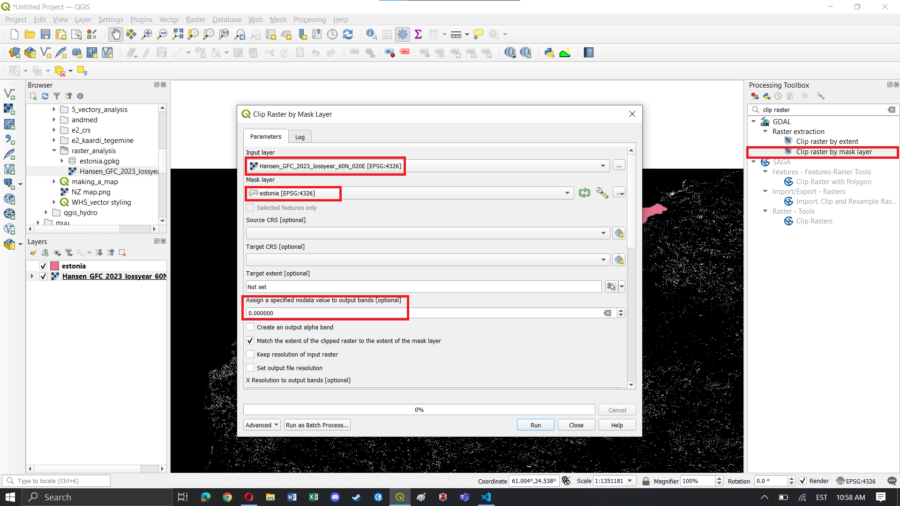
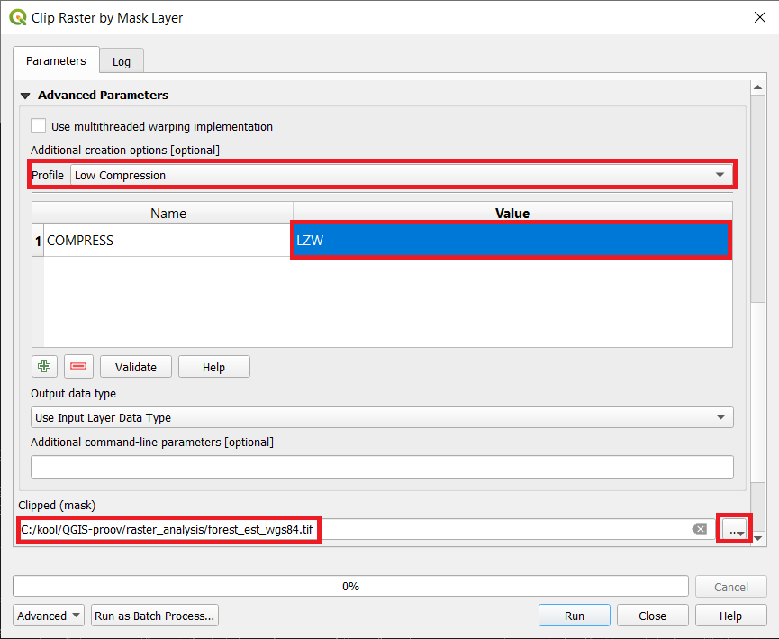
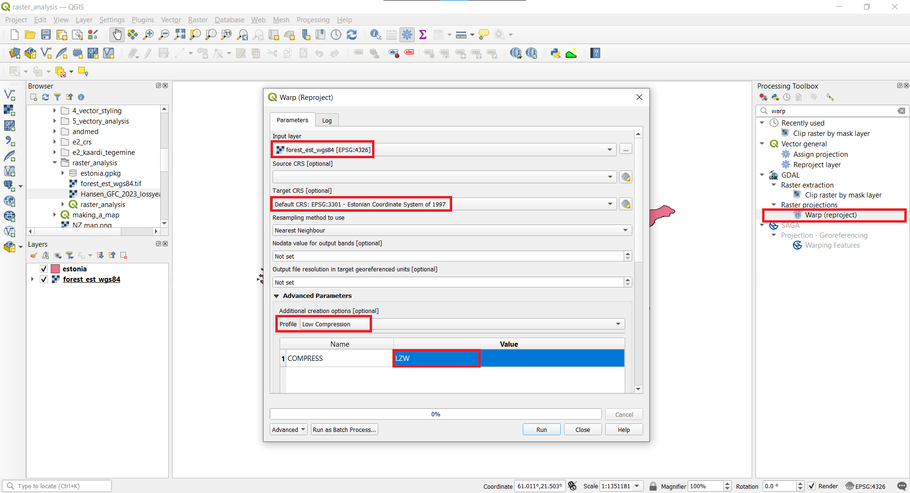
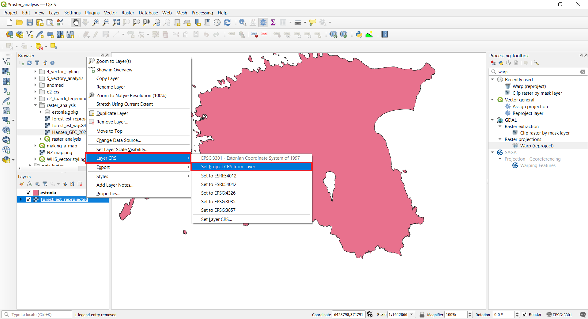
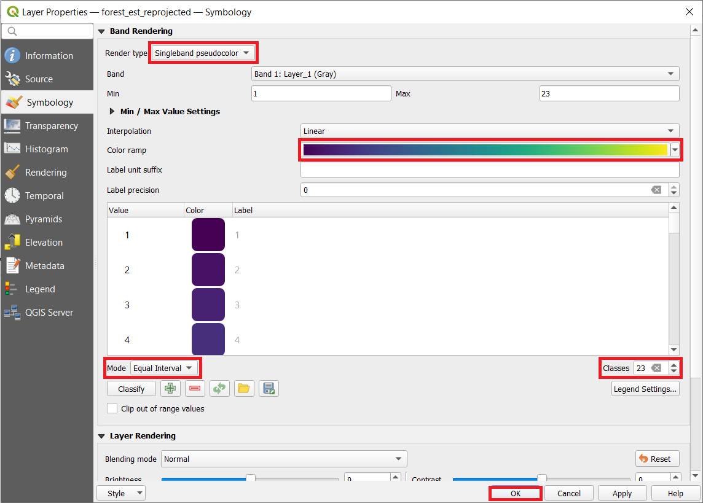
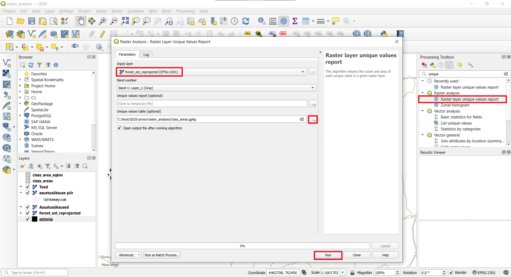
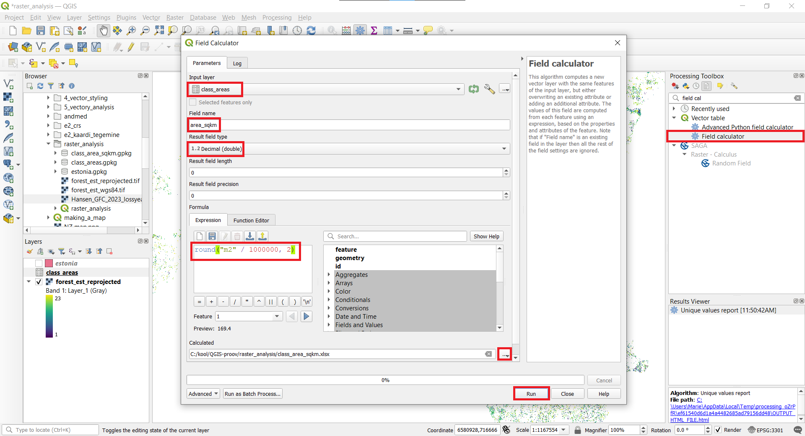

Raster analysis can enable very powerful and large scale analysis. It is especially useful in different environmental applications to detect land use change, mapping and modelling species distribution, mapping suitable locations for either different spieces or solar power parks. 

In this task, you will analyse forest loss in Estonia and whether protected species habitats are affected by forest loss or not.

The tutorial is mainly based on Ujaval Gandhi's [Calculating Raster Area (QGIS3)](https://www.qgistutorials.com/en/docs/3/calculating_raster_area.html).

#### The tutorial consists of the following steps:

### 1. Download data
- [1. Download data](#1-download-data)
Please download the forest loss data: [Hansen_GFC_2023_lossyear_60N_020E.tif](../../datasets/Hansen_GFC_2023_lossyear_60N_020E.tif) and Estonian borders [estonia.gpkg](../../datasets/estonia.gpkg)

>:scroll:**Note**
>
*Global Forest Change is based on time-series analysis of Landsat images characterizing forest extent and change globally.
Trees are defined as vegetation taller than 5m in height. ‘Forest Cover Loss’ is defined as a stand-replacement disturbance, or a change from a forest to non-forest state, during the period 2000–2023.  ‘Forest Loss Year’ is a disaggregation of total ‘Forest Loss’ to annual time scales and the raster value from 1 to 23 indicates loss year from 2001 to 2023 respectively*

**Data Sources:**  ["Global Forest Change by Hansen et al 2011"](https://glad.earthengine.app/view/global-forest-change) and Estonian Land Board

### 2. Calculating raster area
#### 2.1. Raster clipping
1. 1. Open QGIS and in the QGIS Browser Panel, locate the directory where you added the data and add files estonia.gpkg and Hansen_GFC_2023_lossyear_60N_020E.tif to QGIS.
2. Save your project with an appropriate name, for example raster_analysis.
3. Now lets clip the raster layer to the vector boundary, so only Estonia will be left. To do that search Clip raster by mask layer in the Processing toolbox and open it. Choose Hansen_GFC_2023_lossyear_60N_020E.tif layer as the Input Layer and estonia.gpkg layer as the Mask Layer. Enter 0 as the nodata value.

4. In the Advanced Parameters section choose Low compression. Double click on the value box and write LZW. Save the file as forest_est_wgs84.tif and click `Run`..

5. Right-click Hansen_GFC_2023_lossyear_60N_020E.tif layer and select Remove Layer.

#### 2.2. Reprojecting raster
6. Next we need to reproject the raster layer to the Estonian coordinate system. In the Processing Toolbox search Warp(Reprojet) and open it. Choose forest_est_wgs84.tif as the Input Layer and EPSG:3301 as the Target CRS. In the Advanced Parameters choose Low Compression and LZW like before. Save the file as forest_est_reprojected.tif and click `Run`.

7. Remove the forest_est_wgs84.tif layer. Let's set the project layer to the UTM zone. Click on forest_est_reprojected.tif layer and choose `Layer CRS ► Set Project CRS from Layer`.

#### 2.3. Styling raster
8. Now let's change the symbology of the raster layer to a more suitable one. Double click on forest_est_reprojected.tif to open Symbology. Choose Singleband pseudocolor as the Render type, Equal Interval as the mode and 23 classes. Also choose a colour ramp to your liking, for example Viridis. Then click `OK`.

#### 2.4.  Calculating areas
9. Now let's calculate the area for each class. Search Raster layer unique values report in the Processing toolbox and open it. Choose forest_est_reprojected.tif as the Input layer. Save the file as class_areas.gpkg and click `Run`.

10. Right-click on the class_areas.gpkg layer and open Attribute Table. The column m2 contains the area for each class in square meters. 
11. Let's convert the area to square kilometers. To do that, search Field calculator in the Processing toolbox and open it. Select class_areas.gpkg as the Input layer. Enter the Field name as area_sqkm and for the result field type choose decimal (double). In the Expression window enter round("m2" / 1000000, 2). This will convert the square meters to square kilometers. Save the file as class_area_sqkm.xlsx and click `Run`.
