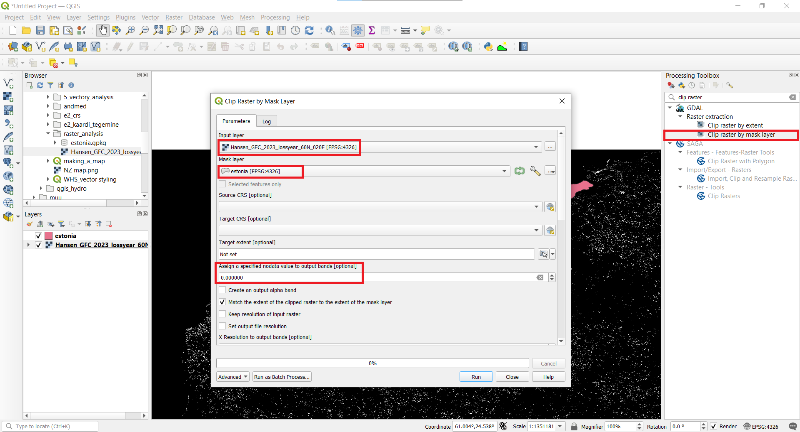

Raster analysis can enable very powerful and large scale analysis. It is especially useful in different environmental applications to detect land use change, mapping and modelling species distribution, mapping suitable locations for either different spieces or solar power parks. 

In this task, you will analyse forest change in Estonia and whether protected species *Lanius collurio* habitats are affected by forest change or not.

#### The tutorial consists of the following steps:
- [1. Download data](#1-download-data)
- [2. Calculating raster area](#2-calculating-raster-area)
  * [2.1. Raster clipping](#21-raster-clipping)
  * [2.2. Reprojecting raster](#22-reprojecting-raster)
  * [2.3. Styling raster](#23-styling-raster)
  * [2.4. Calculating areas](#24-calculating-areas)
- [3. Sampling raster data to points](#3-sampling-raster-data-to-points)

### 1. Download data
- [1. Download data](#1-download-data)
Please download the forest loss data: [Hansen_GFC_2023_lossyear_60N_020E.tif](../../datasets/Hansen_GFC_2023_lossyear_60N_020E.tif) and Estonian borders [estonia.gpkg](../../datasets/estonia.gpkg). For the second part, download bird species *Lanius collurio* data  [lanius_collurio.gpkg](../../datasets/lanius_collurio.gpkg) 

>:scroll:**Note**
>
*Global Forest Change is based on time-series analysis of Landsat images characterizing forest extent and change globally.
Trees are defined as vegetation taller than 5m in height. ‘Forest Cover Loss’ is defined as a stand-replacement disturbance, or a change from a forest to non-forest state, during the period 2000–2023.  ‘Forest Loss Year’ is a disaggregation of total ‘Forest Loss’ to annual time scales and the raster value from 1 to 23 indicates loss year from 2001 to 2023 respectively*

**Data Sources:**  ["Global Forest Change by Hansen et al 2011"](https://glad.earthengine.app/view/global-forest-change) and Estonian Land Board and [Estonian Environmental Portal (Keskkonnaportaal)](https://register.keskkonnaportaal.ee/register)

### 2. Calculating raster area
#### 2.1. Raster clipping
1. Open QGIS and in the QGIS Browser Panel, locate the directory where you added the data and add files estonia.gpkg and Hansen_GFC_2023_lossyear_60N_020E.tif to QGIS.
2. Save your project with an appropriate name, for example raster_analysis.
3. Now lets clip the raster layer with the Estonian vector boundary to obtain forest cahnge data only for Estonia. Find 'Clip raster by mask layer' in the Processing toolbox and open it. Choose Hansen_GFC_2023_lossyear_60N_020E layer as the Input layer and estonia layer as the Mask layer. Enter 0 as the NoData value. If NoData is determined in raster file then it will not be used in further calculations and will be shown as transparent. In most cases, it is useful to define NoData value.

4. Raster files can get very big and therefore it is always recommended to use compression. You should always use lossless compression such as LZW. If you use lossy compression (JPEG). To apply compression, choose in the Advanced Parameters section Low compression. Double click on the value box and write LZW. Save the file as forest_est_wgs84.tif and click `Run`. 

5. Right-click Hansen_GFC_2023_lossyear_60N_020E.tif layer and select Remove Layer.

#### 2.2. Reprojecting raster
6. Next we need to reproject the raster layer to the Estonian coordinate system. In the Processing Toolbox search Warp and open it. Choose forest_est_wgs84 as the Input Layer and EPSG:3301 as the Target CRS. In the Advanced Parameters choose Low Compression and LZW like before. Save the file as forest_est_reprojected.tif and click `Run`.

7. Remove the forest_est_wgs84.tif layer. Let's set the project layer to the Estonian coordinate system. Click on forest_est_reprojected.tif layer and choose `Layer CRS ► Set Project CRS from Layer`.

#### 2.3. Styling raster
8. Now let's change the symbology of the raster layer to a more suitable one. Double click on forest_est_reprojected to open Symbology. Choose Singleband pseudocolor as the Render type, Equal Interval as the mode and 23 classes. Also choose a color ramp to your liking, for example Viridis. Then click `OK`.

9. For better visualization move the layer estonia to the bottom and change it to black. 

10. Next we'll add roads and settlements, which we'll get via WMS. Click `Layer ► Add Later ► Add WMS/WMTS Layer...`. In the new window click `New` and then write Maa-amet as the name and copy this link (https://kaart.maaamet.ee/wms/alus?) as the URL.

>:scroll:**Note**
>
*WMS (Web Map Service) is a service based on OGC WMS (Open Geospatial Consortium Web Map Service) standard that enables to display spatially referenced data on the computer screen without downloading . Many governmental agencies provide their data using WMS service. Estonian Land Board provideas a lot of free spatial data via WMS: https://geoportaal.maaamet.ee/eng/services/public-wms-wfs-p346.html *

11. Now click `Connect` and choose the layers with ID numbers 138, 139 and 140. Make sure to check the option to Load as separate layers and then click `Add`.

#### 2.4. Calculating areas
12. Now let's calculate the area for each class. Search Raster layer unique values report in the Processing Toolbox and open it. Choose forest_est_reprojected as the Input layer. Save the file as class_areas.gpkg and click `Run`.

13. Right-click on the class_areas.gpkg layer and open Attribute Table. The column m2 contains the area for each class in square meters. 
14. Let's convert the area to square kilometers. To do that, search Field calculator in the Processing Toolbox and open it. Select class_areas as the Input layer. Enter the Field name as area_sqkm and for the result field type choose decimal (double). In the Expression window enter round("m2" / 1000000, 2). This will convert the square meters to square kilometers. Save the file as class_area_sqkm.xlsx and click `Run`.

### 3. Sampling raster data to points
15. Our goal is to see how many habitats of the red-backed shrike are affected by logging. First add the layer lanius_collurio.gpkg to the map. 
16. Then search Sample raster values in the Processing Toolbox and open it. Add lanius_collurio as the Input layer and forest_est_reprojected as the Raster layer. For the output column prefix write forest_loss_. Then save the file as lanius_collurio_forest_loss.gpkg and click `Run`.

17. Next open the attribute table of lanius_collurio_forest_loss. As you can see there is a new column forest_loss_1. NULL means that there was no forest change and the number means that there was (the number shows which year the change took place).

18. Now we'll count how many habitats had forest loss. Search Basic statistics for fields in the Processing Toolbox and open it. Choose lanius_collurio_forest_loss as the Input layer and forest_loss_1 as the field to calculate statistics on. Double click on Statistics in the Results Viewer. 

19. Count shows how many rows had a value (aka how many points were affected by forest change) and NULL means there was no forest change.