Spatial  queries and spatial joins are one of the basic analysis forms in GIS. In this tutorial, we will find how many UNSESCO WHC sites are in every country. In some areas there are a lot of WHC sites and this makes their visualization complicated because points tend to overlap. To overcome this, we will analyze points in a grid or generate a heatmap.

#### The tutorial consists of the following steps:
- [1. Download data](#1-download-data)
- [2. Procedure](#2-procedure)
  * [2.1. Spatial join](#21-spatial-join)
  * [2.2. Spatial query](#22-spatial-query)
  * [2.3. Heatmap](#23-heatmap)

### 1. Download data
This tutorial is a continuation to ["Basic vector syling"](https://kevelyn1.github.io/QGIS-Intro/qgis/vector-styling/). And we will use the same WHC sites data from [UNESCO World Heritage Sites](http://whc.unesco.org/en/syndication) saved as gpkg (["Basic vector syling"](https://kevelyn1.github.io/QGIS-Intro/qgis/vector-styling/) sections 1. and 2.1).

We will also need country borders. Download the [countries](https://www.naturalearthdata.com/http//www.naturalearthdata.com/download/10m/cultural/ne_10m_admin_0_countries.zip) and extract to your working folder.

**Data Sources:**
World Heritage List from [World Heritage List](http://whc.unesco.org/en/syndication) and country borders from [Natural Earth](https://www.naturalearthdata.com/)

### 2. Procedure
#### 2.1. Spatial join
1. Open QGIS and in the QGIS Browser Panel, locate the directory where you added the data and add files whc_sites_2021.gpkg and ne_10m_admin_0_countries.shp to QGIS.
2. Change the CRS of the project to Winkel Tripel (ESRI:54042) and save your project.
3. Let's find out which countries have the highest numbers of world heritage sites. We will use spatial join for that purpose. In the Procesing Toolbox, find tool Count points in polygon. Use the layer ne_10m_admin_0_countries as Polygons and layer  whc_sites_2021 as Points, save the output as whc_countries.gpkg and click Run. If there are any problems with using the tool Count points in polygon, like invalid geometry, use the tool Fix geometries to fix the problem (use the layer ne_10m_admin_0_countries as Input layer).
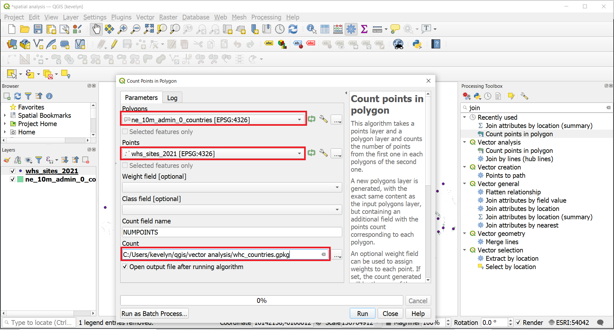
4. You will have a new layer of countries called whc_countries.gpkg. Open the attribute table of this new layer and browse horizontally to the end until you find a column named **NUMPOINTS**. This was created as a result of this analysis. Now every country has a count of WHC sites.
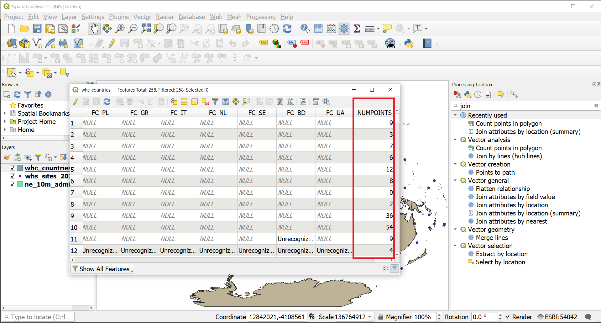
5. Let's visualize the countries based on the number of WHC sites in the country. Open the `Symbology` of the layer whc_countries. Choose Graduated as legend type and NUMPOINTS for Value. Pick a suitable Color ramp and click Classify. You may see that the ranges are quite uneven because Equal Count has divided an even number of objects into each class. Since there are very few countries with a high number of WHC sites, the highest class has a very large range. This means that we won't really see from the map what countries have a lot of WHC sites.
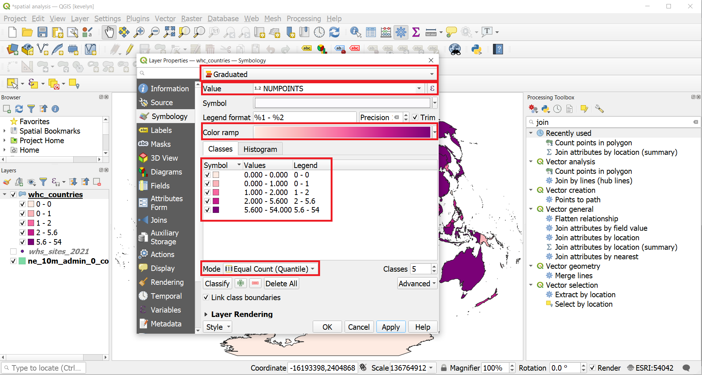
6. Let's try to adjust the classification so that we can easily see what countries have very few WHC sites and which have a lot. Under `Symbology`, change the classification Mode into Natural Breaks (Jenks)[^1]. You can see that the classes changed into more equal ranges. However, there is no class with 0 WHC sites. We will have to make small adjustments to the classes based on the automatic classification since we also want to see those countries. We also need to adjust the values that are presented in the legend so that they are not overlapping and would represent the actual class values. Adjust the class values to what is shown below and click OK.
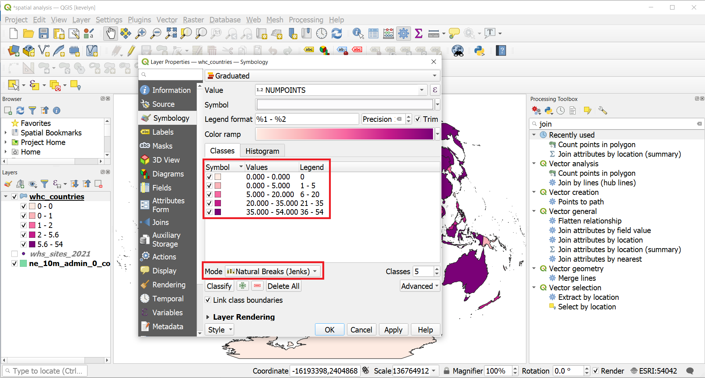
7. We can now adjust the stroke width of the borders and make the map even nicer with some shading. Under Symbology, select all classes and then click on Symbol. Under Symbol Settings click on Simple Fill. Change the Stroke width to 0.16 mm and switch on Draw Effect. Click on the  Customize Effects button . Switch on Inner Glow and adjust the Spread and Blur to 0.4 mm, Opacity to 50% and color to a darker grey. Click OK.
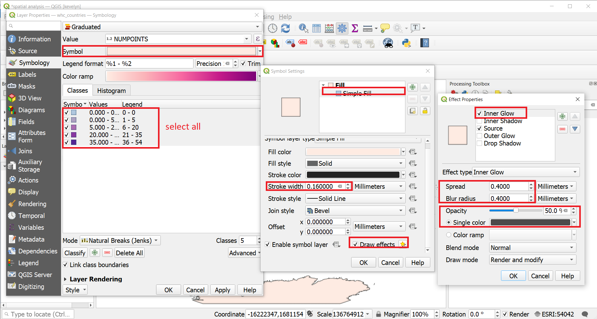
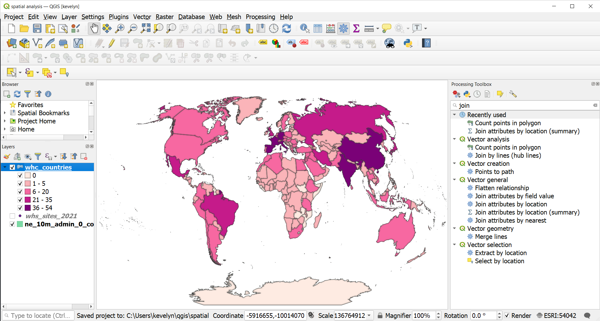
8. It is possible to perform a more complex spatial join. Let's find out when was the first WHC site registered in every country. In the Processing Toolbar, find Join attributes by location (summary). Choose the layer ne_10m_admin_0_countries as Join to features in and whc_sites_2021 layer as By comparing to. Then choose where the features intesects, summarize the fields based on date_inscribed, and for Summaries to calculate choose min. You can create it as temporary layer.
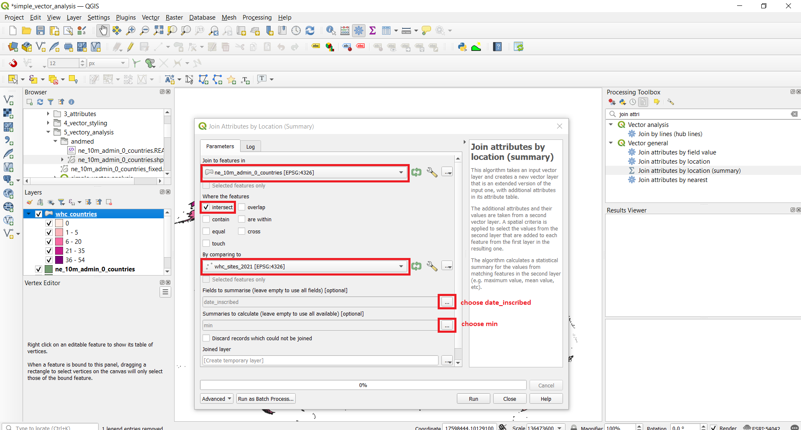
9. You need to change the Symbology based on the new attribute created by join. Open the attribute table of the Joined layer (F6). The **date_inscribed_min** has values generated by join and they show the earliest year a WHC site was inscribed in the countries.
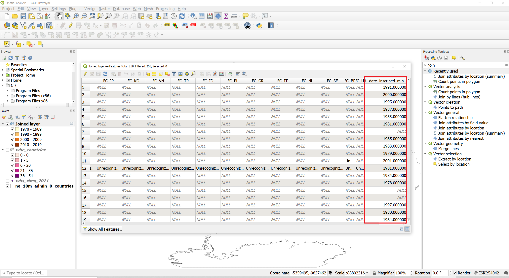
10. Let's visualize it on a map. Open the `Symbology` of Joined layer and change the type to Graduated and Value to date_inscribed_min. Select an appropriate color ramp and reduce the class numbers to 4. Adjust the classification as shown below.
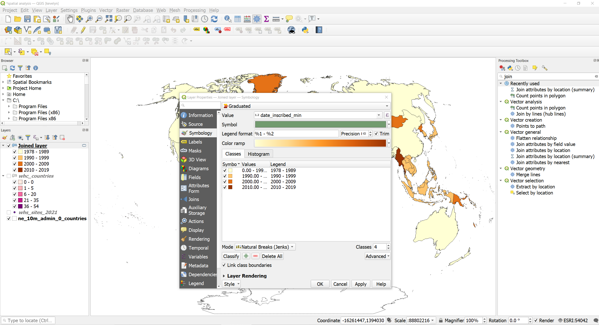
11. As you can see, most countries have their first WHC inscribed in the 1980s. You may notice that some countries are not present on the map. This means that there were no WHC sites in these countries. If you want to visualize it as a proper map, then you should also use the layer ne_10m_admin_0_countries. That layer should be under the Joined layer in the Layer panel and the fill color of the countries should be appropriate for missing countries.
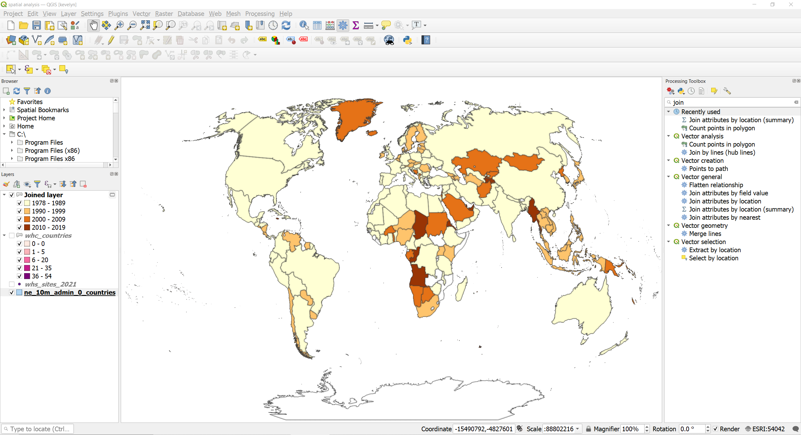
12. The number of WHC sites per country might be somewhat misleading because countries that have a bigger area could just have more WHC sites because they are bigger. This is known as modifiable areal unit problem (MAUP)[^2]. There are several ways to reduce the problem. One possibility is to normalize the number of WHC sites with the area of the country or population. The other possibility is to normalise the spatial unit (enumeration unit) itself. We can create a regular grid (fishnet) and count the WHC sites there. Let's generate a regular grid of hexagons. Hexagons nest together perfectly and they look cool :smirk:. To create a hexagonal grid, find the Create grid tool from the Processing Toolbox.
Choose Hexagon as grid type, for the grid extent choose the layer ne_10m_admin_0_countries, horizontal and vertical spacing should be 300 km, grid CRS can remain Winkel Tripel and save the file as whc_hex.gpkg
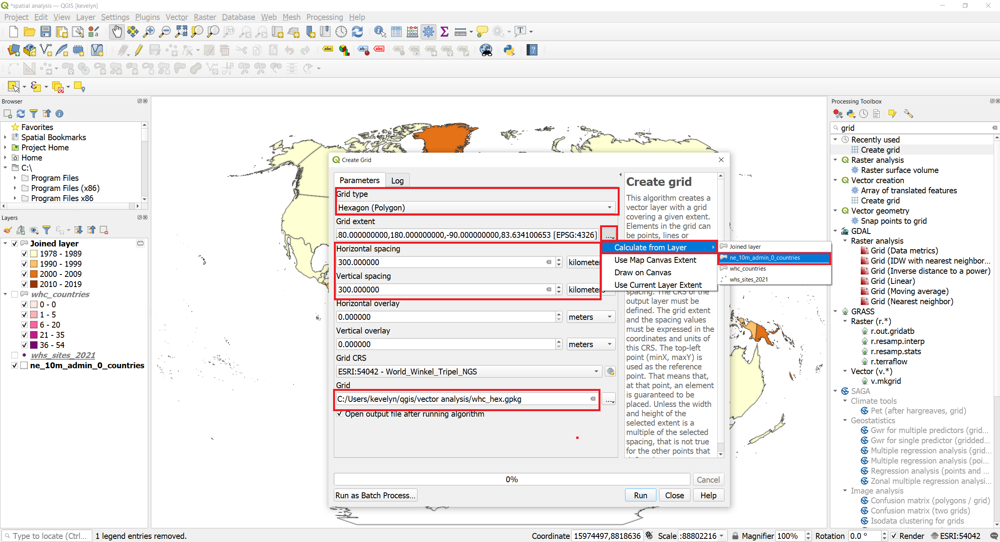
13. Now we need to perform a spatial join. Open the Count Points in Polygon tool. Add whc_hex as Polygons, whc_sites_2021 as Points and save the file as whc_hex_count.gpkg.
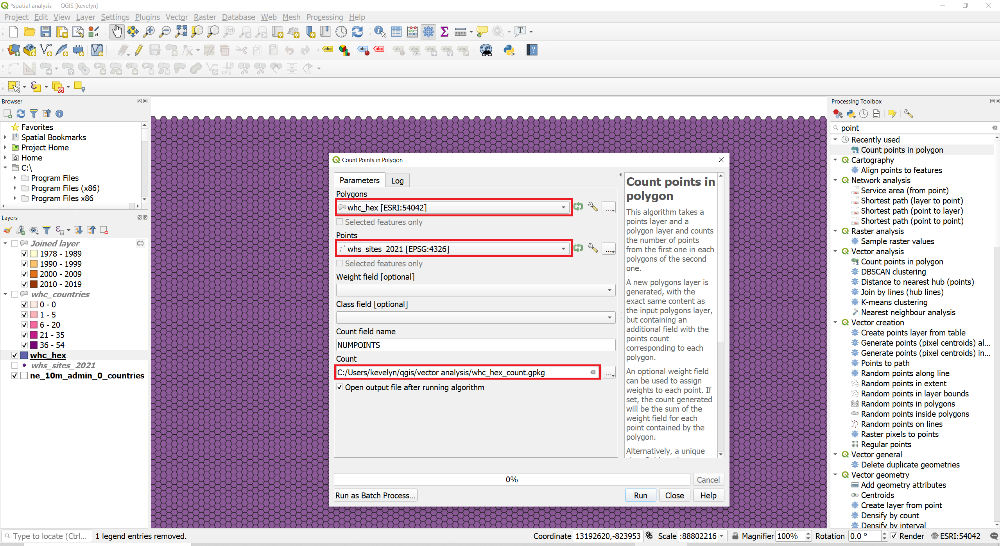
14. We can now visualize the hexagons based on the WHC sites' count. Open the `Symbology` of the whc_hex_count layer. Change the type to Graduated, choose an appropriate color ramp and switch the classification mode to Natural Breaks to get the base for classes. It is useful to look at the histogram of the data from the Histogram tab next to Classes (`Histogram ► Load Values`). Most of the hexagons are without any WHC sites. Therefore we should make a class with a value of 0 and make it invisible. It would be also useful to make the hexagons a little bit transparent in order to be able to see the country borders underneath. Expand the Layer Rendering and reduce make the Opacity to ca 70%.
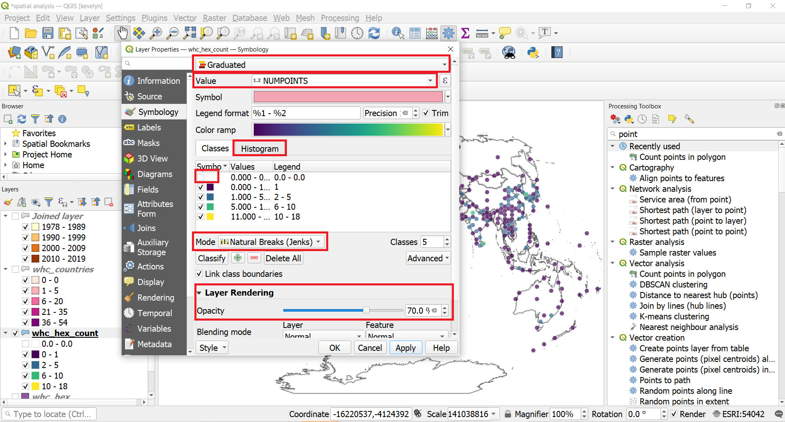
15. For a nice map design you might want to add oceans, so the shape of the globe would become visible. You can find the ocean layer from the  [Making a map](https://kevelyn1.github.io/QGIS-Intro/qgis/making-a-map/) tutorial. You can find the file ne_10m_ocean.shp in the folder \Natural_Earth_quick_start\packages\Natural_Earth_quick_start\10m_physical\
If you don't have the Natural Earth Quickstart Kit downloaded then you can find the dataset for oceans from [Natural Earth](https://www.naturalearthdata.com/downloads/10m-physical-vectors/) under Ocean.
Add the ne_10m_ocean.shp to the map view and drag it under the other layers in the Layer panel. Asjust the Symbology of the ne_10m_ocean.shp light blue.
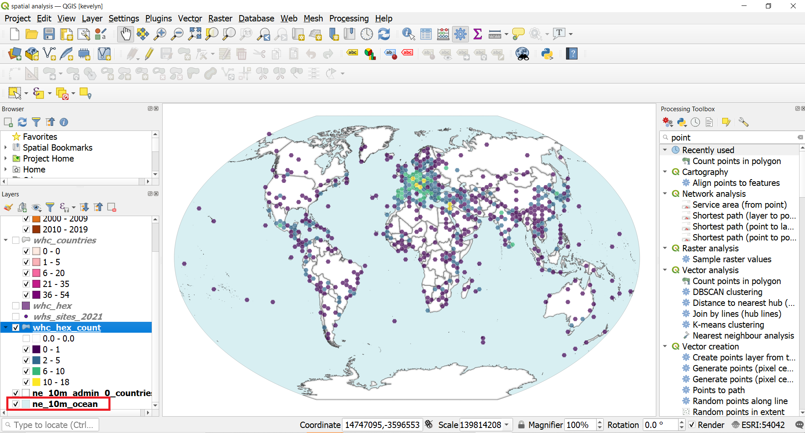
16. You can now create a new layout and add a title, a legend and credentials to the map.
>:scroll:**Note**
>
*North arrow and scale bars are rather unnecessary for global maps because most people know how big the Earth is and have an understanding of the scale. North arrow is more necessary if the north is not oriented up.*

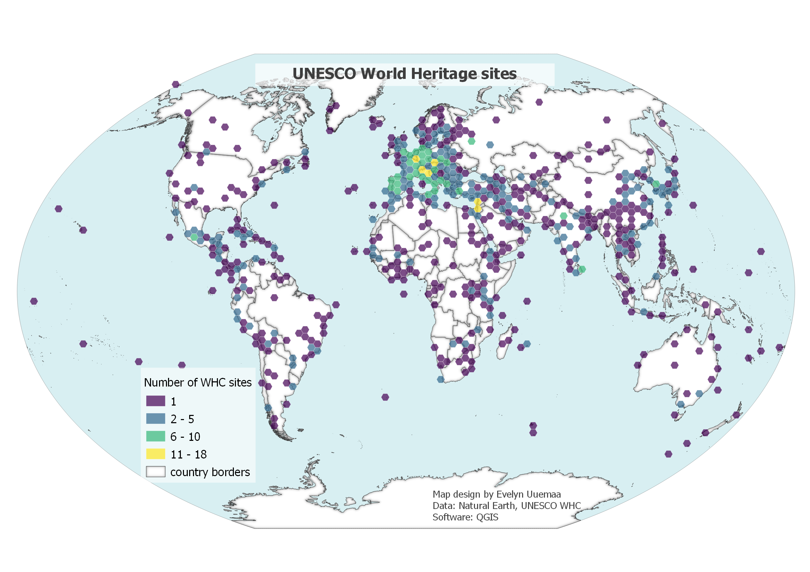

#### 2.2. Spatial query
Spatial queries enable to identify spatial overlap/intersection/containment of two spatial layers. For example, you can quite easily identify WHC sites that are located in United States.
17. Select United States from the ne_10m_admin_0_countries layer by using either the button Select Features by Single Click  or from the attribute table by using Select features by using an expression 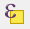.
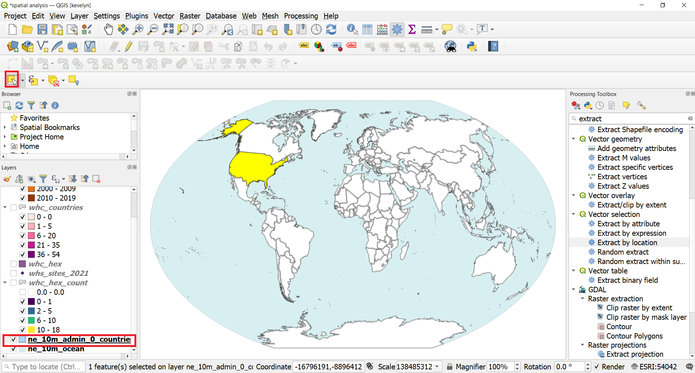
18. From the Processing Toolbox, find the Extract by Location tool. USe the layer whc_sites_2021 as input for Extract features from, check intersect as geometric predicate, use the layer ne_10m_admin_0_countries as input for By comparing to the features from and check Select features only. You may save it as temporary layer.
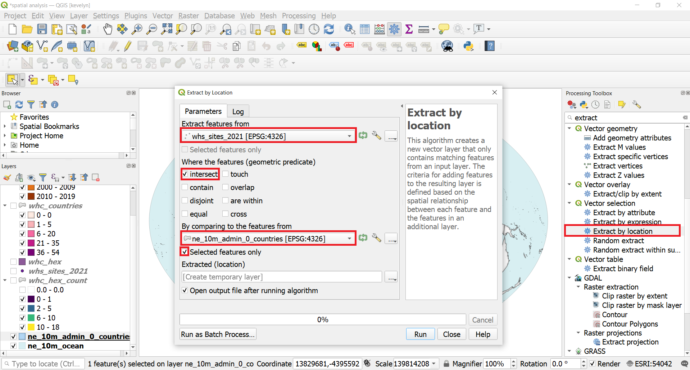
19. As a result you will have WHC sites in US.
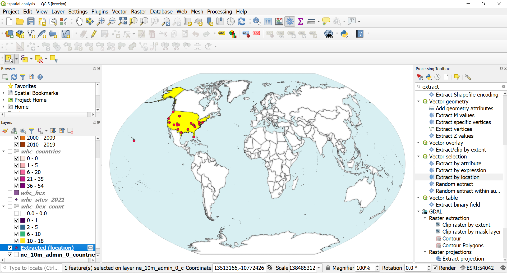

#### 2.3. Heatmap
Heatmaps are a way to analyze and visualize point patterns to see the clustering and dispersion.
20. In QGIS you can create heatmaps very easily. Open the `Symbology` of whc_sites_2021 layer and switch the symbology type into Heatmap, change the Color ramp to Magma, Radius into 4 and click OK.
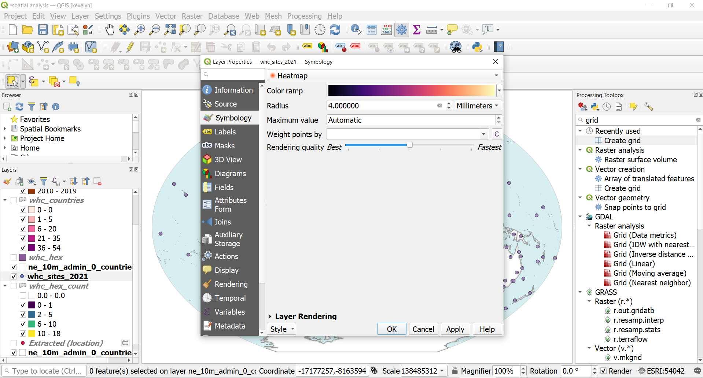
21. The symbology of the whc_sites_2021 layer will be changed into heatmap and you can see the hotspots over some areas. To be able to see better where hotspots are, we should add country borders over the heatmap. You may duplicate the ne_10m_admin_0_countries layer if you don't want to change the existing styling of the layer. Drag the layer on top of the heatmap layer in the Layer panel and open it's Symbology. Make the symbol Fill color transparent, Stroke color white and Stroke width 0.1mm.
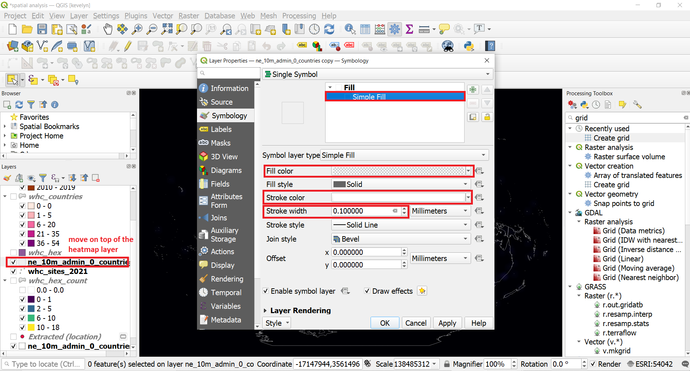  
22. You should now have country borders as white thin lines on top of the heatmap that help to see where there aggregation of WHC sites is.
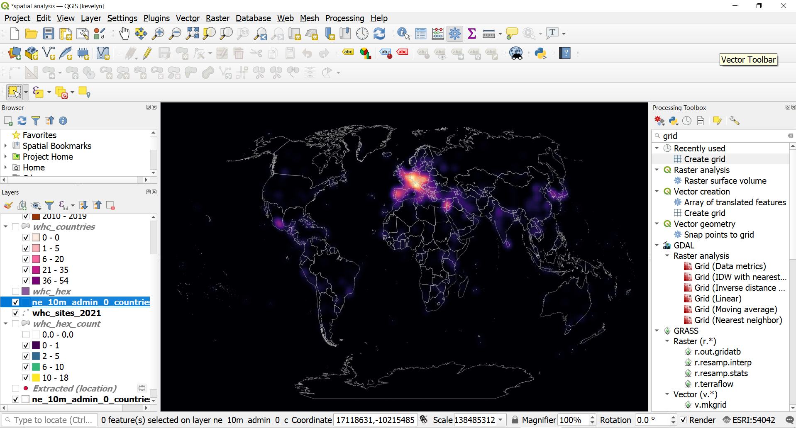

[^1]:You can read more about data classification from this [overview by Axis Maps](https://www.axismaps.com/guide/data-classification).
[^2]:MAUP affects results when point-based measures of spatial phenomena are aggregated into districts, for example, population density or illness rates. The resulting summary values (e.g., totals, rates, proportions, densities) are influenced by both the shape and scale of the aggregation unit. (Wiki) You can watch this nice [Youtube video about MAUP](https://www.youtube.com/watch?v=CISjONu-5Qg) to understand the problem a bit better.
