Koordinaatide referentssüsteem (CRS) põhjustab GIS andmetega töötades tihti frustratsiooni. Aga korralik arusaam ideedest ja ligipääs õigetele tööriistadele muudab projektsioonidega tegelemise palju ergemaks. Koordinatide referentsüsteemid, teise nimega ruumilised referentssüsteemid, jagunevad kaheks:
+ Geograafiline koordinaatide süsteem (GCS)
+ Ristkoordinaatide süsteemid (PCS)

On oluline neid mõista ja eristada. Ristkoordinaatidel on alati olemas informatsioon projektsiooni kohta. On oluline teha projektile koordinaatsüsteemi valides õige otsus. Vale koordinaatsüsteemi valimine võib põhjustada selle, et teie kaart on moonutustega ja kajastab halvasti päris maailma objektide suhtelisi suuruseid ja asukohti. Lisaks võib vale koordinaatsüsteem põhjustada ka vigased ruumianalüüsi tulemused (vale pindala või kauguste hinnang). Töötades väiksemate geograafiliste aladega on riigis või administratiivnses piirkonnas tavaliselt omad kasutatavad standardsed koordinaatsüsteemid. Seega on oluline uurida, millised koordinaatsüsteemid on sobivad või standardiks selles alas, mida soovid kaardil kujutada, et tagada teie QGIS-i projekti vastavus nendele standarditele. Lisainfot koordinaatide referentsüsteemide kohta saab lehelt [QGIS Documentation](https://docs.qgis.org/3.28/en/docs/gentle_gis_introduction/coordinate_reference_systems.html#coordinate-reference-systems)

Antud juhendis uurime kuidas töötab koordinaatsüsteem QGIS-is ning saame teada, millised tööriistab on vektor- ja rasterandmete kihtide jaoks. See juhend põhineb põhiliselt Ujaval Gandhi'i juhendil [QGIS Tutorials and Tips](https://www.qgistutorials.com/en/docs/introduction.html).
#### Juhend koosneb järgnevatest osadest:

- [1. Andmete alla laadimine](#1-andmete-alla-laadimine)
- [2. Koordinaatsüsteemiga töötamise etapid](#2-koordinaatsüsteemiga-töötamise-etapid)
  * [2.1. Projekti koordinaatsüsteemi muutmine](#21-projekti-koordinaatsüsteemi-muutmine)
  * [2.2 Vektorkihi koordinaatsüsteemi muutmine](#22-vektorkihi-koordinaatsüsteemi-muutmine)
  * [2.3 Rasterkihi koordinaatsüsteemi muutmine](#23-rasterkihi-koordinaatsüsteemi-muutmine)

### 1. Andmete alla laadimine

Natural Earth'il on [Admin 0 - Countries](http://www.naturalearthdata.com/downloads/10m-cultural-vectors/) andmestik. Lae alla [countries](https://www.naturalearthdata.com/http//www.naturalearthdata.com/download/10m/cultural/ne_10m_admin_0_countries.zip) ja paki failid lahti oma kausta. 

>:scroll:**Märge**
>
*Natural Earth näitab de facto piire selle alusel, kes alas valitseb, mitte de jure. Teistest vaatenurkadest lähenevad valikud on kättesaadavad paljudele riikidele lehel [Natural Earth]( https://naturalearthdata.com/downloads/10m-cultural-vectors/) Admin 0 – Countries point-of-views all. Näiteks Ukraina piirid saab [siit](https://www.naturalearthdata.com/http//www.naturalearthdata.com/download/10m/cultural/ne_10m_admin_0_countries_ukr.zip).*

[Maa-amet](https://geoportaal.maaamet.ee/est/Ruumiandmed-p1.html) pakub alla laadimiseks Eesti kohta palju avaandmeid. Aga need on väga suure eraldusvõimega (1-5m), mis on selle ülesande jaoks liiga suur. Sellepärast kasutame selles ülesandes muudetud resolutsiooniga (*resampled*) anmdeid: [100m resolution DTM](../../datasets/est_dtm100.7z).

Mugavuse mõttes, võite ülesandeks vaja minevad failid otse alla laadida selle lingi abil:
[data_projections.7z](../../datasets/data_projections.7z)

**Andmete allikad:** [Natural Earth](https://www.naturalearthdata.com/) ja [Estonian Land Board](https://maaamet.ee/en)

### 2. Koordinaatsüsteemiga töötamise etapid
#### 2.1. Projekti koordinaatsüsteemi muutmine
1. Ava QGIS. *Bowser panel*-is leia oma töökaust ja lohistage fail ne_10m_admin_0_countries.shp oma QGIS *Map view*-sse või vajutage nupul *Open Data Source Manager*  ning siis vajutage *Vector tab* ja lisage fail sealt. Salvesta oma projekt sobiva nimega.
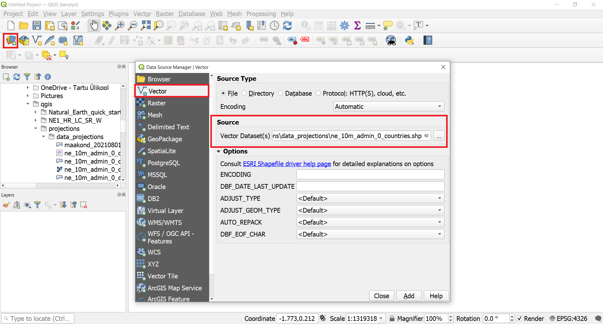
2. QGIS-i akna alumises servas on näha silt ´Coordinate´. Kui te liigutate oma hiirt kaardil, siis see näitab teile selle koha X ja Y koordinaate. Hetkel näitab see geograafilisi koordinaate, kuna andmekihi koordinaatsüsteem on geograafiline, täpsemalt WGS84 (EPSG:4326), mida näed ka alumises paremas nurgas. See on hetkel ka projekti koordinaatsüsteem, kuna QGIS määrab tühjale projektile esimesena lisatud kihi koordinaatsüsteemi.
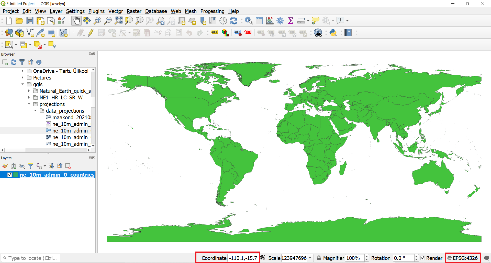
3. Selleks, et tuvastada, mis on kihi projektsioon, saame vaadata metaandemid. Tee parem hiireklõps kihil ne_10m_admin_0_countries.shp ja vali `Properties`. `Layer Properties` alt vali `Information`. CRS alt leiad informatsiooni koordinaatsüsteemi kohta. Nagu näha, on metaandmetes ka palju muud informatsiooni, nagu kihi ulatus, ühikud jne.
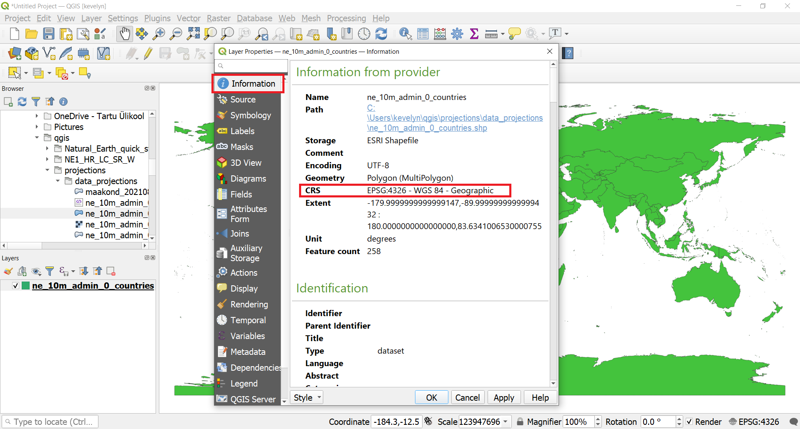
4. Kõigpealt muudame projekti koordinaatsüsteemi. Tee hiireklõps *status bar*-i alumises paremas nurgas asuval tekstil EPSG:4326. Kirjuta otsingusse "winkel". Nüüd peaks näha olema mitu Winkel koordinaatsüsteemi. Vajuta World_Winkel_Tripel_NGS (ESRI:54042)[^1] ja siis OK. Winkel-Tripel on vähimmoondeline projektsioon ja see on National Geographic Society maailmakaartide standard projektsioon (Wiki). Uue projektsiooni tõttu peaks kaart *Map view*-s muutuma.
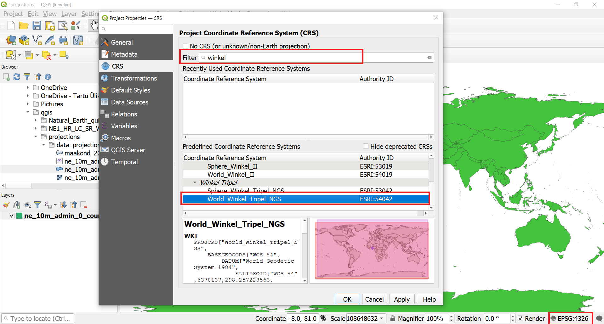
5. Palun kontrollige uuesti kihi koordinaatsüsteemi tehes parem hiireklõps kihil ne_10m_admin_0_countries.shp ja valige `Properties`. Seal valide `Layer Properties` alt `Information` ja kontrollige koordinatsüsteemi informatsiooni. See peaks olema sama, mis enne: WGS84 (EPSG: 4326). Te muutsite ainult projekti koordinaatsüsteemi ja ei muutnud kihi koordinaatsüsteemi. *Map view* kaart projiteeriti automaatselt, kuid ainult virtuaalselt projekti koordinaatsüsteemi, kuna QGIS-is on lennult koordinaatsüsteemi muutmine (*On-The-Fly CRS transformation*) nii raster- kui vektorandmete jaoks. See tähendab, et kui kihi koordinaatsüsteem ei ühti projekti koordinaatsüsteemiga, teisendatakse see automaatselt projekti koordinaatsüsteemi, et seda saaks õigesti kuvada. Seega olenemata kaardi kihitide koordinaatsüsteemidest teie projektis, teisendatakse need alati automaatselt teie projektis määratud koordinaatsüsteemi, et need esitataks üksteise suhtes õiges asendis. 

#### 2.2 Vektorkihi koordinaatsüsteemi muutmine
6. Nüüd muudame kihi koordinaatsüsteemi. Seda kutsutakse projektsiooni muutmiseks (*Re-Projection*). On võimalik tervet kihti muuta, aga on võimalik valida ka teatud objektid ja need uuele kihile konventeerida. Kasuta *Select Features by Area* või *Single Click* tööriista . Tee hiireklõps Eestil selle valimiseks.
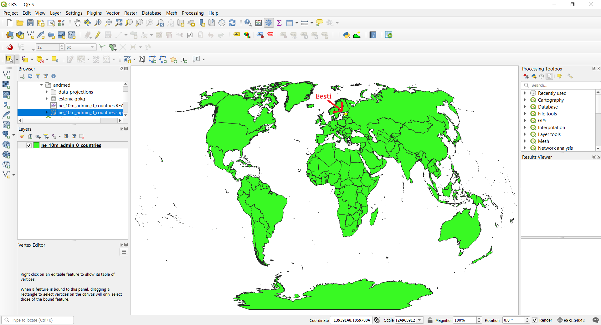
7. Kui sul pole paremal ääres *Processing Toolbox* olemas, siis lülita see sisse vajutades `View ► Panels`. Kui sul on *Processing Toolbox* olemas, võid selle punkti vahele jätta. 
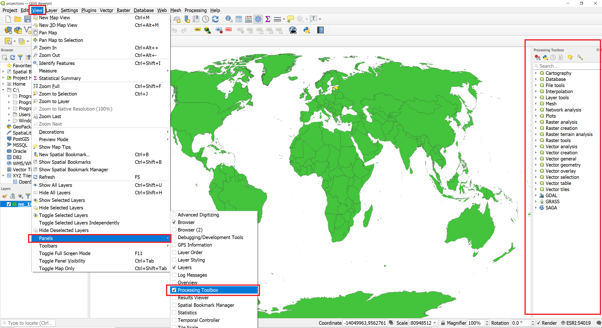
8. *Processing Toolbox*-ist otsi tööriist *Reproject layer*.
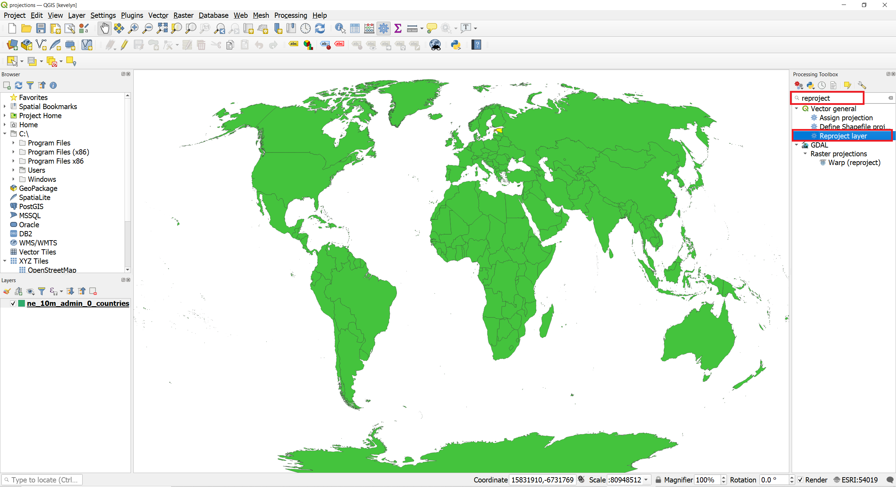
9. Vali *Input layer*-iks ne_10m_admin_0_countries.shp, tee linnuke *Selected features only* ees ja siis vajuta nupul *Select CRS* , mis asub *Target CRS* kõrval, ning otsi ja vali EPSG:3301 - Estonian Coordinate System of 1997. *Reprojected* all vali ... ja tee hiireklõps valikul *Save to a file*. Nüüd vali koht, kuhu soovid faili salvestada ja kirjuta nimeks estonia.gkpg ning siis vajuta *Run*.
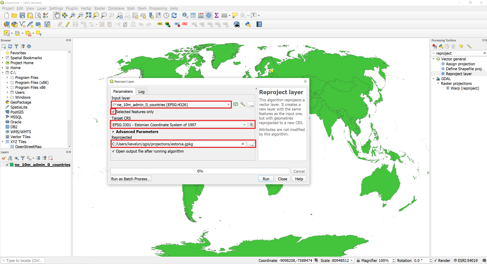
10. Uus kiht nimega estonia tekib *Layer Panel*-isse. Nagu näha, kattuvad mõlemad kihid üksteisega täielikult, kuigi neil on erinev koordinaatsüsteem. See on tänu lennult koordinaatsüsteemi muutmisele. Selleks, et kontrollida, kas kihi estonia koordinaatsüsteem tegelikult ka muutus, tee parem hiireklõps kihil estonia ja siis vali `Properties`. *Layer Properties* vahekaardil vali *Information* ning sealt näed, et koordinaatsüsteem on EPSG:3301. See kinnitab, et kihi koordinaatsüsteem on muutunud.
11. Nüüd muudame projekti koordinaatsüsteemi, et see oleks sama, mis just loodud kihi estonia koordinaatsüsteem. Eemalda kiht ne_10m_admin_0_countries ja tee parem hiireklõps kihil estonia ning vali `Layer CRS ► Set Project CRS from Layer`.
Nüüd näete, et projekti koordinaatsüsteem on nüüd EPSG 3301 (Estonian Coordinate System 1997).

#### 2.3 Rasterkihi koordinaatsüsteemi muutmine
12. Nüüd lisame raterkihi. Vali `Layer ► Add Layer ► Add Raster Layer…` või vajuta nupul *Open Data Source Manager*  ja siis vajuta *Raster tab* ning lisa kiht est_dtm100.tif. Kaardile ilmus uus rasterkiht. Kihid ei kattu täielikult, kuna neil on erinev täpsusaste. Rasterkihil on suurem detailsus ja rannajoon on täpsem. Lisaks on järved kõrgusmudelilt eemaldatud. 

13. Kihi koordinaatsüsteemi kontrollimiseks tee parem hiireklõps kihil estonia ja vajuta `Properties`. *Layer Properties* vahekaardil vali *Information*, mille alt saad näha, et koordinaatsüsteem on EPSG:3301.
14. Selleks, et mõlemda kihid paremini nähtavad oleks, muuda kihtide järjestust. Selleks tõsta est_dtm100 *Layer panel*-is viimaseks. Nüüd muudame kihi estonia leppemärke nii, et me näeks selle all olevat rasterkihti. Tee parem hiireklõps kihil estonia *Layer panel*-is ja vali `Properties`.
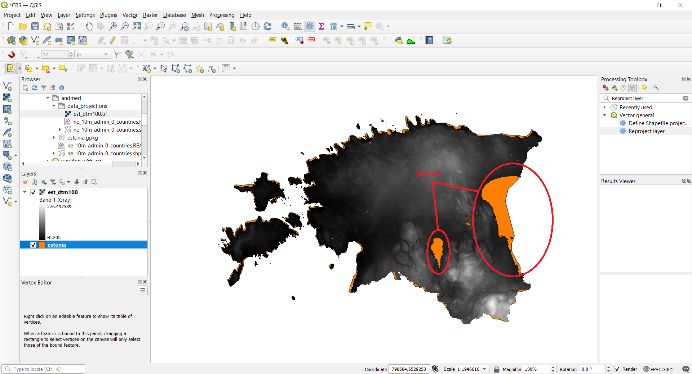
15. Avanenud vahekaardil vali `Symbology` ja seal vajuta *Simple Fill*. *Fill Style* asemel vali *No Brush*, *Stroke colour* vali punane värv ja *Stroke width* kirjuta näiteks 0.3 ning siis vajuta OK.
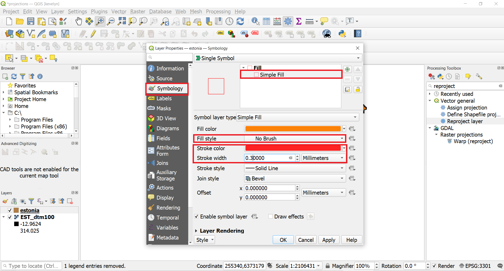
16. Selleks, et rasterkihi koordinaatsüsteem oleks WGS84, peame kasutama teistsugust tööriista kui vektorkihil. Kirjuta *Processing Toolboxi* "*reproject*" ning otsingutulemustest vali *Warp* (*reproject*), mis on GDAL[^2] all. *Input*-iks vali kiht EST_dtm100. *Source input* võite tühjaks jätta, kuna seda loetakse automaatselt metaandmetest. *Target CRS*-iks valige WGS84 (EPSG 4326). Ülejäänud parameetrid jätke nii nagu on ja kerige kuni jõuate valikuni *Advanced Parameters*, kus saate valida, kas tahate, et et uus rasterkiht salvestatakse ajutisse faili (*Save to a temporary file*) või mitte (*Save to file*). Võite siin valida ajutise faili, mis tähendab, et peale QGIS-i sulgemise antud fail kustutatakse. See valik on kasulik siis, kui teil on palju vahepealseid tulemusi, mille puhul olete kindald, et neid ei lähe hiljem vaja. Vajuta *Run*. *Layer panel*-isse peaks tekkima uus fail Reprojected. Uus kiht peaks täpselt kattuma originaalse failiga lennult koordinaatsüsteemi muutmise tõttu, aga kihi koordinaatsüsteem peaks nüüd olema WGS84. Kontrolli kihi koordinaatsüsteemi, et selles veenduda.
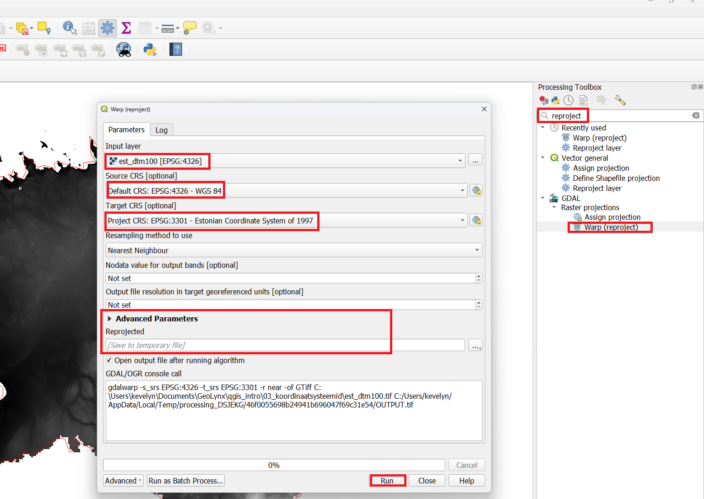

[^1]: Nagu te võite näha, on EPSG asemel ESRI kood, sest kõikidel koordinaatsüsteemidel ei ole EPSG koodi ning Winkel Tripel (NGS) on ESRI tarkvarasse lisatud selle koodi all.
[^2]: [GDAL](https://gdal.org/) on avatud lähtekoodga raamatukogu erinevate raster ja vektor ruumiandmete vormingute jaoks.
