Kaart on kõige tavalisem GIS-i väljund. See juhend õpetab kuidas luua kaarti vektor- ning rasterandmete põhjal koos selle standartsete elementidega, nagu inset, legend, põhjasuund, mõõtkava ja kohanimed.

#### Juhend koosneb järgnevatest osadest:

- [1. Kasutatavad andmed](#1-kasutatavad-andmed)
- [2. Kaardi loomise etapid](#2-kaardi-loomise-etapid)
  * [2.1. Põhikaardi tegemine](#21-põhikaardi-tegemine)
  * [2.2. Inset kaardi tegemine](#22-inset-kaardi-tegemine)
  * [2.3. Põhjasuuna noole, mõõtkava, kaardi pealkirja ja legendi lisamine](#23-põhjasuuna-noole-mõõtkava-kaardi-pealkirja-ja-legendi-lisamine)
  * [2.4. Kaardi salvestamine pildina](#24-kaardi-salvestamine-pildina)
  * [2.5. Aluskaartide lisamine](#25-aluskaartide-lisamine)

### 1. Kasutatavad andmed

Antud ülesandes kasutamine [Maa-ameti WMS-teenust](https://geoportaal.maaamet.ee/est/Teenused/WMSWFS-teenused-p65.html). Maa-amet pakub palju erinevaid andmekihte ja aluskaarte, mida saab otse QGIS-i laadida.

**Andmete allikas:** [Maa-amet](https://geoportaal.maaamet.ee/est/Teenused/WMSWFS-teenused-p65.html)

### 2. Kaardi loomise etapid
#### 2.1. Põhikaardi tegemine
1. Andmete alla laadimiseks avage QGIS. Järgmiseks peame lisama uue kihi. Vali Menu bar-ilt `Layer ► Add layer ► Add WMS/WMTS Layer`. Avanenud aknas valige New ning Name alla kirjuta näiteks Maa-ameti aluskaart ja URL alla kopeerige link: https://kaart.maaamet.ee/wms/fotokaart? Maa-ameti leheküljelt. Siis vajutage OK ning Connect. Nüüd ilmusid andmekihid, mida saadte oma kaardile lisada. Antud töö jaoks pole aga kõiki kihte vaja, kuna see muudaks kaardi ülekoormatuks. Seega valime vaid osad kihid. Vajutades loendi aknas noole märgile, saab lisada ka üksikuid kihte. Ortofotode alt valige kiht, mille pealkiri on Ortofoto ning Halduspiiride alt valige halduspiir (1:600 000), Välisriikide piirid, jarved (1:2 000 000), Eesti-Vene kontrolljoon, meri (1:420 000) ja suur maismaa (1:420 000). Mitu kihti saab korraga valida hoides all Ctrl klahvi. Lisaks tee linnuke kasti Load as separate layers.
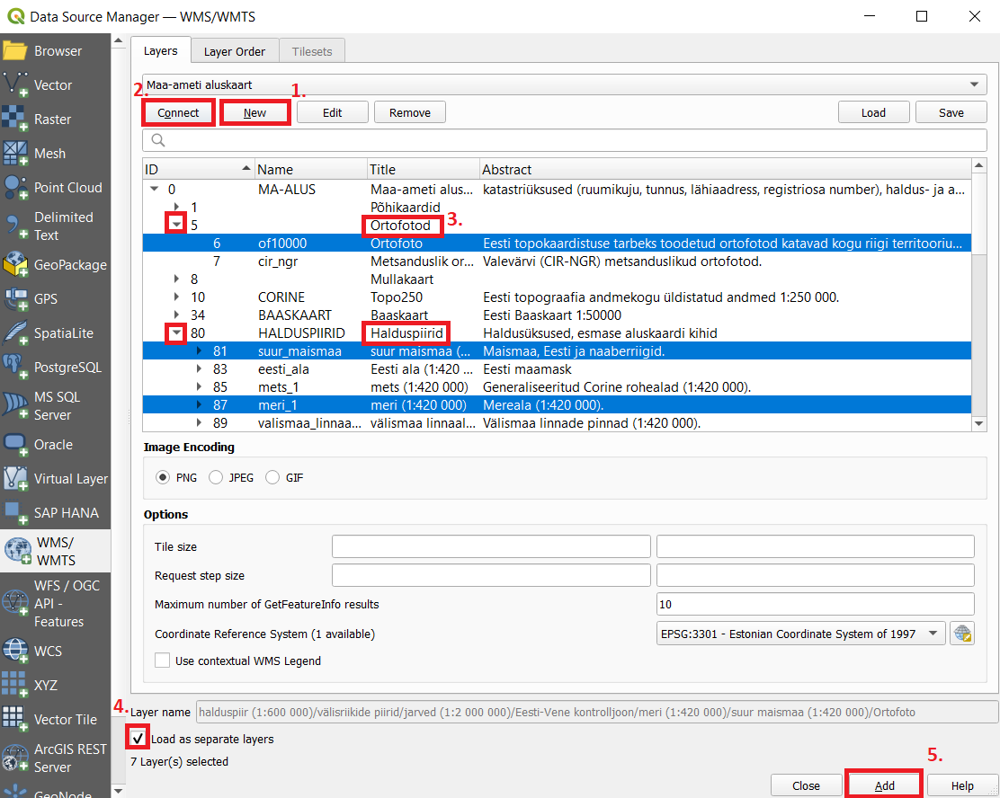
2. Teie tegevust QGIS-is kutsutakse projektiks. QGIS saab korraga töötada ühe projektiga. Palun salvestage oma projekt `Project ► Save as` oma kausta. Proketi fail salvestab sinu lisatud kihid, kihtide atribuudid ja sümboolika, kaardivaate projektsiooni jms. Lisainfot QGIS-i projekti kohta saad siit lehelt [QGIS Documentation](https://docs.qgis.org/3.28/en/docs/user_manual/introduction/project_files.html#working-with-project-files).
3. Kasuta pan and zoom nuppe Map Navigation Toolbar-il ning suurenda kaardil nähtavaks Balti SEJ. 
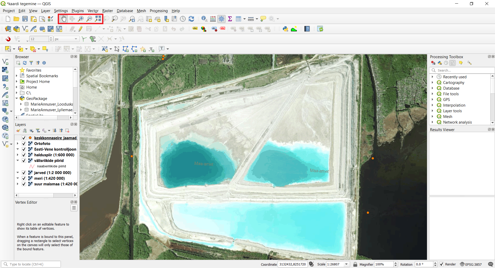
4. Enne kui saame teha printimiseks sobiva kaardi, peame valima sobiva projektsiooni Status bar-ilt , mis asub alumises paremas nurgs. Kuna laadisime andmed alla Maa-ametist, siis on automaatselt projektsioon EPSG: 3301[^1], mis on Eesti koordinaatsüsteem. Seega sobib antud projektsioon meie tööks.
5. Uue küljendatud kaardi (map layout) loomiseks vali `Project ► New Print Layout` või vajuta Show Layout Manager . Loo uus küljendatud kaart ja nimeta see (näiteks Balti SEJ kaart). 

6. Nüüd on meil olemas n-ö lõuend, kuhu saame lisada kaardi map view-st. Automaatselt on map layout horisontaalses formaadis, mis sobib antud töö jaoks, aga seda on võimalik muuta ka portree formaatiks. Selleks peab tegema parema hiireklõpsu lõuendil ja siis valima `Page Properties`. Siis avaneb paneel paremas ääres, kus saab muuta lehe orientatsiooni. 

7. Selleks, et kaarti lisada, peab menüüst valima `Add Item  ► Add Map` või vajutama , mis muudab Add map mode aktiivseks. Hoia all hiire vasakut klahvi ning tõmba ristkülik sinna, kus tahad, et kaart oleks. Hetkel tahame, et terve lõuend oleks kaetud.
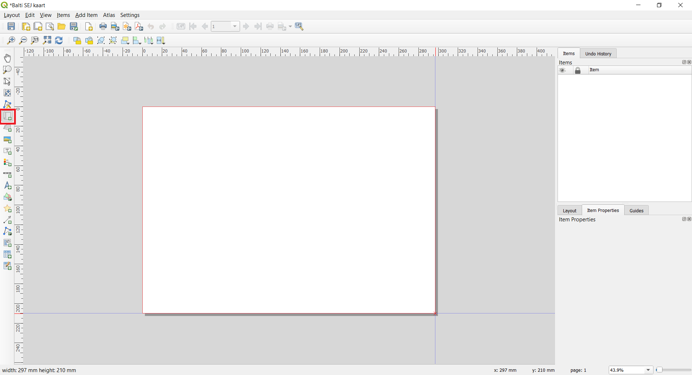
8. Nagu näha, esitatakse tõmmatud ristkülikusse kaart põhi QGIS Map view-st. Kui te eelnevas punktis ei tõmmanud kaarti terve lõuandi ulatuses, ei pruugi esitatud kaardil olla näha kogu meid huvitav ala. Kaardi liigutamiseks ja tsentreerimiseks vali menüüst `Edit ‣ Select/Move item aja Edit ‣ Move Content` või kasuta kaardi liigutamiseks  ja . Selleks, et suurendatust reguleerida, vajuta Item Properties vahekaardile ning sisesta Scale value: 20000. Võib ka vajutada nupule  ning kasutada hiire kerimist, et kaarti suurendada ja vähendada, aga see pole eriti mugav. 

#### 2.2. Inset kaardi tegemine
11. Nüüd lisame väiksema kaardi (map inset[^2]), mis näitab kus Balti SEJ asub Eestis. Aga enne kui me mingeid muutusi põhi QGIS aknas teeme, tehke linnukesed kastidesse Lock layers ja Lock styles. See tagab selle, et kui me mingid kihid välja lülitame või nende sümboolikat muudame, siis layout ei muutu. 
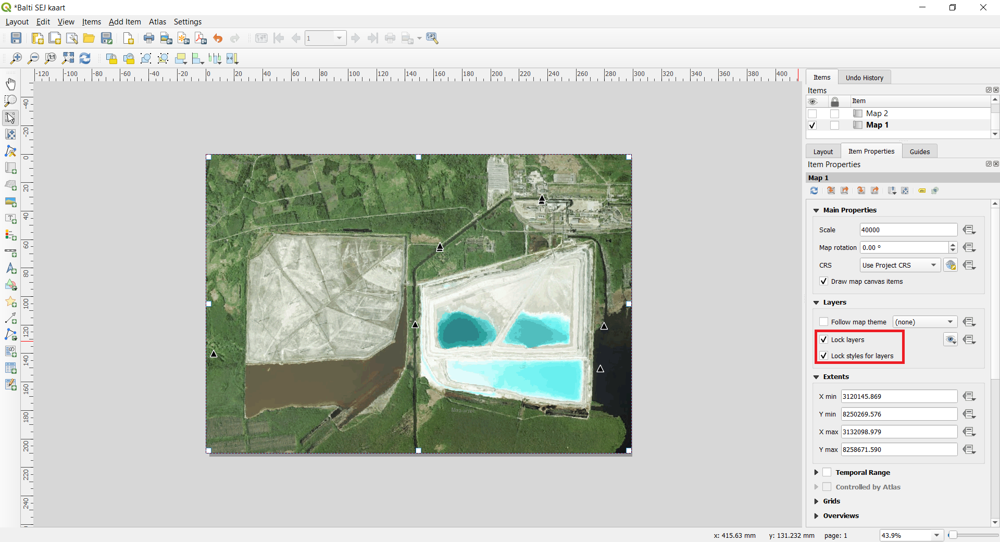
12. Selleks et inset kaarti lisada, vajuta . See muudab Add map mode aktiivseks. Tõmba ristkülik kaardi alumisse vasakusse serva või sinna, kuhu soovute inset kaardi lisada. Nagu näha, on Print Layout-is nüüd 2 kaardi objekti. Kui edaspidi muudatusi teete, siis kontrollige, et olete valinud õige kaardi. Kui soovite võite Map 2 nimeks panna Inset map. Selle tegemiseks peab nimel tegema topeltklõpsu.
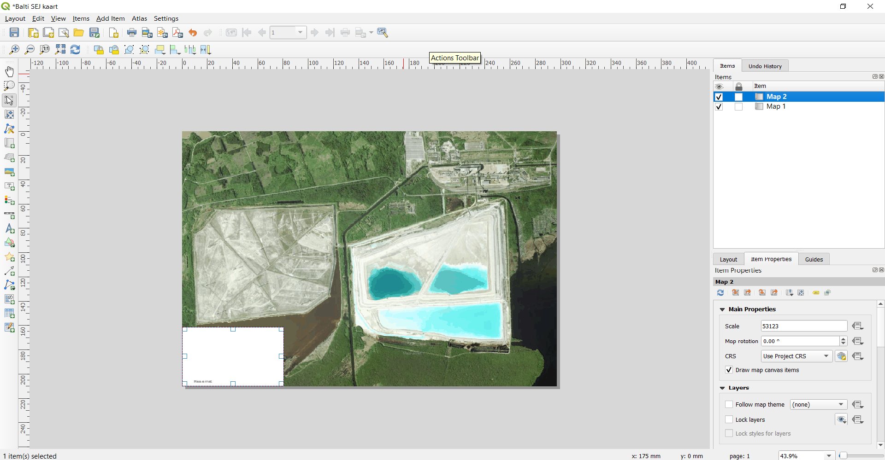
13. Kuna me ei soovi, et inset map oleks nii detailne, peaksime muutma kihtide nähtavust Map view-s. Mine Map view-sse ning muuda ortofoto nähtamatuks. Ülejäänud kihid jäta nähtavaks. Muuda suurentatust nii, et terve Eesti oleks nähtav kasutades valikuid Pan/Zoom In ja Out/Zoom Full. Peale seda mine tagasi Layout vaatesse. Värskenda inset kaardi vaadet ning see peaks muutuma.
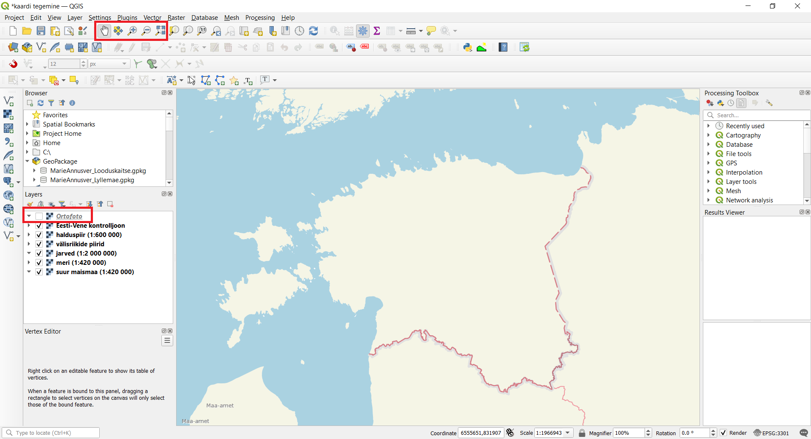
13. Võimalik, et peate veidi kohandama inset kaardi suurendust. Selleks, et kaardi sisu liigutada ning tsentreerida saab kasutada Select/Move  ja Move Content . On ka võimalik inset kaardi suurust muuta.
14. Selleks, et põhikaart ja inset kaart üksteisest paremini visuaalselt eristuksid, saab inset kaardile lisada raami. Vali objekt Map 2 (inset map) Items panel-ist. Vajuta vahekaardile Item properties. Kerige alla kuni jõuate osani Frame panel ning tehke linnuke selle kõrval asuvasse kasti. Võite muuta ka raami värvi ning paksust, et seda oleks kergem eristada.
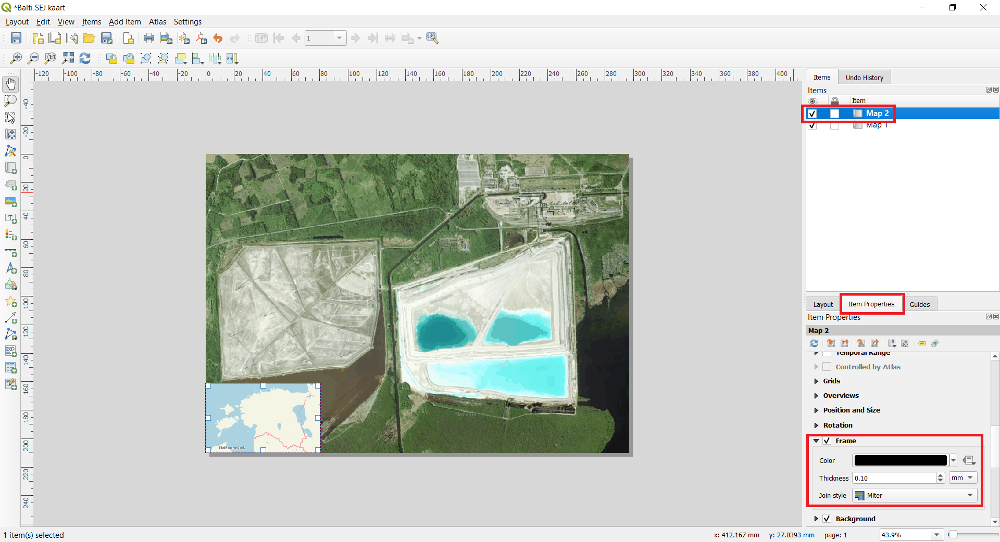
15. Print Layout-il on kasulik funktsioon, mille abil on võimalik automaatselt esile tõsta inset kaardil see osa, mis on põhikaardil (ja ka vastupidi). Vali Map 2 objekt Items panel-ist. Item properties vahekaardil keri nii kaua, kuni jõuad osani Overviews section. Vajuta nupule Add a new overview. Vali Map Frame-iks Map 1. See käsib Print Layout-il esile tõsta praguse valitud objekti (Map 2) selle osa, mis on näha objektil Map 1.
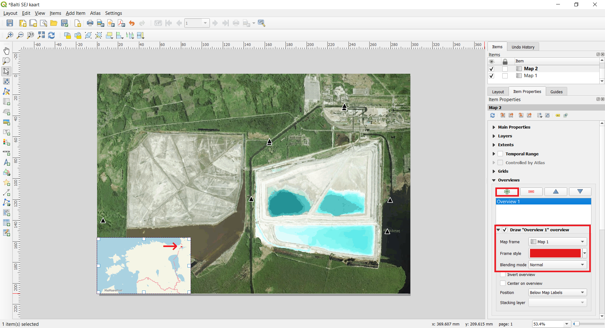

#### 2.3. Põhjasuuna noole, mõõtkava, kaardi pealkirja ja legendi lisamine
21. Kõigepealt lisame ristküliku kujulise raamistiku, mille sisse lisame kaardi elemendid (põhjasuund, mõõtkava jms). Selleks mine `Add Item ► Add Shape ► Add Rectangle` või kasuta nuppu Add shape  ning tõmba ristkülik. Pane tähele, et uus objekt nimega Rectangle 1 ilmub Items panel-i loendisse. Võite muuta ristkülikut nii, et see sobiks kaardiga kokku. Selleks vajuta Itemp properties vahekaardil nupule Style.
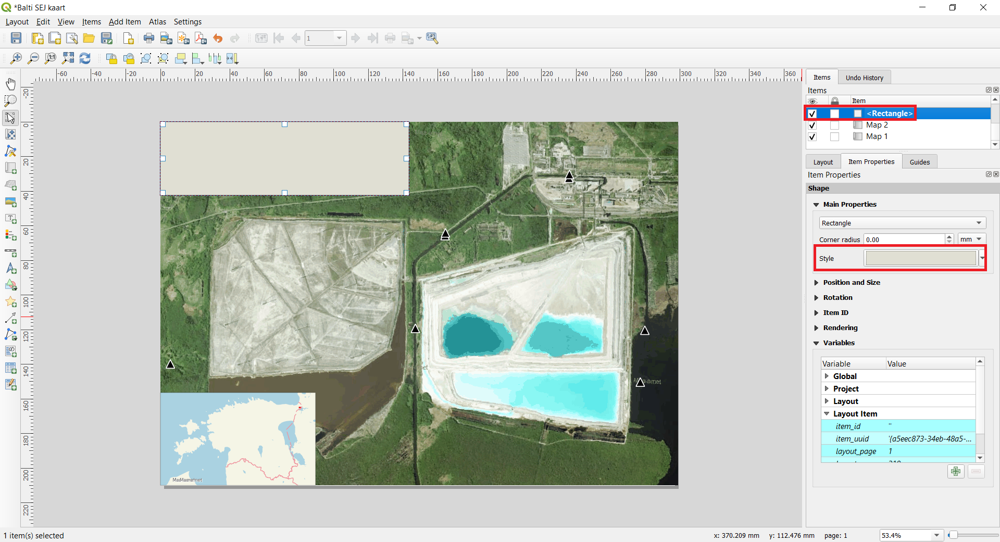
22. Järgmisena lisame kaardile põhjasuuna noole. QGIS-is on hea kollektsioon põhjasuuna nooltest. Vajuta `Add Item ► Add North Arrow` või vajuta nupul Add North Arrow . Hoides all hiire vasakut klahvi, tõmba ristkülik. Paremal pool asuval paneelil vajuta Item properties vahekaardile ning SVG browser alt vajuta arrows. Sealt alt vali endale meeldiv stiil. 
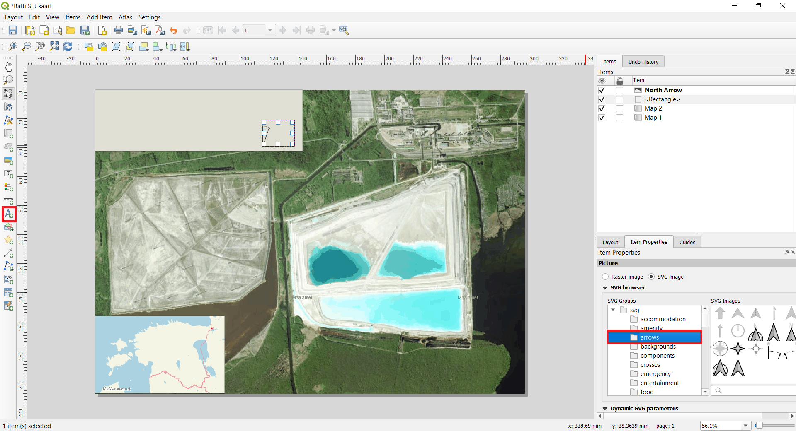
>**Näpunäide** :smirk:
>
*QGIS-i põhjasuuna nooled on SVG pildid ja sa võid uusi pilte juurde lisada või ise kujundada. Lisainfot põhjasuuna noolest ja SVG piltidest QGIS-is saad lehelt [QGIS Documentation](https://docs.qgis.org/3.28/en/docs/user_manual/print_composer/composer_items/composer_image.html#the-picture-item).*

23. Kaardi pealkirja lisamiseks vajuta `Add Item ► Add Label` või vajuta nupule . Vajuta kaardile ja tõmba kast sinna, kuhu soovid pealkirja lisada. Item Properties vahekaardil laienda jaotist Label ning kirjuta kaardile pealkiri. Muuda teksti suurust ja fonti kui vajalik.
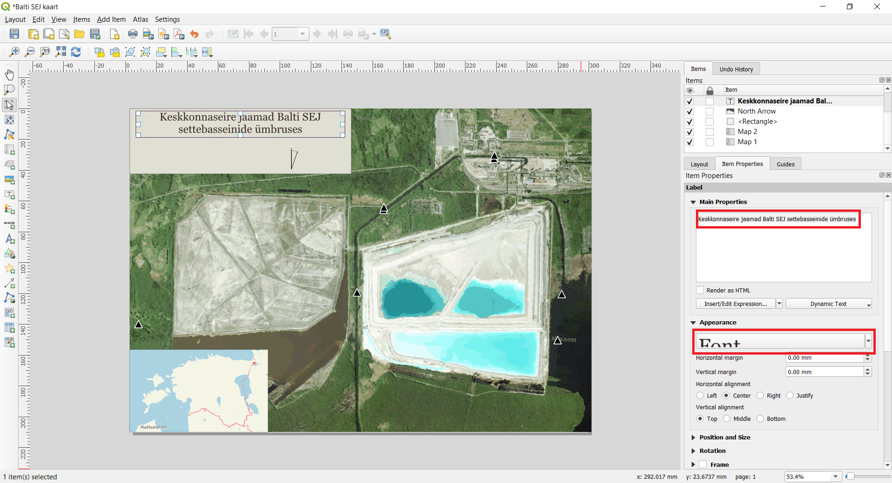
24. Nagu eelmises punktis, lisa kasti informatsioon kaardi autori, tarkvara ning andmete kohta. Lisa kaardile ka silt, mis näitab Balti SEJ asukohta. Vajuta kaardile ja tõmba kast sinna, kuhu soovid silti lisada. Siis kujunda silt nii, et see oleks hästi nähtav. Näitkes lisades sildile teist värvi puhvri. Selleks vajuta Item properties vahepaneelil `Font ► Buffer`. Tee linnuke kasti Draw text buffer. Vajadusel muuda veel teksti värvi ja suurust.

25. Lisame kaardile ka mõõtkava[^3]. Vajuta `Add Item ► Add Scalebar` või vajuta nupule Add Scale Bar . Vajuta kaardil kohale, kus soovid, et mõõtkava asuks. Kontrolli Item Properties vahekaardil, et oled valinud õige kaardi elemendi Map 1, millele mõõtkava lisada. Vali see Style, mis sulle meeldib. Paneelil nimega Segments muuda segmentide arv sulle meeldivaks. Veel on võimalik muuta mõõtkava mitmeid omadusi. Mõõtkava kujundamise ja reguleerimise kohta lisainfot saad lehelt [QGIS Documentation](https://docs.qgis.org/3.28/en/docs/user_manual/print_composer/composer_items/composer_scale_bar.html#the-scale-bar-item).
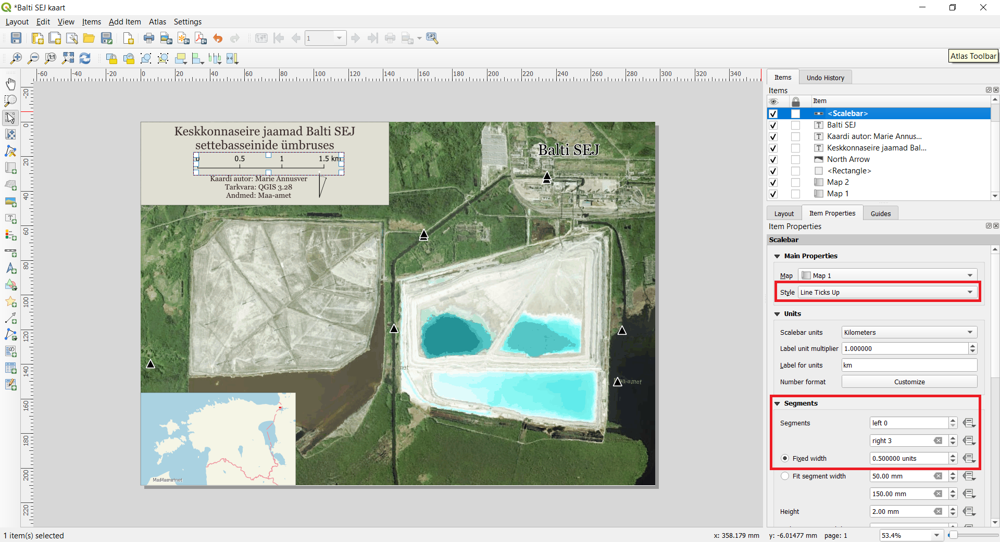

#### 2.4. Kaardi salvestamine pildina
38. Kui olete kaardiga rahul, siis saate selle pildina, PDF või SVG vormis salvestada. Antud juhedis salvestame kaardi pildina. Vajutage `Click Layout ► Export as Image`. Andke failile sobiv nimi ning kontrollige, et Image Export Options all on Export resolution 300 dpi. 300 dpi on minimaalne printimiseks nõutud eraldusvõime. Kui soovite kaarti internetis avaldada, siis võite eraldusvõimet vähendada 150-200 dpi-ni. Aga kui kaardi kasutamise eesmärk pole kindel, siis jätke eraldusvõimeks 300 dpi, kuna oleks kahju, kui te kujundate ilusa kaardi, aga keegi ei saa seda halva eraldusvõime tõttu lugeda.
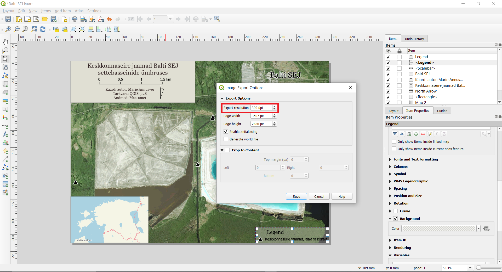
39. Õnnitlused! Olete loonud oma esimese kaardi! :smile:

#### 2.5. Aluskaartide lisamine
3. Lisaks õpima kuidas kaardile lisada alyuskaart. Mõnikord on praktiline kasutada juba stiliseeritud aluskaarte selle asemel, et ise aluskaart kujundada. [Klas Karlsson'il](https://github.com/klakar) on hea kollektsioon erinevatest aluskaartidest, mille lisamiseks on vaja vaid QGIS-is käivitada antud Python skript. Ava Github-ist [qgis_basemaps.py](https://github.com/klakar/QGIS_resources/blob/master/collections/Geosupportsystem/python/qgis_basemaps.py) ja kopeeri (`Crtl+C`) skript alates reast # Sources.

4. Mine tagasi QGIS-i ja ava Python Console. Selleks vajuta toolbar-il . Python Console avaneb Map view all. Kleebi skript ning vajuta klaviatuuril Enter. Peale seda võite Python Console-i sulgeda. 
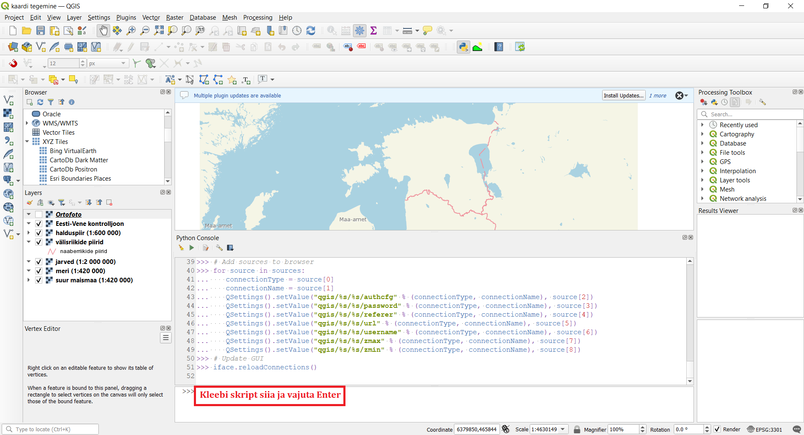
5. Browser Panel-is tekkisid XYZ titels alla paljud uued kihid. Need on lisatud aluskaardid. Proovime neist mõnda. Tee topeltklõps kihil CartoDb Dark Matter. See lisab aluskaardi map view-sse. Proovi näiteks ka aluskihti Google Satellite või lõbusat Stamen Watercolour aluskaarti. Proovi ka teisi aluskaarte. 
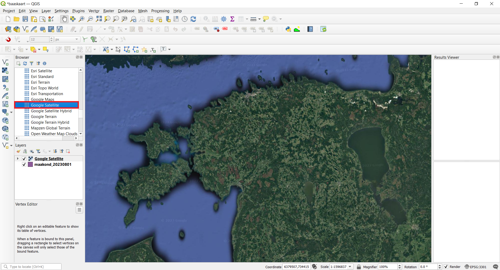 

[^1]: EPSG Geodetic Parameter Dataset (lühidalt EPSG registry) on geodeetiliste andmete, ruumiliste referentssüsteemide, Maa ellipsoidide ning koordinaatide teisenduste ja sellega seotud mõõtühikute avalik register. Igale üksusele on määratud kood vahemikus 1024-32767 koos standardse masinloetava tekstiga (well-known text). (Wiki) EPSG koodid on ainulaadsed ja väga kasulikud, kui soovid GIS programmis otsida ja tuvastada CRS-e.
[^2]: Inset kaart on põhikaardil asuv väiksem kaart. (GIS Wiki)
[^3]: Kaardid liigitatakse väikse, suure ja keskmise mõõtkavaga kaartideks. Suure mõõtkavaga kaardid on tavaliselt vahemikus 1:0 – 1:600 000. Selles mõõtkavas on näiteks linnade kaardid. Keskmise mõõtkavaga kaardid on tavaliselt vahemikus 1:600 000 – 1:2 000 000. Enamasti on keskmise mõõtkavaga terve riigi kaardid. Väikse mõõtkavaga kaardid on tavaliselt vahemikus 1:2 000 000 – 1:∞ ning selles mõõtkavas on maailma või regiooni kaardid. (Wiki) 
