Kaart on kõige tavalisem GIS-i väljund. See juhend õpetab kuidas luua kaarti vektor- ning rasterandmete põhjal koos selle standartsete elementidega, nagu inset, legend, põhjasuund, mõõtkava ja kohanimed.

#### The tutorial consists of the following steps:

- [1. Kasutatavad andmed](#1-kasutatavad-andmed)
- [2. Kaardi loomise etapid](#2-kaardi-loomise-etapid)
  * [2.1. Põhikaardi tegemine](#21-põhikaardi-tegemine)
  * [2.2. Inset kaardi tegemine](#22-inset-kaardi-tegemine)
  * [2.3. Põhjasuuna noole, mõõtkava, kaardi pealkirja ja legendi lisamine](#23-põhjasuuna-noole-mõõtkava-kaardi-pealkirja-ja-legendi-lisamine)
  * [2.4. Legendi lisamine kaardile](#24-legendi-lisamine-kaardile)
  * [2.5. Kaardi salvestamine pildina](#25-kaardi-salvestamine-pildina)
  * [2.6. Aluskaartide lisamine](#26-aluskaartide-lisamine)

### 1. Kasutatavad andmed

Antud ülesandes kasutamine [Maa-ameti WMS-teenust](https://geoportaal.maaamet.ee/est/Teenused/WMSWFS-teenused-p65.html). Maa-amet pakub palju erinevaid andmekihte ja aluskaarte, mida saab otse QGIS-i laadida.

**Andmete allikas:** [Maa-amet](https://geoportaal.maaamet.ee/est/Teenused/WMSWFS-teenused-p65.html)

### 2. Kaardi loomise etapid
#### 2.1. Põhikaardi tegemine
1. Andmete alla laadimiseks ava QGIS. Järgmiseks peame lisama uue kihi. Vali Menu bar-ilt: `Layer ► Add layer ► Add WMS/WMTS Layer`. Avanenud aknas vali New ja Name alla kirjuta näiteks Maa-ameti aluskaart ning URL alla kopeeri link: https://kaart.maaamet.ee/wms/fotokaart? Maa-ameti leheküljelt. Siis vajuta OK ning Connect. Nüüd ilmusid sulle andmekihid, mida saad oma kaardile lisada. Antud töö jaoks pole aga kõiki kihte vaja, kuna see muudaks kaardi ülekoormatuks. Seega valime vaid osad kohid. Vajutades loendi aknas noole märgile, saab lisada ka üksikuid kihte. Ortofotode alt vali kiht, mille pealkiri on Ortofoto ning Halduspiiride alt vali halduspiir (1:600 000), Välisriikide piirid, jarved (1:2 000 000), Eesti-Vene kontrolljoon, meri (1:420 000) ja suur maismaa (1:420 000). Mitu kihti saab korraga valida hoides all Ctrl klahvi. Lisaks tee linnuke kasti Load as separate layers.

2. Sinu tegevust QGIS-is kutsutakse projektiks. QGIS saab korraga töötada ühe projektiga. Palun salvesta oma projekt `Project ► Save as` oma kausta. Proketi fail salvestab sinu lisatud kihid, kihtide atribuudid ja sümboolika, kaardivaate projektsiooni jms. Lisainfot QGIS-i projekti kohta saad siit lehelt [QGIS Documentation](https://docs.qgis.org/3.28/en/docs/user_manual/introduction/project_files.html#working-with-project-files).
3. Kasuta pan and zoom nuppe Map Navigation Toolbar-il ning suurenda kaardil Balti SEJ. 

4. Enne kui me saame teha printimiseks sobiva kaardi, peame valima sobiva projektsiooni Status bar-ilt 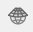, mis asub alumises paremas nurgs. Kuna laadisime andmed alla Maa-ametist, siis on automaatselt projektsioon EPSG: 3301[^1], mis on Eesti koordinaatsüsteem. Seega sobib antud projektsioon meie tööks.
5. Uue küljendatud kaardi (map layout) loomiseks vali `Project ► New Print Layout` või vajuta Show Layout Manager . Loo uus küljendatud kaart ja nimeta see (näiteks Balti SEJ kaart). 

6. Nüüd on meil olemas n-ö lõuend, kuhu saame lisada kaardi map view-st. Automaatselt on map layout horisontaalses formaadis, mis antud töö jaoks sobib, aga seda on võimalik muuta ka portree formaatiks. Selleks peab tegema parema hiireklõpsu lõuendil ja siis valima `Page Properties`. Siis avaneb paneel paremas ääres, kus saab muuta lehe orientatsiooni. 
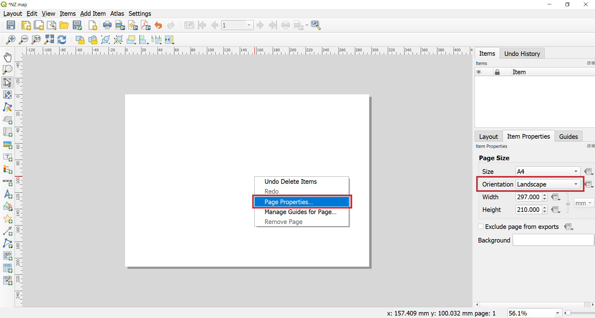
7. Selleks, et kaarti lisada, peab menüüst valima `Add Item  ► Add Map` või vajutama 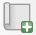, mis muudab Add map mode aktiivseks. Hoia all hiire vasakut klahvi ning tõmba ristkülik sinna, kus tahad, et kaart oleks. Hetkel tahame, et terve lõuend oleks kaetud.

8. Nagu näha, sinu tõmmatud ristkülikusse renderdatakse kaart põhi QGIS Map view-st. Kui sa eelnevas punktis ei tõmmanud terve lõuandi ulatuses, ei pruugi renderdatud kaardilt olla näha kogu meid huvitav ala. Kaardi liigutamiseks ja tsentreerimiseks vali menüüst `Edit ‣ Select/Move item and Edit ‣ Move Content` või kasuta kaardi liigutamiseks  ja . Selleks, et suurendatust reguleerida, vajuta Item Properties vahekaardil ning sisesta Scale value: 20000. Võib ka vajutada nupule  ning kasutada hiire kerimist, et kaarti suurendada ja vähendada, aga see pole eriti mugav. 

#### 2.2. Inset kaardi tegemine
11. Nüüd lisame me väiksema kaardi (map inset[^2]), mis näitab kus Balti SEJ asub Eestis. Aga enne kui me mingeid muutusi põhi QGIS aknas teeme, tee linnukesed kastidesse Lock layers ja Lock styles. See tagab selle, et kui me mingid kihid välja lülitame või nende sümboolikat muudame, siis layout ei muutu. 

12. Selleks et inset kaarti lisada, vajuta . See muudab Add map mode aktiivseks. Tõmba ristkülik kaardi alumisse vasakusse serva või sinna, kuhu sa soovid inset kaardi lisada. Nagu näha, on Print Layout-is nüüd 2 kaardi objekti. Kui sa edaspidi muudatusi teed, siis kontrolli, et oled valinud õige kaardi. Kui soovid võid Map 2 nimeks panna Inset map. Selle tegemiseks pead nimel tegema topeltklõpsu.

13. Kuna me ei soovi, et inset map oleks nii detailne, peaksime me muutma kihtide nähtavust Map view-s. Mine Map view-sse ning muuda ortofoto nähtamatuks. Ülejäänud kihid jäta nähtavaks. Muuda suurentatust nii, et terve Eesti oleks nähtav kasutades valikuid Pan/Zoom In ja Out/Zoom Full. Peale seda mine tagasi Layout vaatesse. Värskenda inset kaardi vaadet ning see peaks muutuma.

13. Võimalik, et pead veidi kohandama inset kaardi suurendust. Selleks, et kaardi sisu liigutada ning tsentreerida saad kasutada Select/Move  ja Move Content . On ka võimalik inset kaardi suurust muuta.
14. Selleks, et põhikaart ja inset kaart üksteisest paremini visuaalselt eristuksid, saame inset kaardile lisada raami. Vali objekt Map 2 (inset map) Items panel-ist. Vajuta vahekaardile Item properties. Kerige alla kuni jõuate osani Frame panel ning tehke linnuke selle kõrval asuvasse kasti. Sa võid muuta ka raami värvi ning paksust, et seda oleks kergem eristada.

15. Print Layout-il on kasulik funktsioon, mille abil on võimalik automaatselt esile tõsta inset kaardil see osa, mis on põhikaardil (ja ka vastupidi). Vali Map 2 objekt Items panel-ist. Item properties vahekaardil keri nii kaua, kuni jõuad osani Overviews section. Vajuta nupule Add a new overview. Vali Map Frame-iks Map 1. See käsib Print Layout-il esile tõsta praguse valitud objekti (Map 2) selle osa, mis on näha objektil Map 1.

#### 2.3. Põhjasuuna noole, mõõtkava, kaardi pealkirja ja legendi lisamine
21. Kõigepealt lisame me ristküliku kujulise raamistiku, mille sisse lisame kaardi elemendid (põhjasuund, mõõtkava jms). Selleks mine `Add Item ► Add Shape ► Add Rectangle` võu kasuta nuppu Add shape  ning tõmba ristkülik. Pane tähele, et uus objekt nimega Rectangle 1 ilmub Items panel-i loendisse. Sa võid muuta ristkülikut nii, et see sobiks kaardiga kokku. Selleks vajuta Itemp properties vahekaardil nupule Style.

22. Järgmisena lisame me kaardile põhjasuuna noole. QGIS-is on hea kollektsioon põhjasuuna nooltest. Vajuta `Add Item ► Add North Arrow` või vajuta nupul Add North Arrow 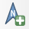. Hoides all hiire vasakut klahvi, tõmba ristkülik. Paremal pool asuval paneelil vajuta Item properties vahekaardile ning SVG browser alt vajuta arrows. Sealt alt vali endale meeldiv stiil. 

>**Näpunäide** :smirk:
>
*QGIS-i põhjasuuna nooled on SVG pildid ja sa võid uusi pilte juurde lisada või ise kujundada. Lisainfot põhjasuuna noolest ja SVG piltidest QGIS-is saad lehelt [QGIS Documentation](https://docs.qgis.org/3.28/en/docs/user_manual/print_composer/composer_items/composer_image.html#the-picture-item).*

23. Kaardi pealkirja lisamiseks vajuta `Add Item ► Add Label` või vajuta nupule 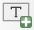. Vajuta kaardile ja tõmba kast sinna, kuhu soovid pealkirja lisada. Item Properties chaekaardil laienda jaotist Label ning kirjuta kaardile pealkiri. Muuda teksti suurust ja fonti kui vajalik.

24. Nagu eelmises punktis, lisa kasti informatsioon kaardi autori, tarkvara ning andmete kohta. Lisa kaardile ka silt, mis näitab Balti SEJ asukohta. Vajuta kaardile ja tõmba kast sinna, kuhu soovid sildi lisada. Siis kujunda silt nii, et see oleks hästi nähtav. Näitkes lisades sildile teist värvi puhvri. Selleks vajuta Item properties vahepaneelil `Font ► Buffer`. Tee linnuke kasti Draw text buffer. Vajadusel muuda veel teksti värvi ja suurust.

25. Lisame kaardile ka mõõtkava. Vajuta `Add Item ► Add Scalebar` või vajuta nupule Add Scale Bar 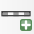. Vajuta kaardil kohale, kus soovid, et mõõtkava asuks. Kontrolli Item Properties vahekaardil, et oled valinud õige kaardi elemendi Map 1, millele mõõtkava lisad. Vali see Style, mis sulle sobib. Paneelil nimega Segments muuda segmentide arv sulle meeldivaks. Veel on võimalik muuta mõõtkava mitmeid omadusi. Mõõtkava kujundamise ja reguleerimise kohta loe lisainfo saamiseks lehelt [QGIS Documentation](https://docs.qgis.org/3.28/en/docs/user_manual/print_composer/composer_items/composer_scale_bar.html#the-scale-bar-item).

#### 2.4. Legendi lisamine kaardile
27. Finally, we will add legend to the map. Click on `Add Item ► Add Legend` or alternatively click on Add Legend
. Click on the layout where you want the scalebar to appear and holding left-side mouse button draw a rectangle. The legend should appear and it will cover most of the map as it is pulling automatically the legend info from all the layers in the Map view. We need to switch off most of the layers from the legend. In the Item Properties tab, scroll down to Legend items and uncheck the Auto update  under the Legend items. This will disconnect the legend from the map view layer panel and several legend adjustment buttons will become active.
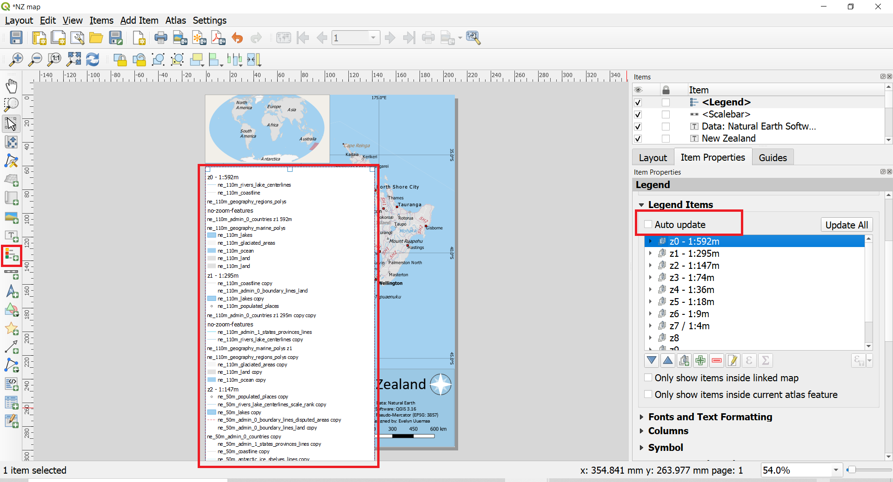
28. We will first remove all the unnecessary layers from the legend. Under the Legend items, select all layers except z7 / 1:4 and click Remove selected item(s) from legend.
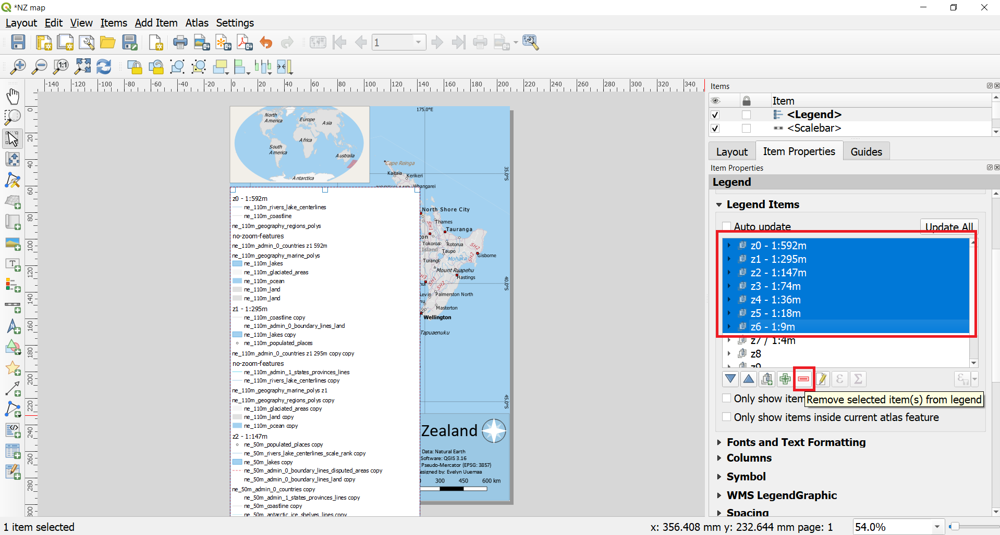
30. For the simplicity, we will show only cities and other populated places in the legend. Therefore we will delete all other sublayers of the z7 / 1:4. Click on the small arrow next to the layer group name under Legend items. This should reveal sublayers of the group. Delete all sublayers of the z7 / 1:4 except layer ne_10m_populated_places z7
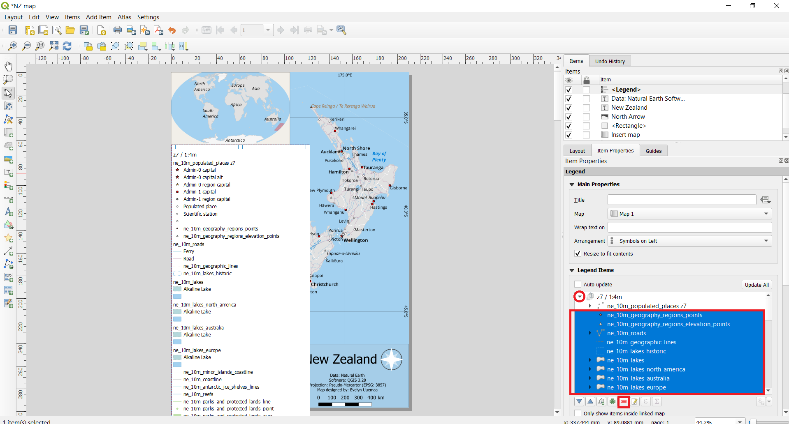
31. Click on the small arrow in front of the layer ne_10m_populated_places z7 to see all of its sublayers. Delete all sublayers except Admin-0 capital, Admin-1 capital, Populated place.

32. We will now change the names of the legend items more appropriate. Double click on the z7 / 1:4m and delete the text and just enter space. The QGIS won't accept leaving the place empty but as we don't need text there then entering space will allow it to keep seemingly empty.
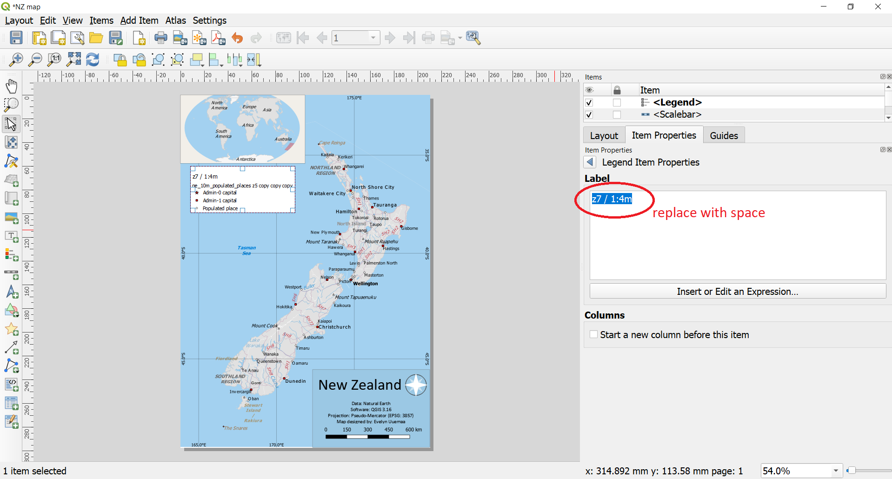.
33. Delete also the layer name of ne_10m_populated_places z7 similarly to previous step.
34. Rename layer name Admin-0 capital to Capital city, layer name Admin-1 capital to  Administrative unit capital.

35. Because of deleting some of the layer names, there is too much white space on the top of the legend. We will remove this by using Spacing options under Legend properties. Scroll down in the Legend Item properties tab to Spacing. Open it's options by clicking on a small arrow next to it. Change the value of Legend Title ‣ Space below to zero and Subgroups ‣ Above subgroup also zero. Note while doing that how the legend changes.

36. We will add a title to the legend. Click `Add Item ► Add Label` or alternatively click on Add Label  and while holding left-side mouse button draw a label box to the legend. Rename it to "Legend"
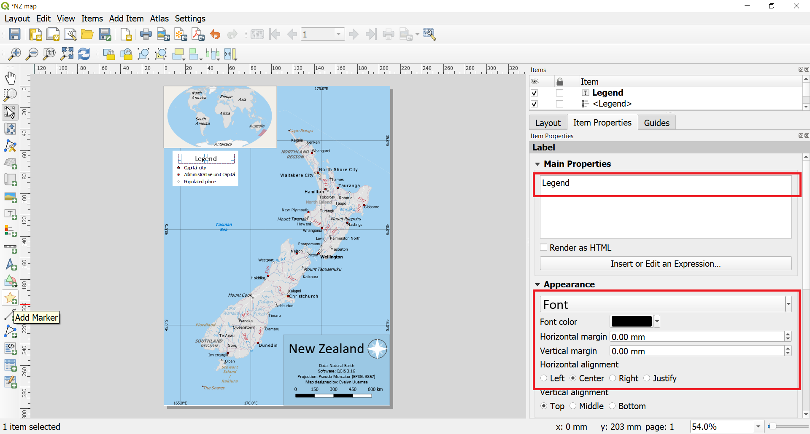
37. Finally, we will make the legend background more fitting with the map. In the legend's Item Properties tab scroll down to Background and click on the color option. In the color options scroll down to Opacity and reduce the opacity to 35%. This will make the legend background partially transparent making it less dominant. The map elements like legend, title, north arrow should not be too dominant on the map itself is the most important.

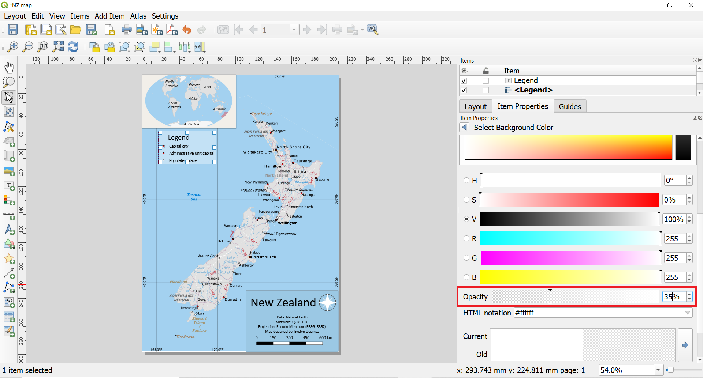

#### 2.5. Kaardi salvestamine pildina
38. Once you are satisfied with the map, you can export it as an Image, PDF or SVG. For this tutorial, let’s export it as an image. `Click Layout ► Export as Image`. Give the file a suitable name and under the Image Export Options make sure that the Export resolution is 300 dpi. 300 dpi is minimal required resolution for printing. If you want to publish the map in the web, then you may reduce the resolution to 150 to 200 dpi, however, if you are not sure about the usage then keep 300 dpi because it is a pity if you design a nice map but nobody can read it because of poor resolution.

39. Congratulations! You have made your first map! :smile:

#### 2.6. Aluskaartide lisamine
40. Natural Earth has also beautifully stylized land cover in raster format that is often very practical to use as background map. The Natural Earth Quickstart Kit has 1:50m raster included. However, our New Zealand map is in 1:1m and therefore Natural Earth 1:10m would be more appropriate scale. Download "Natural Earth I with Shaded Relief and Water" from the [Natural Earth site](https://www.naturalearthdata.com/downloads/10m-raster-data/10m-natural-earth-1/). There are two sizes available. Large size is recommended but if your internet connection is not very good or you don't have much free memory on your computer, then medium size would also do.  Extract the files to your working folder. Before the next step make sure that in the Layout view, your both maps have locked layers, so that the layout maps would not change if you change the maps in the map view.
41. In the Layer panel make visible only z7 / 1:4m layer group and all the others should be invisible. In the Browser panel, navigate to the folder where you have your downloaded raster NE1_HR_LC_SR_W.tif and drag it to your map view.
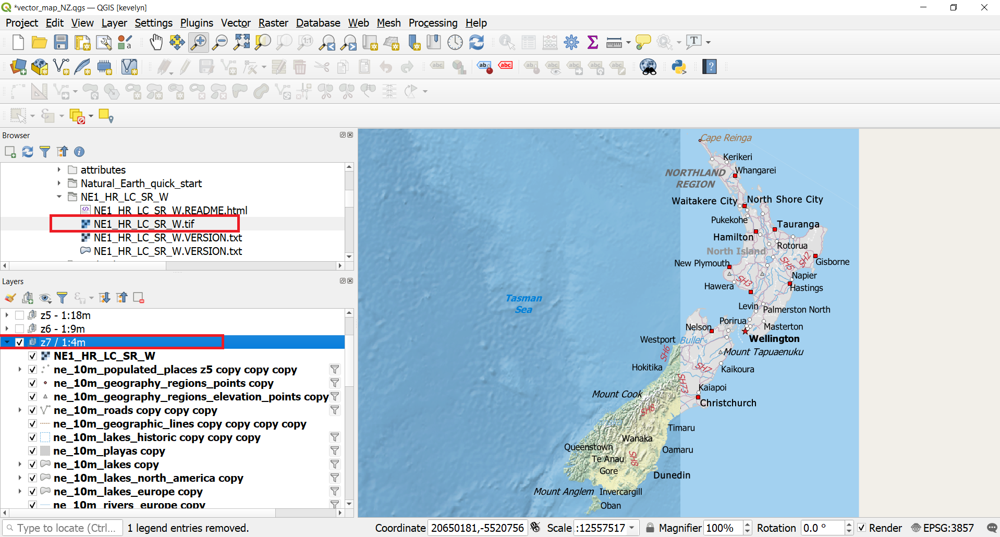
42. In the Layer panel move the NE1_HR_LC_SR_W layer downward between the ne_10m_admin_0_countries and ne_10m_admin_0_disputed_areas. Then the raster does not cover roads, rivers and other features.
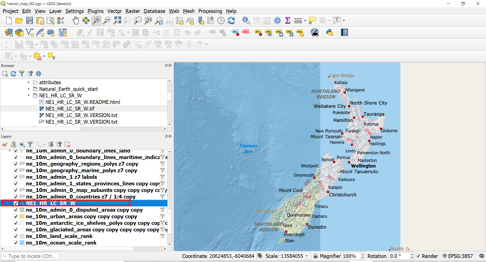
43. You may notice that only half of the New Zealand is covered by the added raster. This is because the Pseudo-Mercator projection does not project the map properly and splits half of the NZ to the other hemisphere. The easiest solution to this is to switch the CRS to WGS84 (EPSG:4326)[^4]. Switch back to Layout view and select the main map object. Switch the CRS to WGS84 and unlock the layers. Your map should automatically redraw. If it does not, then click refresh button .

44. You might need to adjust the scale and pan the map into more appropriate position.
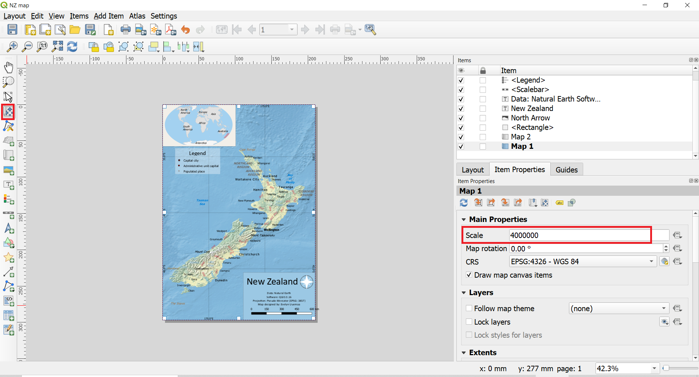
45. You might notice that highway labels are too overpowering on the map. We can switch them off. Go back to the map view and from the Layer panel find layer ne_10m_roads. Double-click on it to open the Properies. Switch to Labels tab and switch off the label rule.
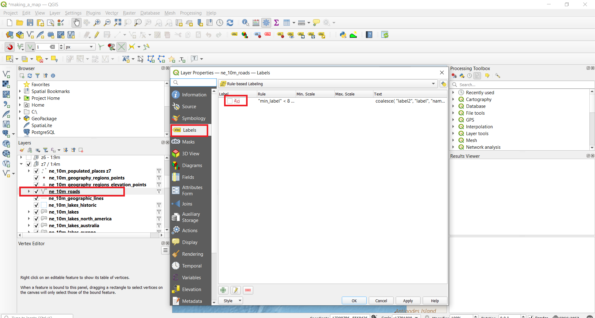
46. Go back to the Layout view and refresh your map. Your map is ready for export.
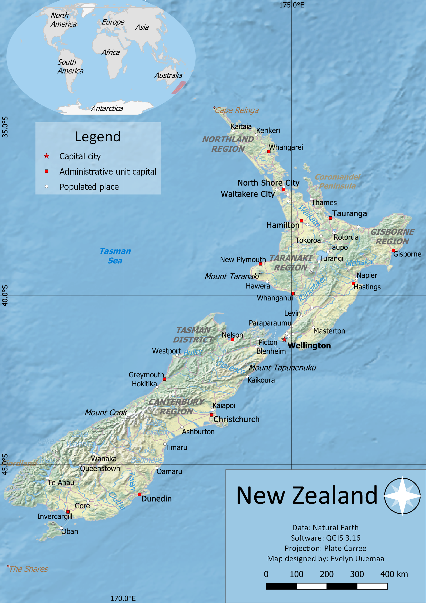

[^1]: EPSG Geodetic Parameter Dataset (also EPSG registry) is a public registry of geodetic datums, spatial reference systems, Earth ellipsoids, coordinate transformations and related units of measurement.  Each entity is assigned an EPSG code between 1024-32767, along with a standard machine-readable well-known text (WKT) representation. (Wiki) The EPSG codes are unique and they are very useful to use for searching and identifying the CRS-s in GIS programs.
[^2]: An inset map is a smaller map featured on the same page as the main map (GIS Wiki)
[^3]: A map is classified as small scale or large scale or sometimes medium scale. Large scale maps are usually 1:0 – 1:600 000 and represent for example town. Medium scale maps are usually 1:600 000 – 1:2 000 000 and mostly a whole country maps are in this range. Small scale maps are 1:2 000 000 – 1:∞ and world or regions are mapped in this scale. (Wiki)
[^4]: WGS84 is actually geographic CRS and is not projected, but as we still need to see it in 2D on the computer screen then QGIS uses Plate Carree projection to visualize WGS84 CRS.
