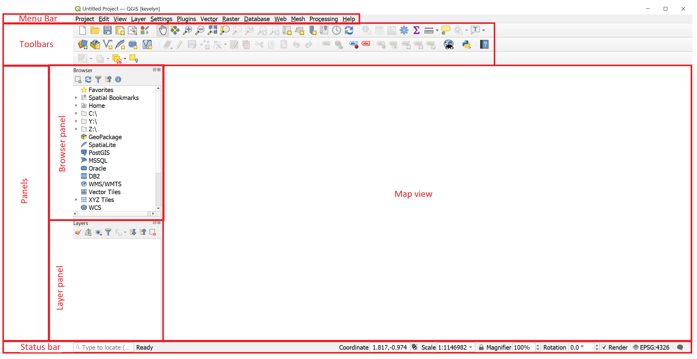
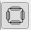

QGIS on populaarne avatud lähtekoodiga geograafiline infosüsteem (GIS), millel on suur võimekus. Gary Sherman alustas Quantum GIS-i arendamisega 2002. aasta alguses ning 2007. aastal sai sellest projekt organisatsioonile Open Source Geospatial Foundation. Versioon 1.0 ilmus 2009. aasta jaanuaris. Aastal 2013 ilmus versioon 2.0 ning selle nimeks sai Quantum GIS asemel GIS, et vältida segadust, sest varasemalt olid mõlemad nimed kasutuses. (Wiki)

Järgnevad juhendid on tutvustus QGIS-i (ja lihtsalt GIS-i) kasutamiseks neile, kes pole varem QGIS-i kasutanud. Antud juhendeid võib kasutada omale sobival kiirusel programmi kasutama õppimiseks.

#### Litsents ja kasutustingimused
Antud materjalid põhinevad osaliselt Ujaval Gandhi juhendil [QGIS Tutorials and Tips](https://www.qgistutorials.com/en/docs/introduction.html) ja [QGIS Desktop User Guide](https://docs.qgis.org/3.28/en/docs/user_manual/index.html), CC-BY-SA. Kui soovite antud materjale muuta, siis me soovime, et jagaksite oma materjale ka avalikult, näiteks GitHub-is, kus kõigil oleks teie tööst kasu. Sellepärast jagame meie oma muudetud materjale litsentsi CC-BY-SA alusel.
Selle litsentsi järgi on teil lubatud järgnevad tegevused:
+ **Jagamine** - kopeeri ja jaga materjale ükskõik mis vahendi abil või formaadis
+ **Muutmine** - remiksi, muuda ja täienda materjali

Aikuke asi, mis te tegema peate, on **korrektselt viitama** originaalse töö autorile.

#### Juhend koosneb järgmistest osadest:

- [1. Paigaldamine](#1-paigaldamine)
- [2. Ettevalmistus](#2-ettevalmistus)
- [3. Failide haldamine](#3-failide-haldamine)
- [4. Graafiline kasutajaliides](#4-graafiline-kasutajaliides)

### 1. Paigaldamine
**Antud juhendid on loodud QGIS Windows versiooni 3.28 põhjal** ja sellepärast on neid kõige kergem jälgida arvutiga versioonil 3.28.  QGIS-i sab alla laadida [siit](https://qgis.org/en/site/forusers/download.html). Versiooni 3.31 ei ole hetkel soovitatav kasutada, kuna see pole veel stabiilne. Kui QGIS on alla laetud, siis on soovitatav kasutajaliides inglisekeelseks panna, kuna eestikeelne ei ole täielikult tõlgitud ning kakskeele kasutajaliides on segadust tekitav. Kasutajaliidese saab inglise keelseks muuta `Settings ► Options ► General ► Override System Locale`. Sealnelinnuke peab olema sees ja seejärel vajutama `User interface translation ► American English`.

### 2. Ettevalmistus
Kui teil pole varasemat kogemust GIS-iga, siis peate enne juhendite jälgimist omandama arusaamise GIS-i põhikontseptsioonidest ja ruumiandmetest. Ujaval Gandhi [Spatial Thoughts](https://spatialthoughts.com/) on loonud hea video [A practical introduction to GIS](https://www.youtube.com/watch?v=yfLjnK569XY), mida saate vaadata, et omandada GIS-i põhiteadmised. 

### 3. Failide haldamine
Looge omale töökaust Windows File Explorer-is, kus hoiate kõik selle kursuse failid. Palun ärge kasutage kausta ega failide nimeses tühikuid ega täpitähti.

### 4. Graafiline kasutajaliides
Peale QGIS-i avamist arvutis peaksite nägema sarnast vaadet nagu sellel pildil.

**The Menu bar** võimaldab juurdepääsu QGIS funktsioonidele kasutades standardseid hierarhilisi menüüsid.

**The Toolbars** võimaldab juurdepääsu enamikele funktsioonidele menüüs ja lisaks veel mõningatele tööriistadele, mida saad kasutada kaardi liigutamiseks jms. Kui hoiate oma kursorit mingi tööriista peal, siis ilmub lühike kirjeldus tööriista eesmärgist. Igat *toolbar*-i on võimalik vastavalt vajadusele liigutada. Lisaks saab neid ka välja lülitada. Selleks peab tegema parema hiireklõpsu *toolbar*-il, mis avab menüü.

**The Browser panel** on QGIS-i ressursside sirvimiseks, otsimiseks, kontrollimiseks, kopeerimiseks ja laadimiseks. Näidatud on vaid need ressursid, mida QGIS oskab käsitleda. *Bowser panel*-it saab kasutada andmete asukoha leidmiseks, kontrollimiseks ja projektile lisamiseks.

**The Layer panel** (teise nimega *map legend*) loetleb kõik projekti andmekihid ja aitab hallata nende nähtavust. Z-järjestuse muutmiseks saab valida kihi ning seda legendis üles või alla liigutada. Z-järjestus tähendab, et legendis kõrgemal asuvad kihid kuvatakse allpool asuvate kihtide peal. 

>**Näpunäide** :smirk:
>
*`View` menüüst on võimalik nii QGIS *widgets* (`Panels ►`) kui ka *toolbars* (`Toolbars ►`) sisse ja välja lülitada. Selleks, et neid sisse või välja lülitada, peab tegema parema hiireklõpsu *menu bar* või *toolbar* peal, mis avab menüü. *Panels* ja *toolbars* on võimalik ka liigutada ning paigutada nii kuidas ise tahate QGIS-i kasutajaliideses.*

**The Map view** (teise nimega *Map canvas*) on koht, kus kuvatakse kaardid 2D vormingus. Kuvatav kaart kajastab teie tehtud kihtide muudatusi (leppemärgid, kohanimed, nähtavus). Veel sõltub see kihtide ja projekti koordinaatide referentssüsteemist (CRS).

>**Näpunäide** :smirk:
>
>*Vaikimisi avab QGIS map view, kus on üks kaart, mis on seotud Layers panel-iga. Põhikaart kajastab automaatselt neid muutusi, mida te teete Layers panel-is. On aga võimalik avada veel teisi kaarte, mille sisu võib Layers panel-i praegusest olekust erineda. Need võivad olla 2D või 3D tüüpi, olla teises mõõtkavas või ulatuses või kuvada teisi andmekihte. Lisateavet map view kohta saab lehelt [QGIS Documentation](https://docs.qgis.org/3.28/en/docs/user_manual/map_views/map_view.html#setting-additional-map-views).*

**The Status bar** edastab üldist informatsiooni *map view* ja tehtud või võimalike tegevuste kohta ning sisaldab tööriistu kaardivaate haldamiseks.

 `Coordinate` näitab hiire hetkeasukohta kaardil. Selle ühikut (ja täpsust) on võimalik muuta: `Project ► Properties… ► General tab`. Tehes hiireklõpsu väiksel nupul, mis asub tekstiaknast vasakul, on võimalik valida `Coordinate` ja  `Extents` vahel, mis näitab hetkeseisu alusel *map view* alumise vasaku nurga ja ülemise parema nurga koordinaate kaardi ühikutes.

>**Näpunäide** :smirk:
>
>*Kui sa kirjutad sõna "world" `Coordinate` aknasse, ilmub automaatselt maailma kaart [Natural Earth](https://www.naturalearthdata.com/) andmebaasist. Päris lahe, eksole! :smirk:*

Koordinaatide kõrval on `Scale`, mis näitab kaardi mõõtkava. Vajutades mõõtkavast paremal olevale nupule , saab ajutiselt mõõtkava lukustada, et kaarti suurendada või vähendada. 

*Status bar*-i paremas ääres on väike märkeruut, mida saab kasutada ajutiselt kaardikihtide esitamise peatamiseks. Esitamise välja lülitamine on kasulik siis, kui andmekihid on väga suured ning esitamine võtab kaua aega. Lisateavet esitamise kohta saab lehelt [QGIS Documentation](https://docs.qgis.org/3.28/en/docs/user_manual/map_views/map_view.html#controlling-map-rendering).

> **Näpunäide** :smirk:
>
>*On võimalik luua ka isiklik QGIS kasutajakonto. Kasutajakonto on ühtne rakenduse konfiguratsioon, mis võimaldab salvestada kõik seadistused, GUI konfiguratsioonid ja kohandused, alla laetud pistikprogrammid ja nende konfiguratsioonid, projekti mallid, töötlemise seaded jne. Oma kasutajakonto loomiseks peate minea `Settings ► User Profiles`. Lisateave saamiseks loe kasutajakontode kohta lehelt [QGIS Documentation](https://docs.qgis.org/3.28/en/docs/user_manual/introduction/qgis_configuration.html#working-with-user-profiles).*
